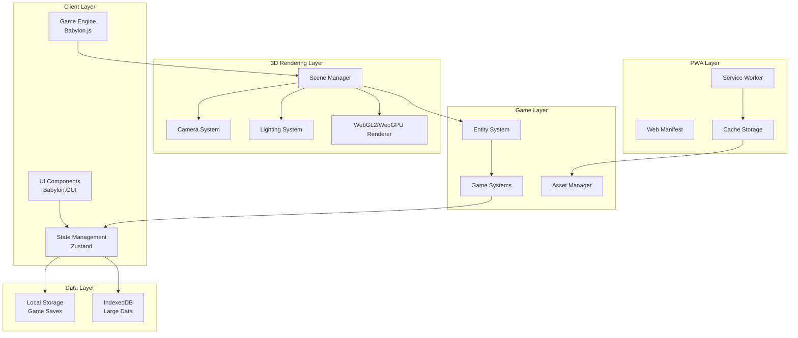
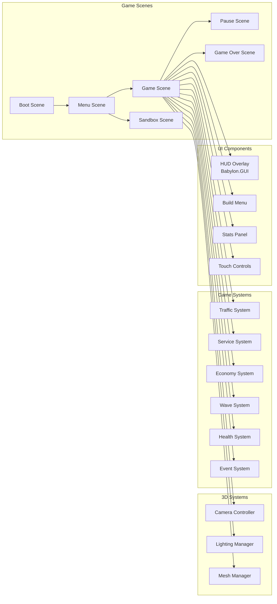

# Server Survival - 3D Tower Defense PWA Architecture Plan

## Executive Summary

This document outlines the architectural plan for the 3D "Server Survival" tower defense game, a Progressive Web App (PWA) that teaches cloud architecture concepts through interactive gameplay. The game uses Babylon.js 7.0+ for 3D rendering, with support for mobile and desktop browsers, offline capabilities, and native-like installation.

## Table of Contents

1. [Project Overview](#project-overview)
2. [Framework Selection](#framework-selection)
3. [System Architecture](#system-architecture)
4. [Core Infrastructure](#core-infrastructure)
5. [Responsive Design Strategy](#responsive-design-strategy)
6. [Core Game Mechanics](#core-game-mechanics)
7. [PWA Implementation](#pwa-implementation)
8. [File Structure](#file-structure)
9. [Performance Optimization](#performance-optimization)
10. [Testing Strategy](#testing-strategy)

---

## Project Overview

### Original Game Analysis

**Server Survival** is a 3D tower defense game that teaches cloud architecture concepts through gameplay:

- **Theme**: Cloud infrastructure management
- **Objective**: Build and scale infrastructure to handle traffic while surviving DDoS attacks
- **Resources**: Budget ($), Reputation (%), Service Health
- **Core Mechanics**:
  - Place defensive services (Firewall, CDN, Load Balancer, Cache, Database, Auto Scaler)
  - Process different traffic types (Static, Read, Write, Upload, Search, Malicious)
  - Block malicious attacks
  - Manage service health and repairs
  - Survive escalating traffic waves

### New Implementation Goals

1. **Maintain 3D Graphics**: Keep the immersive 3D visual style while optimizing performance
2. **Responsive Design**: Seamless experience across mobile, tablet, and desktop
3. **Touch-First Controls**: Optimize for mobile touch interactions (pan, zoom, rotate)
4. **PWA Capabilities**: Offline support, installable
5. **Modern Tech Stack**: Use contemporary 3D frameworks and best practices

---

## Framework Selection

### Recommendation: **Babylon.js 7.0+**

**Rationale:**

1. **Complete 3D Game Engine**: Provides all systems needed out-of-the-box (scene management, input handling, physics, GUI, camera controls)
2. **Mobile Optimization**: Built-in touch handling, responsive scaling, and mobile-specific optimizations
3. **Rich Documentation**: Extensive tutorials, API documentation, and playground examples
4. **Active Development**: Regular updates with modern features, WebGL2/WebGPU support
5. **PWA Ready**: Works seamlessly with service workers and offline caching
6. **TypeScript Support**: First-class TypeScript support with complete type definitions
7. **Built-in GUI System**: Babylon.GUI provides a complete UI system for HUDs and menus
8. **Camera Controls**: Built-in ArcRotateCamera perfect for tower defense games
9. **Physics Integration**: Easy integration with multiple physics engines
10. **Asset Pipeline**: Built-in support for glTF/GLB models, textures, and audio

---

## System Architecture

### High-Level Architecture Diagram



### Component Architecture



---

## Core Infrastructure

### EventBus System

A dedicated EventBus singleton provides type-safe communication between all game systems:

**Location**: [`src/utils/EventBus.ts`](src/utils/EventBus.ts)

**Supported Events**:
- `traffic-processed`: Emitted when traffic is successfully processed
- `traffic-leaked`: Emitted when traffic reaches the destination (failure)
- `service-selected`: Emitted when a service is selected
- `service-placed`: Emitted when a new service is placed
- `service-upgraded`: Emitted when a service is upgraded
- `service-failed`: Emitted when a service fails (health reaches 0)
- `wave-started`: Emitted when a new wave begins
- `wave-completed`: Emitted when a wave completes
- `game-over`: Emitted when game ends
- `budget-changed`: Emitted when budget changes
- `reputation-changed`: Emitted when reputation changes
- `event-triggered`: Emitted when a random event occurs
- `event-ended`: Emitted when a random event ends

**Usage Pattern**:
```typescript
// Subscribe to events
eventBus.on('traffic-processed', ({ type, reward }) => {
  console.log(`Processed ${type}, earned $${reward}`);
});

// Emit events
eventBus.emit('traffic-processed', {
  type: TrafficType.STATIC,
  reward: 5
});
```

### Core Game Systems

All systems follow a consistent pattern with:
- Constructor taking dependencies (Scene, GridSystem, etc.)
- `update(deltaTime: number)` method called each frame
- Event subscriptions via EventBus
- `dispose()` method for cleanup

**TrafficSystem** ([`src/systems/TrafficSystem.ts`](src/systems/TrafficSystem.ts)):
- Spawns traffic entities based on RPS (requests per second)
- Manages traffic mix ratios (static, read, write, upload, search, malicious)
- Moves traffic along A* paths
- Handles traffic leaks (reaching destination)
- Responds to wave and random events

**ServiceSystem** ([`src/systems/ServiceSystem.ts`](src/systems/ServiceSystem.ts)):
- Places services on the grid
- Manages service upgrades (3 levels per service type)
- Attacks traffic in range
- Creates range indicator meshes
- Handles service selection

**EconomySystem** ([`src/systems/EconomySystem.ts`](src/systems/EconomySystem.ts)):
- Manages budget and reputation
- Processes rewards from traffic
- Handles game over conditions
- Tracks game statistics
- Processes upkeep costs

**WaveSystem** ([`src/systems/WaveSystem.ts`](src/systems/WaveSystem.ts)):
- Manages wave progression
- Calculates RPS acceleration (×1.3 at 1min → ×4.0 at 10min)
- Triggers random events
- Tracks game time

**HealthSystem** ([`src/systems/HealthSystem.ts`](src/systems/HealthSystem.ts)):
- Manages service health
- Applies degradation over time
- Handles service repairs
- Triggers service failures

**EventSystem** ([`src/systems/EventSystem.ts`](src/systems/EventSystem.ts)):
- Manages random event timing
- Triggers events (traffic surge, DDoS, degradation, budget bonus)
- Manages event durations

### Configuration Files

**Game Config** ([`src/config/game.config.ts`](src/config/game.config.ts)):
- Game mode configurations (Survival, Sandbox)
- Wave progression formulas
- Random event definitions

**Services Config** ([`src/config/services.config.ts`](src/config/services.config.ts)):
- 6 service types: Firewall, CDN, Load Balancer, Cache, Database, Auto Scaler
- 3 upgrade levels per service
- Cost, range, damage, attack speed, health, upkeep values

**Traffic Config** ([`src/config/traffic.config.ts`](src/config/traffic.config.ts)):
- 6 traffic types: Static, Read, Write, Upload, Search, Malicious
- Health, speed, reward, damage values
- Default traffic mix ratios

---

## Responsive Design Strategy

### Grid System

The grid system handles placement validation, pathfinding, and spatial queries:

**Location**: [`src/utils/GridSystem.ts`](src/utils/GridSystem.ts)

**Key Features**:
- Grid-based world coordinate conversion
- Service placement validation
- A* pathfinding algorithm for traffic movement
- Entity range detection
- Cell occupation management

**Configuration**:
- Cell size: 2 units
- Default grid: 10x10 cells (20x20 world units)
- 4-directional movement (up, down, left, right)

---

## Responsive Design Strategy

### Breakpoint Strategy

| Device | Width | Camera | Controls | UI Layout |
|--------|-------|--------|----------|-----------|
| Mobile Portrait | 320-428px | Top-down/Isometric | Touch-only (pan, zoom, tap) | Stacked HUD, virtual buttons |
| Mobile Landscape | 480-896px | Isometric | Touch-only (pan, zoom, rotate) | Compact HUD, swipe gestures |
| Tablet | 768-1024px | Isometric | Touch + optional keyboard | Split HUD, gesture controls |
| Desktop | 1024px+ | Isometric/Free | Mouse + keyboard | Full HUD, keyboard shortcuts |

### Camera Configuration

```typescript
// Camera setup for responsive 3D
class CameraController {
  private camera: BABYLON.ArcRotateCamera;
  private scene: BABYLON.Scene;

  constructor(scene: BABYLON.Scene, canvas: HTMLCanvasElement) {
    this.scene = scene;
    this.setupCamera(canvas);
    this.setupResponsiveCamera();
  }

  private setupCamera(canvas: HTMLCanvasElement) {
    this.camera = new BABYLON.ArcRotateCamera(
      'camera',
      -Math.PI / 4,  // Alpha
      Math.PI / 3,   // Beta
      30,            // Radius
      BABYLON.Vector3.Zero(),
      scene
    );
    this.camera.attachControl(canvas, true);
    this.camera.wheelPrecision = 50;
    this.camera.lowerRadiusLimit = 10;
    this.camera.upperRadiusLimit = 80;
    this.camera.lowerBetaLimit = 0.1;
    this.camera.upperBetaLimit = Math.PI / 2 - 0.1;
  }

  private setupResponsiveCamera() {
    window.addEventListener('resize', () => this.adjustCameraForScreen());
    this.adjustCameraForScreen();
  }

  private adjustCameraForScreen() {
    const isMobile = /Android|webOS|iPhone|iPad|iPod|BlackBerry|IEMobile|Opera Mini/i.test(navigator.userAgent);
    const isPortrait = window.innerHeight > window.innerWidth;

    if (isMobile && isPortrait) {
      this.camera.beta = Math.PI / 4;
      this.camera.radius = 40;
    } else if (isMobile) {
      this.camera.beta = Math.PI / 3;
      this.camera.radius = 35;
    } else {
      this.camera.beta = Math.PI / 3;
      this.camera.radius = 30;
    }
  }
}
```

---

## Core Game Mechanics

### State Management

The architecture uses a hybrid approach combining Zustand for global state and EventBus for decoupled game events.

### 1. Traffic System

**Traffic Types:**
- `STATIC` - Green - CDN/Storage
- `READ` - Blue - SQL DB
- `WRITE` - Purple - SQL DB
- `UPLOAD` - Orange - Storage
- `SEARCH` - Cyan - SQL DB
- `MALICIOUS` - Red - DDoS attack

### 2. Service System

**Service Types (6 services):**
- `FIREWALL` - Blocks malicious traffic
- `CDN` - Processes static content
- `LOAD_BALANCER` - Distributes traffic
- `CACHE` - Caches frequent requests
- `DATABASE` - Handles read/write operations
- `AUTO_SCALER` - Automatically adjusts capacity

### 3. Economy System

Manages budget and reputation:
- Budget: Earned by processing requests, spent on building/upgrading services
- Reputation: Lost when requests fail or attacks leak through
- Game Over: Reputation hits 0% or Budget drops below -$1000

### 4. Wave System

Manages wave progression with RPS acceleration:
- RPS acceleration: ×1.3 at 1min → ×4.0 at 10min
- Traffic pattern shifts every 40 seconds
- DDoS spikes every 45 seconds
- Random events every 15-45 seconds

### 5. Health System

Manages service health and degradation:
- Services degrade over time under load
- Repairs cost 15% of service cost
- Failed services stop functioning until repaired

### 6. Event System

Random events that affect gameplay:
- Traffic Surge: Increased traffic for duration
- DDoS Attack: High percentage of malicious traffic
- Service Degradation: Reduced capacity
- Budget Bonus: Extra funds

---

## PWA Implementation

### Service Worker

```typescript
// public/sw.js
import { precacheAndRoute, cleanupOutdatedCaches } from 'workbox-precaching';
import { registerRoute, StaleWhileRevalidate } from 'workbox-routing';
import { CacheFirst } from 'workbox-strategies';
import { ExpirationPlugin } from 'workbox-expiration';

precacheAndRoute(self.__WB_MANIFEST);
cleanupOutdatedCaches();

registerRoute(
  ({ request }) => request.destination === 'image' ||
                    request.destination === 'font' ||
                    request.destination === 'audio',
  new CacheFirst({
    cacheName: 'assets-cache',
    plugins: [
      new ExpirationPlugin({
        maxEntries: 100,
        maxAgeSeconds: 30 * 24 * 60 * 60
      })
    ]
  })
);

self.addEventListener('install', (event) => self.skipWaiting());
self.addEventListener('activate', (event) => event.waitUntil(self.clients.claim()));
```

### Web App Manifest

```json
{
  "name": "Server Survival - 3D Tower Defense",
  "short_name": "Server Survival",
  "description": "Build cloud infrastructure, survive traffic, learn scaling",
  "start_url": "/",
  "display": "standalone",
  "background_color": "#1a1a2e",
  "theme_color": "#16213e",
  "orientation": "any",
  "scope": "/",
  "icons": [
    { "src": "/assets/icons/icon-192x192.png", "sizes": "192x192", "type": "image/png" },
    { "src": "/assets/icons/icon-512x512.png", "sizes": "512x512", "type": "image/png" }
  ],
  "categories": ["games", "entertainment"]
}
```

### Game Configuration

```typescript
// src/config/game.config.ts
export const GAME_CONFIG = {
  INITIAL_BUDGET: 1000,
  INITIAL_REPUTATION: 100,
  GAME_OVER_BANKRUPTCY_THRESHOLD: -1000,
  REPAIR_COST_MULTIPLIER: 0.15,
  UPGRADE_COST_MULTIPLIER: 0.75,
  UPGRADE_DAMAGE_MULTIPLIER: 1.2,
  UPGRADE_RANGE_MULTIPLIER: 1.1,
  UPGRADE_CAPACITY_MULTIPLIER: 1.3,
  UPGRADE_ATTACK_SPEED_MULTIPLIER: 0.9,
  WAVE_DURATION_MS: 60000,
  TRAFFIC_INTERVAL_BASE: 1000,
  RPS_ACCELERATION_MIN: 1.3,
  RPS_ACCELERATION_MAX: 4.0,
  MAX_SERVICE_HEALTH: 100,
  BASE_DEGRADATION_RATE: 0.1,
  TRAFFIC_POOL_MAX_SIZE: 100,
  SERVICE_POOL_MAX_SIZE: 50,
  GRID_CELL_SIZE: 2,
  CAMERA_MIN_RADIUS: 10,
  CAMERA_MAX_RADIUS: 80,
  CAMERA_DEFAULT_RADIUS: 30,
} as const;
```

---

## File Structure

```
sz_server_survival/
├── public/
│   ├── index.html          # Main HTML entry point
│   ├── vite.svg          # Vite logo
│   └── assets/           # Static assets (images, models)
├── src/
│   ├── main.ts           # Application entry point
│   ├── config/
│   │   ├── game.config.ts      # Game configuration ✅
│   │   ├── services.config.ts  # Service definitions ✅
│   │   └── traffic.config.ts   # Traffic definitions ✅
│   ├── scenes/           # All scenes implemented ✅
│   │   ├── BootScene.ts       ✅
│   │   ├── MenuScene.ts       ✅
│   │   ├── GameScene.ts       ✅
│   │   ├── PauseScene.ts      ✅
│   │   ├── GameOverScene.ts   ✅
│   │   └── SandboxScene.ts    ✅
│   ├── systems/          # All core systems implemented ✅
│   │   ├── TrafficSystem.ts       ✅
│   │   ├── ServiceSystem.ts       ✅
│   │   ├── EconomySystem.ts       ✅
│   │   ├── WaveSystem.ts          ✅
│   │   ├── HealthSystem.ts        ✅
│   │   └── EventSystem.ts         ✅
│   ├── entities/         # All entities implemented ✅
│   │   ├── TrafficEntity.ts       ✅
│   │   ├── ServiceEntity.ts       ✅
│   │   └── ParticleEntity.ts      ✅
│   ├── ui/              # All UI components implemented ✅
│   │   ├── HUD.ts                 ✅
│   │   ├── BuildMenu.ts           ✅
│   │   ├── StatsPanel.ts          ✅
│   │   └── VirtualControls.ts     ✅
│   ├── managers/         # Partially implemented
│   │   ├── InputManager.ts        ✅
│   │   ├── CameraController.ts    ✅
│   │   ├── SaveManager.ts        ⏳ Planned
│   │   ├── AudioManager.ts       ⏳ Planned
│   │   └── PWAInstaller.ts       ⏳ Planned
│   ├── utils/
│   │   ├── EventBus.ts   ✅
│   │   └── GridSystem.ts ✅
│   └── types/
│       ├── game.types.ts     ✅
│       ├── traffic.types.ts  ✅
│       └── service.types.ts ✅
├── tests/
│   ├── unit/            # ⏳ Planned
│   └── integration/     # ⏳ Planned
├── .eslintrc.json      # ESLint configuration ✅
├── .gitignore          # Git ignore rules ✅
├── .prettierrc         # Prettier configuration ✅
├── index.html          # HTML entry point ✅
├── package.json        # NPM configuration ✅
├── tsconfig.json       # TypeScript configuration ✅
├── vite.config.ts     # Vite configuration ✅
└── README.md          # Project documentation ✅
```

---

## Performance Optimization

### 1. Asset Optimization
- Use compressed textures (WebP, KTX)
- Load glTF models with Draco compression
- Lazy load non-critical assets

### 2. Object Pooling
- Reuse traffic entities
- Reuse particle entities
- Limit pool sizes to prevent memory issues

### 3. Render Optimization
- Use WebGL2 renderer
- Enable frustum culling
- Freeze world matrices for static objects
- Optimize mesh data

### 4. Memory Management
- Unload unused assets when switching scenes
- Minimize object creation in game loop
- Use texture atlases for small textures

---

## Testing Strategy

### Unit Testing

```typescript
import { describe, it, expect, beforeEach } from 'vitest';
import EconomySystem from '../../src/systems/EconomySystem';

describe('EconomySystem', () => {
  let economy: EconomySystem;

  beforeEach(() => {
    economy = new EconomySystem();
  });

  it('should start with initial budget', () => {
    expect(economy.getBudget()).toBe(1000);
  });

  it('should deduct funds correctly', () => {
    economy.deductFunds(100);
    expect(economy.getBudget()).toBe(900);
  });

  it('should detect game over on bankruptcy', () => {
    economy.deductFunds(2000);
    const result = economy.checkGameOver();
    expect(result.gameOver).toBe(true);
    expect(result.reason).toBe('Bankrupt!');
  });
});
```

### Integration Testing

Integration tests should verify system interactions:

| Test Scenario | Description |
|---------------|-------------|
| Full Game Cycle | Complete a wave with service placement, traffic processing, and scoring |
| Event Handling | Verify random events properly affect all systems |
| Scene Transitions | Test Boot → Menu → Game → GameOver flow |
| PWA Offline | Verify service worker caching and offline gameplay |

**Implementation Status**: ⏳ Planned

---

## Conclusion

This architecture plan provides a comprehensive foundation for the Server Survival 3D Tower Defense PWA. The use of Babylon.js 7.0+ ensures robust 3D game functionality with excellent mobile support, while PWA implementation provides offline capabilities and native-like installation.

The modular architecture allows for easy maintenance and future enhancements, while responsive design ensures a great experience across all devices.

**Project Status:**

| Component | Status |
|-----------|--------|
| Core 3D Systems (EventBus, GridSystem) | ✅ Complete |
| Game Mechanics (All 6 core systems) | ✅ Complete |
| Configuration (game, services, traffic) | ✅ Complete |
| Type Definitions | ✅ Complete |
| Game Scenes (6 scenes) | ✅ Complete |
| Entity Classes (Traffic, Service, Particle) | ✅ Complete |
| UI Components (HUD, BuildMenu, StatsPanel, VirtualControls) | ✅ Complete |
| Managers (CameraController, InputManager) | ✅ Complete |
| Managers (SaveManager, AudioManager, PWAInstaller) | ⏳ Planned |
| Testing (Unit, Integration, E2E) | ⏳ Planned |

The project is significantly more advanced than previously indicated - scenes, entities, UI components, and most managers are fully implemented and ready for integration testing.
