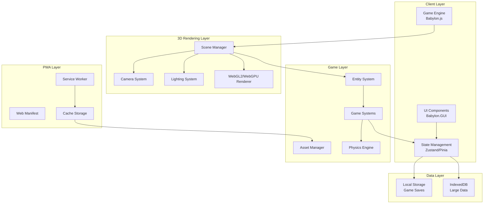
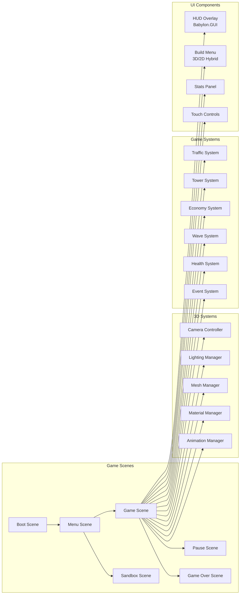

# Server Survival - 3D Tower Defense PWA Architecture Plan

## Executive Summary

This document outlines the comprehensive architectural plan for transforming the 3D "Server Survival" game into a modern, responsive 3D Tower Defense Progressive Web App (PWA). The new implementation will maintain the original game's 3D visual style and core mechanics while optimizing for mobile and desktop browsers with offline capabilities and native-like installation.

## Table of Contents

1. [Project Overview](#project-overview)
2. [Framework Selection](#framework-selection)
3. [System Architecture](#system-architecture)
4. [Responsive Design Strategy](#responsive-design-strategy)
5. [Core Game Mechanics](#core-game-mechanics)
6. [PWA Implementation](#pwa-implementation)
7. [File Structure](#file-structure)
8. [Code Examples](#code-examples)
9. [Performance Optimization](#performance-optimization)
10. [Testing Strategy](#testing-strategy)

---

## Project Overview

### Original Game Analysis

**Server Survival** is a 3D tower defense game that teaches cloud architecture concepts through gameplay:

- **Theme**: Cloud infrastructure management
- **Objective**: Build and scale infrastructure to handle traffic while surviving DDoS attacks
- **Resources**: Budget ($), Reputation (%), Service Health
- **Core Mechanics**:
  - Place defensive services (Firewall, CDN, Load Balancer, etc.)
  - Process different traffic types (Static, Read, Write, Upload, Search)
  - Block malicious attacks
  - Manage service health and repairs
  - Survive escalating traffic waves

### New Implementation Goals

1. **Maintain 3D Graphics**: Keep the immersive 3D visual style while optimizing performance
2. **Responsive Design**: Seamless experience across mobile, tablet, and desktop
3. **Touch-First Controls**: Optimize for mobile touch interactions (pan, zoom, rotate)
4. **PWA Capabilities**: Offline support, installable, push notifications
5. **Modern Tech Stack**: Use contemporary 3D frameworks and best practices

---

## Framework Selection

### Comparison: Babylon.js vs Three.js

| Feature | Babylon.js | Three.js |
|---------|-----------|----------|
| **Engine Type** | ✅ Full 3D game engine | ⚠️ 3D rendering library only |
| **Learning Curve** | 🟢 Moderate | 🟡 Steeper (need to build game systems) |
| **Mobile Performance** | ✅ Optimized for mobile | ✅ Good, but requires optimization |
| **Touch Support** | ✅ Built-in touch handling | ⚠️ Manual implementation |
| **Documentation** | ✅ Extensive tutorials and API docs | ✅ Good, but more technical |
| **Community** | ✅ Large, active community | ✅ Largest 3D web community |
| **Bundle Size** | 🟡 ~800KB (minified) | ✅ ~600KB (minified) |
| **PWA Integration** | ✅ Easy integration | ✅ Easy integration |
| **Asset Management** | ✅ Built-in asset loader | ⚠️ Manual implementation |
| **Scene Management** | ✅ Built-in scene system | ⚠️ Manual implementation |
| **Physics** | ✅ Cannon.js, Havok, Oimo | ⚠️ Need external library |
| **GUI System** | ✅ Babylon GUI | ⚠️ Need external library |
| **Input System** | ✅ Comprehensive input manager | ⚠️ Manual implementation |
| **Camera Controls** | ✅ ArcRotateCamera, UniversalCamera | ⚠️ Need external library (OrbitControls) |
| **Animation** | ✅ Built-in animation system | ✅ Good, but manual setup |
| **TypeScript Support** | ✅ First-class TypeScript | ✅ Good TypeScript support |

### Recommendation: **Babylon.js 7.0+**

**Rationale:**

1. **Complete 3D Game Engine**: Babylon.js provides all systems needed out-of-the-box (scene management, input handling, physics, GUI, camera controls), reducing development time significantly.

2. **Mobile Optimization**: Babylon.js has built-in touch handling, responsive scaling, and mobile-specific optimizations including WebGL2 support and hardware acceleration.

3. **Rich Documentation**: Extensive tutorials, API documentation, playground examples, and community resources accelerate development.

4. **Active Development**: Regular updates with modern features, WebGL2/WebGPU support, and bug fixes.

5. **PWA Ready**: Works seamlessly with service workers and offline caching strategies. Babylon.js has built-in asset management for offline scenarios.

6. **TypeScript Support**: First-class TypeScript support with complete type definitions for better code quality and maintainability.

7. **Built-in GUI System**: Babylon.GUI provides a complete UI system for creating HUDs, menus, and overlays without external dependencies.

8. **Camera Controls**: Built-in camera controllers (ArcRotateCamera for orbit, UniversalCamera for FPS-style) perfect for tower defense games.

9. **Physics Integration**: Easy integration with multiple physics engines (Cannon.js, Havok, Oimo) for collision detection and interactions.

10. **Asset Pipeline**: Built-in support for glTF/GLB models, textures, and audio with automatic loading and caching.

**Version**: Babylon.js 7.0+ (latest stable with WebGPU support and improved mobile performance)

### Alternative: Three.js + Custom Game Loop

Use Three.js if:
- You need maximum flexibility and control
- Building a highly custom 3D engine
- You're already familiar with Three.js ecosystem
- You want to leverage the largest 3D web community

**Note**: The original Server Survival uses Three.js, so migrating to Babylon.js would require rewriting the rendering code, but would provide a more complete game engine out-of-the-box.

---

## System Architecture

### High-Level Architecture Diagram



### Component Architecture



---

## Responsive Design Strategy

### Breakpoint Strategy

| Device | Width | Height | Camera | Controls | UI Layout |
|--------|-------|--------|--------|----------|-----------|
| Mobile Portrait | 320-428px | 100% | Top-down/Isometric | Touch-only (pan, zoom, tap) | Stacked HUD, virtual buttons |
| Mobile Landscape | 480-896px | 100% | Isometric | Touch-only (pan, zoom, rotate) | Compact HUD, swipe gestures |
| Tablet | 768-1024px | 100% | Isometric | Touch + optional keyboard | Split HUD, gesture controls |
| Desktop | 1024px+ | 100% | Isometric/Free | Mouse + keyboard | Full HUD, keyboard shortcuts |

### 3D Camera System

**Camera Configuration:**

```typescript
// Babylon.js camera setup for responsive 3D
class CameraController {
  private camera: BABYLON.ArcRotateCamera;
  private scene: BABYLON.Scene;
  
  constructor(scene: BABYLON.Scene, canvas: HTMLCanvasElement) {
    this.scene = scene;
    this.setupCamera(canvas);
    this.setupCameraControls();
    this.setupResponsiveCamera();
  }
  
  private setupCamera(canvas: HTMLCanvasElement) {
    // Create orbit camera for tower defense gameplay
    this.camera = new BABYLON.ArcRotateCamera(
      'camera',
      -Math.PI / 4,  // Alpha (horizontal rotation)
      Math.PI / 3,   // Beta (vertical rotation)
      30,            // Radius (distance from target)
      new BABYLON.Vector3(0, 0, 0),
      scene
    );
    
    this.camera.attachControl(canvas, true);
    this.camera.wheelPrecision = 50;  // Mouse wheel zoom speed
    this.camera.lowerRadiusLimit = 10; // Minimum zoom
    this.camera.upperRadiusLimit = 80;  // Maximum zoom
    this.camera.lowerBetaLimit = 0.1;   // Minimum vertical angle
    this.camera.upperBetaLimit = Math.PI / 2 - 0.1; // Maximum vertical angle
    this.camera.panningSensibility = 50; // Pan sensitivity
    
    // Disable camera rotation on mobile (use touch gestures instead)
    if (this.isMobile()) {
      this.camera.useAutoRotationBehavior = false;
    }
  }
  
  private setupCameraControls() {
    // Keyboard shortcuts
    this.scene.onKeyboardObservable.add((kbInfo) => {
      switch (kbInfo.type) {
        case BABYLON.KeyboardEventTypes.KEYDOWN:
          this.handleKeyDown(kbInfo.event);
          break;
      }
    });
  }
  
  private handleKeyDown(event: KeyboardEvent) {
    const panSpeed = 0.5;
    switch (event.key) {
      case 'w':
      case 'ArrowUp':
        this.camera.cameraDirection.addInPlace(new BABYLON.Vector3(0, 0, panSpeed));
        break;
      case 's':
      case 'ArrowDown':
        this.camera.cameraDirection.addInPlace(new BABYLON.Vector3(0, 0, -panSpeed));
        break;
      case 'a':
      case 'ArrowLeft':
        this.camera.cameraDirection.addInPlace(new BABYLON.Vector3(panSpeed, 0, 0));
        break;
      case 'd':
      case 'ArrowRight':
        this.camera.cameraDirection.addInPlace(new BABYLON.Vector3(-panSpeed, 0, 0));
        break;
      case 'r':
        this.resetCamera();
        break;
      case 't':
        this.toggleCameraView();
        break;
    }
  }
  
  private setupResponsiveCamera() {
    // Adjust camera based on screen size
    window.addEventListener('resize', () => {
      this.adjustCameraForScreen();
    });
    
    this.adjustCameraForScreen();
  }
  
  private adjustCameraForScreen() {
    const isMobile = this.isMobile();
    const isPortrait = window.innerHeight > window.innerWidth;
    
    if (isMobile && isPortrait) {
      // Portrait mobile: more top-down view
      this.camera.beta = Math.PI / 4;
      this.camera.radius = 40;
    } else if (isMobile) {
      // Landscape mobile: isometric view
      this.camera.beta = Math.PI / 3;
      this.camera.radius = 35;
    } else {
      // Desktop/tablet: standard isometric view
      this.camera.beta = Math.PI / 3;
      this.camera.radius = 30;
    }
  }
  
  private resetCamera() {
    this.camera.alpha = -Math.PI / 4;
    this.camera.beta = Math.PI / 3;
    this.camera.radius = 30;
    this.camera.target = BABYLON.Vector3.Zero();
  }
  
  private toggleCameraView() {
    // Toggle between isometric and top-down
    if (this.camera.beta > Math.PI / 4) {
      this.camera.beta = Math.PI / 8; // Top-down
    } else {
      this.camera.beta = Math.PI / 3; // Isometric
    }
  }
  
  private isMobile(): boolean {
    return /Android|webOS|iPhone|iPad|iPod|BlackBerry|IEMobile|Opera Mini/i.test(navigator.userAgent);
  }
}
```

---

## Core Game Mechanics

### 1. Traffic System (Enemies)

**Traffic Types:**

```typescript
enum TrafficType {
  STATIC = 'static',      // Green - CDN/Storage
  READ = 'read',          // Blue - SQL DB
  WRITE = 'write',        // Purple - SQL DB
  UPLOAD = 'upload',      // Orange - Storage
  SEARCH = 'search',      // Cyan - SQL DB
  MALICIOUS = 'malicious' // Red - DDoS attack
}

interface TrafficConfig {
  type: TrafficType;
  color: number;
  speed: number;
  health: number;
  reward: number;
  damage: number;
  path: BABYLON.Vector3[];
}
```

### 2. Tower System (Services)

**Service Types:**

```typescript
enum ServiceType {
  FIREWALL = 'firewall',
  QUEUE = 'queue',
  LOAD_BALANCER = 'load_balancer',
  COMPUTE = 'compute',
  CDN = 'cdn',
  CACHE = 'cache',
  SQL_DB = 'sql_db',
  STORAGE = 'storage'
}

interface ServiceConfig {
  type: ServiceType;
  name: string;
  cost: number;
  capacity: number;
  upkeep: number;
  range: number;
  damage: number;
  attackSpeed: number;
  color: number;
  icon: string;
  upgradeLevels: number;
}
```

### 3. Economy System

```typescript
class EconomyManager {
  private budget: number = 1000;
  private reputation: number = 100;
  private income: number = 0;
  private expenses: number = 0;
  
  // Scoring
  private score: number = 0;
  private requestsProcessed: number = 0;
  private attacksBlocked: number = 0;
  
  processRequest(type: TrafficType, success: boolean) {
    if (success) {
      const reward = this.getRequestReward(type);
      this.addFunds(reward);
      this.addScore(this.getRequestScore(type));
      this.addReputation(0.1);
      this.requestsProcessed++;
    } else {
      this.loseReputation(1);
    }
  }
  
  blockAttack() {
    this.addFunds(0.5);
    this.addScore(10);
    this.attacksBlocked++;
  }
  
  attackLeaked() {
    this.loseReputation(5);
  }
  
  checkGameOver(): { gameOver: boolean; reason?: string } {
    if (this.reputation <= 0) {
      return { gameOver: true, reason: 'Reputation destroyed!' };
    }
    if (this.budget < -1000) {
      return { gameOver: true, reason: 'Bankrupt!' };
    }
    return { gameOver: false };
  }
}
```

### 4. Wave System

```typescript
class WaveManager {
  private currentWave: number = 0;
  
  startWave(waveNumber: number) {
    this.currentWave = waveNumber;
    const config = this.getWaveConfig(waveNumber);
    
    // Spawn traffic based on wave config
    config.traffic.forEach((traffic, index) => {
      setTimeout(() => {
        this.trafficManager.spawnTraffic(traffic.type, traffic.path);
      }, index * config.interval);
    });
  }
  
  private getWaveConfig(waveNumber: number): WaveConfig {
    const gameTime = waveNumber * 60000; // 1 minute per wave
    
    // RPS acceleration: ×1.3 at 1min → ×4.0 at 10min
    const rpsMultiplier = Math.min(1.3 + (gameTime / 600000) * 2.7, 4.0);
    
    // Traffic mix shifts every 40 seconds
    const trafficMix = this.getTrafficMix(waveNumber);
    
    // DDoS spikes every 45 seconds
    const hasDDoS = waveNumber % 3 === 0;
    
    return {
      waveNumber,
      duration: 60000,
      rps: Math.floor(10 * rpsMultiplier),
      traffic: this.generateTraffic(trafficMix, hasDDoS),
      interval: 1000 / (10 * rpsMultiplier)
    };
  }
}
```

### 5. Health System

```typescript
class HealthSystem {
  private services: Map<string, ServiceHealth> = new Map();
  
  registerService(service: ServiceEntity) {
    this.services.set(service.id, {
      currentHealth: 100,
      maxHealth: 100,
      degradationRate: this.calculateDegradationRate(service)
    });
  }
  
  private calculateDegradationRate(service: ServiceEntity): number {
    // Services degrade faster under load
    const load = service.getCurrentLoad();
    const baseRate = 0.1; // 0.1% per second base
    return baseRate * (1 + load / service.config.capacity);
  }
  
  repairService(id: string) {
    const health = this.services.get(id);
    const service = this.serviceManager.getService(id);
    
    if (health && service) {
      const repairCost = service.config.cost * 0.15;
      
      if (this.economy.canAfford(repairCost)) {
        this.economy.deductFunds(repairCost);
        health.currentHealth = health.maxHealth;
        service.setFailed(false);
        service.setCapacityMultiplier(1);
        service.updateHealthBar(1);
      }
    }
  }
}
```

### 6. Event System

```typescript
class EventManager {
  private activeEvent: GameEvent | null = null;
  
  private triggerRandomEvent() {
    const events = this.getAvailableEvents();
    const event = events[Math.floor(Math.random() * events.length)];
    
    this.activeEvent = {
      ...event,
      startTime: Date.now(),
      duration: event.duration
    };
    
    this.applyEventEffects(this.activeEvent);
    this.showEventNotification(this.activeEvent);
    
    // Schedule event end
    setTimeout(() => this.endEvent(), event.duration);
  }
  
  private getAvailableEvents(): GameEventTemplate[] {
    return [
      {
        id: 'cost_spike',
        name: 'Market Volatility',
        description: 'Service costs increased by 50%',
        duration: 30000,
        effect: () => this.economy.multiplyCosts(1.5),
        cleanup: () => this.economy.multiplyCosts(1/1.5)
      },
      {
        id: 'capacity_drop',
        name: 'Server Overload',
        description: 'All services at 50% capacity',
        duration: 20000,
        effect: () => this.serviceManager.setAllCapacityMultiplier(0.5),
        cleanup: () => this.serviceManager.setAllCapacityMultiplier(1)
      },
      {
        id: 'traffic_burst',
        name: 'Flash Sale',
        description: 'Traffic increased by 200%',
        duration: 15000,
        effect: () => this.trafficManager.multiplyRPS(3),
        cleanup: () => this.trafficManager.multiplyRPS(1/3)
      },
      {
        id: 'ddos_attack',
        name: 'DDoS Attack',
        description: '50% malicious traffic',
        duration: 20000,
        effect: () => this.trafficManager.setMaliciousRatio(0.5),
        cleanup: () => this.trafficManager.setMaliciousRatio(0)
      }
    ];
  }
}
```

---

## PWA Implementation

### Service Worker Architecture

```typescript
// public/sw.js
const CACHE_NAME = 'server-survival-v1';
const STATIC_CACHE = 'static-v1';
const DYNAMIC_CACHE = 'dynamic-v1';

const STATIC_ASSETS = [
  '/',
  '/index.html',
  '/manifest.json',
  '/assets/models/',
  '/assets/textures/',
  '/assets/audio/',
  '/bundle.js',
  '/bundle.css'
];

self.addEventListener('install', (event) => {
  event.waitUntil(
    caches.open(STATIC_CACHE).then((cache) => {
      return cache.addAll(STATIC_ASSETS);
    })
  );
  self.skipWaiting();
});

self.addEventListener('activate', (event) => {
  event.waitUntil(
    caches.keys().then((cacheNames) => {
      return Promise.all(
        cacheNames
          .filter((name) => name !== STATIC_CACHE && name !== DYNAMIC_CACHE)
          .map((name) => caches.delete(name))
      );
    })
  );
  self.clients.claim();
});

self.addEventListener('fetch', (event) => {
  event.respondWith(
    caches.match(event.request).then((cachedResponse) => {
      if (cachedResponse) {
        return cachedResponse;
      }

      return fetch(event.request).then((response) => {
        if (response.ok) {
          const responseClone = response.clone();
          caches.open(DYNAMIC_CACHE).then((cache) => {
            cache.put(event.request, responseClone);
          });
        }
        return response;
      }).catch(() => {
        if (event.request.destination === 'image') {
          return caches.match('/assets/fallback.png');
        }
        return new Response('Offline', { status: 503 });
      });
    })
  );
});
```

### Web App Manifest

```json
{
  "name": "Server Survival - 3D Tower Defense",
  "short_name": "Server Survival",
  "description": "Build cloud infrastructure, survive traffic, learn scaling in this 3D tower defense game",
  "start_url": "/",
  "display": "standalone",
  "background_color": "#1a1a2e",
  "theme_color": "#16213e",
  "orientation": "any",
  "scope": "/",
  "icons": [
    {
      "src": "/assets/icons/icon-72x72.png",
      "sizes": "72x72",
      "type": "image/png",
      "purpose": "any maskable"
    },
    {
      "src": "/assets/icons/icon-96x96.png",
      "sizes": "96x96",
      "type": "image/png",
      "purpose": "any maskable"
    },
    {
      "src": "/assets/icons/icon-128x128.png",
      "sizes": "128x128",
      "type": "image/png",
      "purpose": "any maskable"
    },
    {
      "src": "/assets/icons/icon-144x144.png",
      "sizes": "144x144",
      "type": "image/png",
      "purpose": "any maskable"
    },
    {
      "src": "/assets/icons/icon-152x152.png",
      "sizes": "152x152",
      "type": "image/png",
      "purpose": "any maskable"
    },
    {
      "src": "/assets/icons/icon-192x192.png",
      "sizes": "192x192",
      "type": "image/png",
      "purpose": "any maskable"
    },
    {
      "src": "/assets/icons/icon-384x384.png",
      "sizes": "384x384",
      "type": "image/png",
      "purpose": "any maskable"
    },
    {
      "src": "/assets/icons/icon-512x512.png",
      "sizes": "512x512",
      "type": "image/png",
      "purpose": "any maskable"
    }
  ],
  "screenshots": [
    {
      "src": "/assets/screenshots/gameplay-1.png",
      "sizes": "1280x720",
      "type": "image/png",
      "form_factor": "wide"
    },
    {
      "src": "/assets/screenshots/gameplay-mobile.png",
      "sizes": "540x960",
      "type": "image/png",
      "form_factor": "narrow"
    }
  ],
  "categories": ["games", "entertainment"],
  "shortcuts": [
    {
      "name": "Quick Play",
      "short_name": "Play",
      "description": "Start a new survival game",
      "url": "/?mode=survival",
      "icons": [{ "src": "/assets/icons/play-96x96.png", "sizes": "96x96" }]
    },
    {
      "name": "Sandbox",
      "short_name": "Sandbox",
      "description": "Open sandbox mode",
      "url": "/?mode=sandbox",
      "icons": [{ "src": "/assets/icons/sandbox-96x96.png", "sizes": "96x96" }]
    }
  ]
}
```

---

## File Structure

```
sz_server_survival/
├── public/
│   ├── index.html
│   ├── manifest.json
│   ├── sw.js
│   └── assets/
│       ├── models/
│       │   ├── services.glb
│       │   ├── traffic.glb
│       │   └── environment.glb
│       ├── textures/
│       │   ├── services.png
│       │   ├── traffic.png
│       │   └── environment.png
│       ├── audio/
│       │   ├── music/
│       │   ├── sfx/
│       │   └── voice/
│       ├── fonts/
│       │   ├── main-font.woff2
│       │   └── ui-font.woff2
│       ├── icons/
│       │   ├── icon-72x72.png
│       │   ├── icon-96x96.png
│       │   ├── ...
│       │   └── icon-512x512.png
│       └── screenshots/
│           ├── gameplay-1.png
│           └── gameplay-mobile.png
├── src/
│   ├── main.ts
│   ├── config/
│   │   ├── game.config.ts
│   │   ├── services.config.ts
│   │   └── traffic.config.ts
│   ├── scenes/
│   │   ├── BootScene.ts
│   │   ├── MenuScene.ts
│   │   ├── GameScene.ts
│   │   ├── PauseScene.ts
│   │   ├── GameOverScene.ts
│   │   └── SandboxScene.ts
│   ├── systems/
│   │   ├── TrafficSystem.ts
│   │   ├── ServiceSystem.ts
│   │   ├── EconomySystem.ts
│   │   ├── WaveSystem.ts
│   │   ├── HealthSystem.ts
│   │   └── EventSystem.ts
│   ├── entities/
│   │   ├── TrafficEntity.ts
│   │   ├── ServiceEntity.ts
│   │   └── ParticleEntity.ts
│   ├── ui/
│   │   ├── HUD.ts
│   │   ├── BuildMenu.ts
│   │   ├── StatsPanel.ts
│   │   ├── Controls.ts
│   │   └── VirtualControls.ts
│   ├── managers/
│   │   ├── InputManager.ts
│   │   ├── CameraController.ts
│   │   ├── SaveManager.ts
│   │   ├── AudioManager.ts
│   │   └── PWAInstaller.ts
│   ├── utils/
│   │   ├── GridSystem.ts
│   │   ├── Pathfinding.ts
│   │   └── Helpers.ts
│   └── types/
│       ├── game.types.ts
│       ├── traffic.types.ts
│       └── service.types.ts
├── tests/
│   ├── unit/
│   │   ├── TrafficSystem.test.ts
│   │   ├── EconomySystem.test.ts
│   │   └── WaveSystem.test.ts
│   └── integration/
│       └── GameFlow.test.ts
├── plans/
│   ├── architecture-plan.md
│   └── architecture-plan-3d.md
├── package.json
├── tsconfig.json
├── vite.config.ts
├── .eslintrc.json
└── README.md
```

---

## Code Examples

### 1. Main Game Entry Point

```typescript
// src/main.ts
import * as BABYLON from '@babylonjs/core';
import '@babylonjs/loaders/glTF';
import '@babylonjs/gui';
import BootScene from './scenes/BootScene';
import MenuScene from './scenes/MenuScene';
import GameScene from './scenes/GameScene';
import PauseScene from './scenes/PauseScene';
import GameOverScene from './scenes/GameOverScene';
import SandboxScene from './scenes/SandboxScene';
import { GAME_CONFIG } from './config/game.config';

class Game {
  private canvas: HTMLCanvasElement;
  private engine: BABYLON.Engine;
  private currentScene: BABYLON.Scene | null = null;
  private sceneManager: SceneManager;

  constructor() {
    this.canvas = document.getElementById('render-canvas') as HTMLCanvasElement;
    this.engine = new BABYLON.Engine(this.canvas, true, {
      preserveDrawingBuffer: true,
      stencil: true,
      disableWebGL2Support: false
    });

    this.sceneManager = new SceneManager(this.engine);
    this.setupEngine();
    this.registerServiceWorker();
    this.start();
  }

  private setupEngine() {
    this.engine.enableOfflineSupport = true;
    this.engine.setHardwareScalingLevel(1.0);
    
    window.addEventListener('resize', () => {
      this.engine.resize();
    });
    
    this.engine.setFramesPerSecond(60);
  }

  private registerServiceWorker() {
    if ('serviceWorker' in navigator) {
      navigator.serviceWorker.register('/sw.js')
        .then((registration) => {
          console.log('SW registered:', registration);
        })
        .catch((error) => {
          console.log('SW registration failed:', error);
        });
    }
  }

  private async start() {
    await this.sceneManager.switchScene('BootScene');
    
    this.engine.runRenderLoop(() => {
      if (this.currentScene) {
        this.currentScene.render();
      }
    });
  }
}

class SceneManager {
  private scenes: Map<string, () => BABYLON.Scene> = new Map();
  private currentScene: BABYLON.Scene | null = null;

  constructor(private engine: BABYLON.Engine) {
    this.registerScenes();
  }

  private registerScenes() {
    this.scenes.set('BootScene', () => new BootScene(this.engine).create());
    this.scenes.set('MenuScene', () => new MenuScene(this.engine).create());
    this.scenes.set('GameScene', () => new GameScene(this.engine).create());
    this.scenes.set('PauseScene', () => new PauseScene(this.engine).create());
    this.scenes.set('GameOverScene', () => new GameOverScene(this.engine).create());
    this.scenes.set('SandboxScene', () => new SandboxScene(this.engine).create());
  }

  async switchScene(sceneName: string, data?: any): Promise<void> {
    if (this.currentScene) {
      this.currentScene.dispose();
    }

    const sceneFactory = this.scenes.get(sceneName);
    if (!sceneFactory) {
      throw new Error(`Scene ${sceneName} not found`);
    }

    this.currentScene = sceneFactory();
    
    if (data && this.currentScene['initialize']) {
      await this.currentScene['initialize'](data);
    }
  }

  getCurrentScene(): BABYLON.Scene | null {
    return this.currentScene;
  }
}

new Game();
```

### 2. 3D Traffic Entity

```typescript
// src/entities/TrafficEntity.ts
import * as BABYLON from '@babylonjs/core';
import { TrafficType, TrafficConfig } from '../types/traffic.types';

export default class TrafficEntity {
  private mesh: BABYLON.Mesh;
  private config: TrafficConfig;
  private path: BABYLON.Vector3[];
  private currentPathIndex: number = 0;
  private speed: number;
  private health: number;
  private maxHealth: number;
  private isProcessed: boolean = false;
  private healthBarMesh: BABYLON.Mesh;

  constructor(
    scene: BABYLON.Scene,
    position: BABYLON.Vector3,
    config: TrafficConfig,
    path: BABYLON.Vector3[]
  ) {
    this.config = config;
    this.path = path;
    this.speed = config.speed;
    this.health = config.health;
    this.maxHealth = config.health;
    
    this.mesh = this.createMesh(scene, position, config);
    this.healthBarMesh = this.createHealthBar(scene);
    
    this.mesh.metadata = {
      type: 'traffic',
      id: this.generateId(),
      config: config
    };
  }

  private createMesh(scene: BABYLON.Scene, position: BABYLON.Vector3, config: TrafficConfig): BABYLON.Mesh {
    let mesh: BABYLON.Mesh;
    
    switch (config.type) {
      case TrafficType.STATIC:
        mesh = BABYLON.MeshBuilder.CreateBox('traffic-static', { size: 1 }, scene);
        break;
      case TrafficType.READ:
        mesh = BABYLON.MeshBuilder.CreateSphere('traffic-read', { diameter: 1 }, scene);
        break;
      case TrafficType.WRITE:
        mesh = BABYLON.MeshBuilder.CreateCylinder('traffic-write', { height: 1.5, diameter: 0.8 }, scene);
        break;
      case TrafficType.UPLOAD:
        mesh = BABYLON.MeshBuilder.CreateTorus('traffic-upload', { diameter: 1, thickness: 0.2 }, scene);
        break;
      case TrafficType.SEARCH:
        mesh = BABYLON.MeshBuilder.CreatePolyhedron('traffic-search', { type: 1, size: 0.8 }, scene);
        break;
      case TrafficType.MALICIOUS:
        mesh = BABYLON.MeshBuilder.CreateCone('traffic-malicious', { height: 1.5, diameter: 1 }, scene);
        break;
      default:
        mesh = BABYLON.MeshBuilder.CreateBox('traffic-default', { size: 1 }, scene);
    }

    mesh.position = position.clone();
    
    const material = new BABYLON.StandardMaterial(`traffic-material-${config.type}`, scene);
    material.diffuseColor = BABYLON.Color3.FromHexString(config.color.toString(16).padStart(6, '0'));
    material.emissiveColor = BABYLON.Color3.FromHexString(config.color.toString(16).padStart(6, '0')).scale(0.3);
    mesh.material = material;

    if (config.type === TrafficType.MALICIOUS) {
      const glowLayer = new BABYLON.GlowLayer('malicious-glow', scene);
      glowLayer.intensity = 0.5;
    }

    return mesh;
  }

  private createHealthBar(scene: BABYLON.Scene): BABYLON.Mesh {
    const healthBarBg = BABYLON.MeshBuilder.CreatePlane('health-bar-bg', { width: 2, height: 0.2 }, scene);
    const bgMaterial = new BABYLON.StandardMaterial('health-bar-bg-material', scene);
    bgMaterial.diffuseColor = new BABYLON.Color3(0.2, 0.2, 0.2);
    bgMaterial.disableLighting = true;
    healthBarBg.material = bgMaterial;
    healthBarBg.billboardMode = BABYLON.Mesh.BILLBOARDMODE_ALL;
    healthBarBg.position = new BABYLON.Vector3(0, 1.5, 0);
    healthBarBg.parent = this.mesh;

    const healthBarFill = BABYLON.MeshBuilder.CreatePlane('health-bar-fill', { width: 2, height: 0.2 }, scene);
    const fillMaterial = new BABYLON.StandardMaterial('health-bar-fill-material', scene);
    fillMaterial.diffuseColor = new BABYLON.Color3(0.3, 0.69, 0.31);
    fillMaterial.disableLighting = true;
    healthBarFill.material = fillMaterial;
    healthBarFill.billboardMode = BABYLON.Mesh.BILLBOARDMODE_ALL;
    healthBarFill.position = new BABYLON.Vector3(0, 1.5, 0.01);
    healthBarFill.parent = this.mesh;

    (healthBarFill as any).isHealthBar = true;
    
    return healthBarFill;
  }

  followPath(path: BABYLON.Vector3[]) {
    this.path = path;
    this.currentPathIndex = 0;
    this.moveToNextPoint();
  }

  private moveToNextPoint() {
    if (this.currentPathIndex >= this.path.length) {
      this.reachDestination();
      return;
    }

    const target = this.path[this.currentPathIndex];
    const distance = BABYLON.Vector3.Distance(this.mesh.position, target);
    const duration = (distance / this.speed) * 1000;

    BABYLON.Animation.CreateAndStartAnimation(
      'move',
      this.mesh,
      'position',
      60,
      duration / 16.67,
      this.mesh.position,
      target,
      BABYLON.Animation.ANIMATIONLOOPMODE_CONSTANT,
      new BABYLON.QuadraticEase(),
      () => {
        this.currentPathIndex++;
        this.moveToNextPoint();
      }
    );

    const direction = target.subtract(this.mesh.position).normalize();
    this.mesh.lookAt(this.mesh.position.add(direction));
  }

  private reachDestination() {
    if (!this.isProcessed) {
      this.mesh.scene.events.emit('traffic-leaked', this.config.type);
    }
    this.dispose();
  }

  takeDamage(damage: number): boolean {
    this.health -= damage;
    this.updateHealthBar();
    
    this.flashMesh();
    
    if (this.health <= 0) {
      this.createDeathEffect();
      this.dispose();
      return true;
    }
    
    return false;
  }

  private flashMesh() {
    const originalColor = (this.mesh.material as BABYLON.StandardMaterial).diffuseColor.clone();
    (this.mesh.material as BABYLON.StandardMaterial).diffuseColor = new BABYLON.Color3(1, 1, 1);
    
    setTimeout(() => {
      (this.mesh.material as BABYLON.StandardMaterial).diffuseColor = originalColor;
    }, 100);
  }

  private createDeathEffect() {
    const particleSystem = new BABYLON.ParticleSystem('death-particles', 50, this.mesh.scene);
    particleSystem.particleTexture = new BABYLON.Texture('assets/textures/particle.png', this.mesh.scene);
    particleSystem.emitter = this.mesh.position;
    particleSystem.minEmitBox = new BABYLON.Vector3(-0.5, -0.5, -0.5);
    particleSystem.maxEmitBox = new BABYLON.Vector3(0.5, 0.5, 0.5);
    particleSystem.color1 = new BABYLON.Color4(1, 0.5, 0, 1);
    particleSystem.color2 = new BABYLON.Color4(1, 0, 0, 1);
    particleSystem.minSize = 0.1;
    particleSystem.maxSize = 0.3;
    particleSystem.minLifeTime = 0.5;
    particleSystem.maxLifeTime = 1;
    particleSystem.emitRate = 100;
    particleSystem.blendMode = BABYLON.ParticleSystem.BLENDMODE_ONEONE;
    particleSystem.gravity = new BABYLON.Vector3(0, -9.81, 0);
    particleSystem.start();
    
    setTimeout(() => {
      particleSystem.stop();
      setTimeout(() => particleSystem.dispose(), 1000);
    }, 1000);
  }

  process() {
    this.isProcessed = true;
    this.mesh.scene.events.emit('traffic-processed', this.config.type);
    this.dispose();
  }

  private updateHealthBar() {
    const healthPercent = this.health / this.maxHealth;
    const healthBar = this.healthBarMesh;
    
    if (healthBar) {
      healthBar.scaling.x = healthPercent;
      
      const material = healthBar.material as BABYLON.StandardMaterial;
      if (healthPercent > 0.5) {
        material.diffuseColor = new BABYLON.Color3(0.3, 0.69, 0.31);
      } else if (healthPercent > 0.25) {
        material.diffuseColor = new BABYLON.Color3(1, 0.76, 0.03);
      } else {
        material.diffuseColor = new BABYLON.Color3(0.96, 0.26, 0.21);
      }
    }
  }

  private generateId(): string {
    return `traffic-${Date.now()}-${Math.random().toString(36).substr(2, 9)}`;
  }

  dispose() {
    if (this.healthBarMesh) {
      this.healthBarMesh.dispose();
    }
    if (this.mesh) {
      this.mesh.dispose();
    }
  }
}
```

### 3. 3D Service Entity

```typescript
// src/entities/ServiceEntity.ts
import * as BABYLON from '@babylonjs/core';
import { ServiceType, ServiceConfig } from '../types/service.types';

export default class ServiceEntity {
  public readonly id: string;
  public config: ServiceConfig;
  private level: number = 1;
  private health: number = 100;
  private maxHealth: number = 100;
  private isAutoRepairEnabled: boolean = false;
  private isFailed: boolean = false;
  private capacityMultiplier: number = 1;
  private currentLoad: number = 0;
  
  private mesh: BABYLON.Mesh;
  private rangeIndicator: BABYLON.Mesh;
  private healthBarMesh: BABYLON.Mesh;
  private glowLayer: BABYLON.GlowLayer | null = null;

  constructor(
    scene: BABYLON.Scene,
    position: BABYLON.Vector3,
    config: ServiceConfig,
    id: string
  ) {
    this.id = id;
    this.config = config;
    
    this.mesh = this.createMesh(scene, position, config);
    this.rangeIndicator = this.createRangeIndicator(scene);
    this.healthBarMesh = this.createHealthBar(scene);
    
    this.mesh.metadata = {
      type: 'service',
      id: id,
      config: config
    };
    
    this.setupInteraction(scene);
  }

  private createMesh(scene: BABYLON.Scene, position: BABYLON.Vector3, config: ServiceConfig): BABYLON.Mesh {
    let mesh: BABYLON.Mesh;
    
    switch (config.type) {
      case ServiceType.FIREWALL:
        mesh = BABYLON.MeshBuilder.CreateBox('service-firewall', { width: 2, height: 2, depth: 0.5 }, scene);
        break;
      case ServiceType.QUEUE:
        mesh = BABYLON.MeshBuilder.CreateBox('service-queue', { width: 2, height: 1.5, depth: 2 }, scene);
        break;
      case ServiceType.LOAD_BALANCER:
        mesh = BABYLON.MeshBuilder.CreateCylinder('service-load-balancer', { height: 1, diameter: 2 }, scene);
        break;
      case ServiceType.COMPUTE:
        mesh = BABYLON.MeshBuilder.CreateBox('service-compute', { width: 1.5, height: 2, depth: 1.5 }, scene);
        break;
      case ServiceType.CDN:
        mesh = BABYLON.MeshBuilder.CreateSphere('service-cdn', { diameter: 2 }, scene);
        break;
      case ServiceType.CACHE:
        mesh = BABYLON.MeshBuilder.CreateCylinder('service-cache', { height: 1.5, diameter: 1.5 }, scene);
        break;
      case ServiceType.SQL_DB:
        mesh = BABYLON.MeshBuilder.CreateCylinder('service-sql-db', { height: 2, diameter: 2 }, scene);
        break;
      case ServiceType.STORAGE:
        mesh = BABYLON.MeshBuilder.CreateBox('service-storage', { width: 2, height: 1, depth: 1.5 }, scene);
        break;
      default:
        mesh = BABYLON.MeshBuilder.CreateBox('service-default', { size: 2 }, scene);
    }

    mesh.position = position.clone();
    mesh.position.y = 1;
    
    const material = new BABYLON.StandardMaterial(`service-material-${config.type}`, scene);
    material.diffuseColor = BABYLON.Color3.FromHexString(config.color.toString(16).padStart(6, '0'));
    material.specularColor = new BABYLON.Color3(0.3, 0.3, 0.3);
    mesh.material = material;

    this.glowLayer = new BABYLON.GlowLayer('service-glow', scene);
    this.glowLayer.intensity = 0.3;

    return mesh;
  }

  private createRangeIndicator(scene: BABYLON.Scene): BABYLON.Mesh {
    const rangeIndicator = BABYLON.MeshBuilder.CreateDisc('range-indicator', {
      radius: this.config.range,
      tessellation: 32
    }, scene);
    
    const material = new BABYLON.StandardMaterial('range-indicator-material', scene);
    material.diffuseColor = BABYLON.Color3.FromHexString(this.config.color.toString(16).padStart(6, '0'));
    material.alpha = 0.3;
    material.disableLighting = true;
    rangeIndicator.material = material;
    
    rangeIndicator.rotation.x = Math.PI / 2;
    rangeIndicator.position.y = 0.1;
    rangeIndicator.isVisible = false;
    rangeIndicator.parent = this.mesh;
    
    return rangeIndicator;
  }

  private createHealthBar(scene: BABYLON.Scene): BABYLON.Mesh {
    const healthBarBg = BABYLON.MeshBuilder.CreatePlane('health-bar-bg', { width: 2, height: 0.2 }, scene);
    const bgMaterial = new BABYLON.StandardMaterial('health-bar-bg-material', scene);
    bgMaterial.diffuseColor = new BABYLON.Color3(0.2, 0.2, 0.2);
    bgMaterial.disableLighting = true;
    healthBarBg.material = bgMaterial;
    healthBarBg.billboardMode = BABYLON.Mesh.BILLBOARDMODE_ALL;
    healthBarBg.position = new BABYLON.Vector3(0, 2.5, 0);
    healthBarBg.parent = this.mesh;

    const healthBarFill = BABYLON.MeshBuilder.CreatePlane('health-bar-fill', { width: 2, height: 0.2 }, scene);
    const fillMaterial = new BABYLON.StandardMaterial('health-bar-fill-material', scene);
    fillMaterial.diffuseColor = new BABYLON.Color3(0.3, 0.69, 0.31);
    fillMaterial.disableLighting = true;
    healthBarFill.material = fillMaterial;
    healthBarFill.billboardMode = BABYLON.Mesh.BILLBOARDMODE_ALL;
    healthBarFill.position = new BABYLON.Vector3(0, 2.5, 0.01);
    healthBarFill.parent = this.mesh;

    (healthBarFill as any).isHealthBar = true;
    
    return healthBarFill;
  }

  private setupInteraction(scene: BABYLON.Scene) {
    scene.onPointerObservable.add((pointerInfo) => {
      if (pointerInfo.type === BABYLON.PointerEventTypes.POINTERDOWN) {
        if (pointerInfo.pickInfo.hit && pointerInfo.pickInfo.pickedMesh === this.mesh) {
          this.handleClick();
        }
      }
      
      if (pointerInfo.type === BABYLON.PointerEventTypes.POINTEROVER) {
        if (pointerInfo.pickInfo.hit && pointerInfo.pickInfo.pickedMesh === this.mesh) {
          this.handleHover();
        }
      }
      
      if (pointerInfo.type === BABYLON.PointerEventTypes.POINTEROUT) {
        if (pointerInfo.pickInfo.pickedMesh === this.mesh) {
          this.handleHoverOut();
        }
      }
    });
  }

  private handleClick() {
    this.mesh.scene.events.emit('service-selected', this);
    this.showRange();
  }

  private handleHover() {
    this.mesh.scaling = new BABYLON.Vector3(1.1, 1.1, 1.1);
    this.showRange();
  }

  private handleHoverOut() {
    this.mesh.scaling = new BABYLON.Vector3(1, 1, 1);
    this.hideRange();
  }

  private showRange() {
    this.rangeIndicator.isVisible = true;
  }

  private hideRange() {
    this.rangeIndicator.isVisible = false;
  }

  upgrade() {
    if (this.level >= this.config.upgradeLevels) return;
    
    this.level++;
    
    this.config.damage *= 1.2;
    this.config.range *= 1.1;
    this.config.capacity *= 1.3;
    this.config.attackSpeed *= 0.9;
    
    this.rangeIndicator.dispose();
    this.rangeIndicator = this.createRangeIndicator(this.mesh.scene);
    
    this.animateUpgrade();
  }

  private animateUpgrade() {
    BABYLON.Animation.CreateAndStartAnimation(
      'upgrade',
      this.mesh,
      'scaling',
      60,
      20,
      new BABYLON.Vector3(1, 1, 1),
      new BABYLON.Vector3(1.3, 1.3, 1.3),
      BABYLON.Animation.ANIMATIONLOOPMODE_CONSTANT,
      new BABYLON.QuadraticEase(),
      () => {
        BABYLON.Animation.CreateAndStartAnimation(
          'upgrade-down',
          this.mesh,
          'scaling',
          60,
          20,
          new BABYLON.Vector3(1.3, 1.3, 1.3),
          new BABYLON.Vector3(1, 1, 1),
          BABYLON.Animation.ANIMATIONLOOPMODE_CONSTANT
        );
      }
    );
  }

  canUpgrade(): boolean {
    return this.level < this.config.upgradeLevels;
  }

  getUpgradeCost(): number {
    return Math.floor(this.config.cost * 0.75 * this.level);
  }

  getCurrentLoad(): number {
    return this.currentLoad;
  }

  setLoad(load: number) {
    this.currentLoad = load;
  }

  setCapacityMultiplier(multiplier: number) {
    this.capacityMultiplier = multiplier;
  }

  setAutoRepair(enabled: boolean) {
    this.isAutoRepairEnabled = enabled;
  }

  isAutoRepairEnabled(): boolean {
    return this.isAutoRepairEnabled;
  }

  setFailed(failed: boolean) {
    this.isFailed = failed;
    if (failed) {
      (this.mesh.material as BABYLON.StandardMaterial).diffuseColor = new BABYLON.Color3(0.4, 0.4, 0.4);
      this.mesh.alpha = 0.5;
    } else {
      (this.mesh.material as BABYLON.StandardMaterial).diffuseColor = BABYLON.Color3.FromHexString(this.config.color.toString(16).padStart(6, '0'));
      this.mesh.alpha = 1;
    }
  }

  updateHealthBar(healthPercent: number) {
    this.health = healthPercent * this.maxHealth;
    
    const healthBar = this.healthBarMesh;
    if (healthBar) {
      healthBar.scaling.x = healthPercent;
      
      const material = healthBar.material as BABYLON.StandardMaterial;
      if (healthPercent > 0.5) {
        material.diffuseColor = new BABYLON.Color3(0.3, 0.69, 0.31);
      } else if (healthPercent > 0.25) {
        material.diffuseColor = new BABYLON.Color3(1, 0.76, 0.03);
      } else {
        material.diffuseColor = new BABYLON.Color3(0.96, 0.26, 0.21);
      }
    }
  }

  dispose() {
    if (this.rangeIndicator) {
      this.rangeIndicator.dispose();
    }
    if (this.healthBarMesh) {
      this.healthBarMesh.dispose();
    }
    if (this.glowLayer) {
      this.glowLayer.dispose();
    }
    if (this.mesh) {
      this.mesh.dispose();
    }
  }
}
```

---

## Performance Optimization

### 1. Asset Optimization

```typescript
class AssetOptimizer {
  static preloadOptimized(scene: BABYLON.Scene) {
    // Use compressed textures
    scene.loadTexture('compressed-texture', 'assets/textures/compressed.ktx');
    
    // Load glTF models with compression
    BABYLON.SceneLoader.ImportMesh(
      '',
      'assets/models/',
      'services.glb',
      scene,
      (meshes) => {
        // Optimize meshes
        meshes.forEach(mesh => {
          mesh.optimize();
          mesh.freezeNormals();
        });
      }
    );
    
    // Lazy load non-critical assets
    setTimeout(() => {
      this.lazyLoadSecondaryAssets(scene);
    }, 5000);
  }
}
```

### 2. Object Pooling

```typescript
class TrafficPool {
  private pool: TrafficEntity[] = [];
  private maxSize: number = 100;
  
  get(scene: BABYLON.Scene, position: BABYLON.Vector3, config: TrafficConfig): TrafficEntity {
    if (this.pool.length > 0) {
      const entity = this.pool.pop()!;
      entity.mesh.position = position.clone();
      entity.mesh.setEnabled(true);
      return entity;
    }
    return new TrafficEntity(scene, position, config, []);
  }
  
  release(entity: TrafficEntity) {
    if (this.pool.length < this.maxSize) {
      entity.mesh.setEnabled(false);
      this.pool.push(entity);
    } else {
      entity.dispose();
    }
  }
}
```

### 3. Render Optimization

```typescript
const renderConfig = {
  // Use WebGL2 renderer
  engineOptions: {
    preserveDrawingBuffer: true,
    stencil: true,
    disableWebGL2Support: false
  },
  
  // Optimize for mobile
  adaptToDeviceRatio: true,
  antialias: true,
  
  // Performance settings
  powerPreference: 'high-performance',
  failIfMajorPerformanceCaveat: false
};
```

---

## Testing Strategy

### 1. Unit Testing

```typescript
import { describe, it, expect, beforeEach } from 'vitest';
import EconomySystem from '../../src/systems/EconomySystem';

describe('EconomySystem', () => {
  let economy: EconomySystem;
  
  beforeEach(() => {
    economy = new EconomySystem();
  });
  
  it('should start with initial budget', () => {
    expect(economy.getBudget()).toBe(1000);
  });
  
  it('should deduct funds correctly', () => {
    economy.deductFunds(100);
    expect(economy.getBudget()).toBe(900);
  });
  
  it('should detect game over on bankruptcy', () => {
    economy.deductFunds(2000);
    const result = economy.checkGameOver();
    expect(result.gameOver).toBe(true);
    expect(result.reason).toBe('Bankrupt!');
  });
});
```

### 2. Integration Testing

```typescript
describe('Game Flow Integration', () => {
  it('should complete a full game cycle', async () => {
    const scene = await createGameScene();
    
    scene.serviceSystem.placeService(new BABYLON.Vector3(0, 1, 0), 'firewall');
    scene.waveSystem.startWave(1);
    
    await scene.wait(60000);
    
    expect(scene.economySystem.getScore()).toBeGreaterThan(0);
    expect(scene.trafficSystem.getTrafficCount()).toBe(0);
  });
});
```

---

## Implementation Roadmap

### Phase 1: Foundation (Week 1-2)
- [ ] Set up project structure with Vite + TypeScript
- [ ] Configure Babylon.js game engine
- [ ] Implement basic scene system
- [ ] Create asset loading system
- [ ] Set up responsive scaling

### Phase 2: Core Mechanics (Week 3-5)
- [ ] Implement 3D traffic system
- [ ] Implement 3D service/tower system
- [ ] Implement economy system
- [ ] Implement wave system
- [ ] Implement health system
- [ ] Implement event system

### Phase 3: UI/UX (Week 6-7)
- [ ] Create HUD overlay with Babylon.GUI
- [ ] Create build menu
- [ ] Create stats panel
- [ ] Implement virtual controls for mobile
- [ ] Add touch gestures

### Phase 4: PWA Features (Week 8)
- [ ] Create service worker
- [ ] Create web manifest
- [ ] Implement offline caching
- [ ] Add install prompt
- [ ] Implement save system

### Phase 5: Polish & Optimization (Week 9-10)
- [ ] Add sound effects and music
- [ ] Implement particle effects
- [ ] Optimize 3D rendering
- [ ] Add animations
- [ ] Test on multiple devices

### Phase 6: Testing & Launch (Week 11-12)
- [ ] Write unit tests
- [ ] Write integration tests
- [ ] Performance testing
- [ ] Cross-browser testing
- [ ] Mobile device testing
- [ ] Deploy to production

---

## Conclusion

This architecture plan provides a comprehensive foundation for building a modern, responsive 3D Tower Defense PWA based on the Server Survival game. The use of Babylon.js 7.0+ ensures robust 3D game functionality with excellent mobile support, while the PWA implementation provides offline capabilities and native-like installation.

The modular architecture allows for easy maintenance and future enhancements, while the responsive design ensures a great experience across all devices. The code examples demonstrate the implementation of key systems and provide a starting point for development.

Next steps would involve:
1. Reviewing and approving this architecture plan
2. Setting up the development environment
3. Beginning implementation with Phase 1
4. Iterating through each phase with regular testing and feedback
