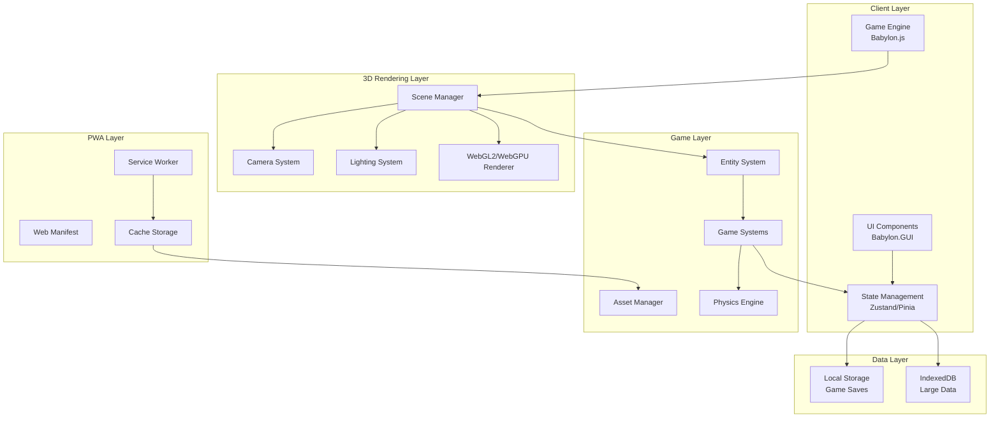
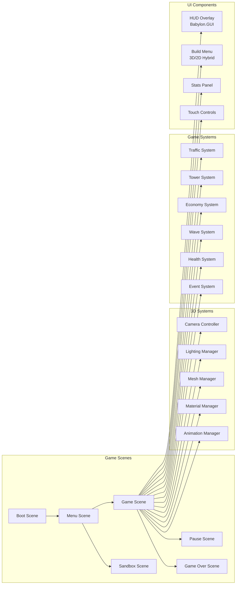

# Server Survival - 3D Tower Defense PWA Architecture Plan

## Executive Summary

This document outlines the comprehensive architectural plan for transforming the 3D "Server Survival" game into a modern, responsive 3D Tower Defense Progressive Web App (PWA). The new implementation will maintain the original game's 3D visual style and core mechanics while optimizing for mobile and desktop browsers with offline capabilities and native-like installation.

## Table of Contents

1. [Project Overview](#project-overview)
2. [Framework Selection](#framework-selection)
3. [System Architecture](#system-architecture)
4. [Responsive Design Strategy](#responsive-design-strategy)
5. [Core Game Mechanics](#core-game-mechanics)
6. [PWA Implementation](#pwa-implementation)
7. [File Structure](#file-structure)
8. [Code Examples](#code-examples)
9. [Performance Optimization](#performance-optimization)
10. [Testing Strategy](#testing-strategy)

---

## Project Overview

### Original Game Analysis

**Server Survival** is a 3D tower defense game that teaches cloud architecture concepts through gameplay:

- **Theme**: Cloud infrastructure management
- **Objective**: Build and scale infrastructure to handle traffic while surviving DDoS attacks
- **Resources**: Budget ($), Reputation (%), Service Health
- **Core Mechanics**:
  - Place defensive services (Firewall, CDN, Load Balancer, etc.)
  - Process different traffic types (Static, Read, Write, Upload, Search)
  - Block malicious attacks
  - Manage service health and repairs
  - Survive escalating traffic waves

### New Implementation Goals

1. **Maintain 3D Graphics**: Keep the immersive 3D visual style while optimizing performance
2. **Responsive Design**: Seamless experience across mobile, tablet, and desktop
3. **Touch-First Controls**: Optimize for mobile touch interactions (pan, zoom, rotate)
4. **PWA Capabilities**: Offline support, installable, push notifications
5. **Modern Tech Stack**: Use contemporary 3D frameworks and best practices

---

## Framework Selection

### Comparison: Babylon.js vs Three.js

| Feature | Babylon.js | Three.js |
|---------|-----------|----------|
| **Engine Type** | ✅ Full 3D game engine | ⚠️ 3D rendering library only |
| **Learning Curve** | 🟢 Moderate | 🟡 Steeper (need to build game systems) |
| **Mobile Performance** | ✅ Optimized for mobile | ✅ Good, but requires optimization |
| **Touch Support** | ✅ Built-in touch handling | ⚠️ Manual implementation |
| **Documentation** | ✅ Extensive tutorials and API docs | ✅ Good, but more technical |
| **Community** | ✅ Large, active community | ✅ Largest 3D web community |
| **Bundle Size** | 🟡 ~800KB (minified) | ✅ ~600KB (minified) |
| **PWA Integration** | ✅ Easy integration | ✅ Easy integration |
| **Asset Management** | ✅ Built-in asset loader | ⚠️ Manual implementation |
| **Scene Management** | ✅ Built-in scene system | ⚠️ Manual implementation |
| **Physics** | ✅ Cannon.js, Havok, Oimo | ⚠️ Need external library |
| **GUI System** | ✅ Babylon GUI | ⚠️ Need external library |
| **Input System** | ✅ Comprehensive input manager | ⚠️ Manual implementation |
| **Camera Controls** | ✅ ArcRotateCamera, UniversalCamera | ⚠️ Need external library (OrbitControls) |
| **Animation** | ✅ Built-in animation system | ✅ Good, but manual setup |
| **TypeScript Support** | ✅ First-class TypeScript | ✅ Good TypeScript support |

### Recommendation: **Babylon.js 7.0+**

**Rationale:**

1. **Complete 3D Game Engine**: Babylon.js provides all systems needed out-of-the-box (scene management, input handling, physics, GUI, camera controls), reducing development time significantly.

2. **Mobile Optimization**: Babylon.js has built-in touch handling, responsive scaling, and mobile-specific optimizations including WebGL2 support and hardware acceleration.

3. **Rich Documentation**: Extensive tutorials, API documentation, playground examples, and community resources accelerate development.

4. **Active Development**: Regular updates with modern features, WebGL2/WebGPU support, and bug fixes.

5. **PWA Ready**: Works seamlessly with service workers and offline caching strategies. Babylon.js has built-in asset management for offline scenarios.

6. **TypeScript Support**: First-class TypeScript support with complete type definitions for better code quality and maintainability.

7. **Built-in GUI System**: Babylon.GUI provides a complete UI system for creating HUDs, menus, and overlays without external dependencies.

8. **Camera Controls**: Built-in camera controllers (ArcRotateCamera for orbit, UniversalCamera for FPS-style) perfect for tower defense games.

9. **Physics Integration**: Easy integration with multiple physics engines (Cannon.js, Havok, Oimo) for collision detection and interactions.

10. **Asset Pipeline**: Built-in support for glTF/GLB models, textures, and audio with automatic loading and caching.

**Version**: Babylon.js 7.0+ (latest stable with WebGPU support and improved mobile performance)

### Alternative: Three.js + Custom Game Loop

Use Three.js if:
- You need maximum flexibility and control
- Building a highly custom 3D engine
- You're already familiar with Three.js ecosystem
- You want to leverage the largest 3D web community

**Note**: The original Server Survival uses Three.js, so migrating to Babylon.js would require rewriting the rendering code, but would provide a more complete game engine out-of-the-box.

---

## System Architecture

### High-Level Architecture Diagram



### Component Architecture



---

## Core Infrastructure

### EventBus System

Babylon.js Scene does not have a built-in event emitter. A dedicated EventBus singleton provides type-safe communication between systems:

```typescript
// src/utils/EventBus.ts
export type GameEventMap = {
  'traffic-processed': { type: TrafficType; reward: number };
  'traffic-leaked': { type: TrafficType; damage: number };
  'service-selected': { serviceId: string; serviceType: ServiceType };
  'service-placed': { position: BABYLON.Vector3; type: ServiceType };
  'service-upgraded': { serviceId: string; newLevel: number };
  'service-failed': { serviceId: string };
  'wave-started': { waveNumber: number; rps: number };
  'wave-completed': { waveNumber: number };
  'game-over': { reason: string; score: number };
  'budget-changed': { newBudget: number; delta: number };
  'reputation-changed': { newReputation: number; delta: number };
  'event-triggered': { eventId: string; duration: number };
  'event-ended': { eventId: string };
};

export type GameEvent = keyof GameEventMap;

export class EventBus {
  private static instance: EventBus;
  private listeners: Map<GameEvent, Set<((data: any) => void)>> = new Map();

  static getInstance(): EventBus {
    if (!EventBus.instance) {
      EventBus.instance = new EventBus();
    }
    return EventBus.instance;
  }

  emit<K extends GameEvent>(event: K, data: GameEventMap[K]): void {
    const eventListeners = this.listeners.get(event);
    if (eventListeners) {
      eventListeners.forEach((callback) => {
        try {
          callback(data);
        } catch (error) {
          console.error(`Error in event listener for ${event}:`, error);
        }
      });
    }
  }

  on<K extends GameEvent>(event: K, callback: (data: GameEventMap[K]) => void): () => void {
    if (!this.listeners.has(event)) {
      this.listeners.set(event, new Set());
    }
    this.listeners.get(event)!.add(callback as (data: any) => void);

    // Return unsubscribe function
    return () => {
      this.listeners.get(event)?.delete(callback as (data: any) => void);
    };
  }

  off<K extends GameEvent>(event: K, callback: (data: GameEventMap[K]) => void): void {
    this.listeners.get(event)?.delete(callback as (data: any) => void);
  }

  clear(): void {
    this.listeners.clear();
  }
}

// Global singleton instance
export const eventBus = EventBus.getInstance();
```

**Usage Example:**
```typescript
// In TrafficSystem
entity.process() {
  eventBus.emit('traffic-processed', { 
    type: this.config.type, 
    reward: this.config.reward 
  });
  this.dispose();
}

// In EconomySystem
constructor() {
  eventBus.on('traffic-processed', ({ type, reward }) => {
    this.addFunds(reward);
    this.requestsProcessed++;
  });
}
```

---

### Grid System

The grid system is essential for tower defense gameplay, handling placement validation, pathfinding, and spatial queries:

```typescript
// src/utils/GridSystem.ts
export interface GridPosition {
  x: number;
  z: number;
}

export interface GridCell {
  position: GridPosition;
  worldPosition: BABYLON.Vector3;
  isWalkable: boolean;
  isOccupied: boolean;
  entityId?: string;
  cost: number;
}

export class GridSystem {
  private grid: Map<string, GridCell> = new Map();
  private cellSize: number = 2;
  private width: number;
  private depth: number;
  private offset: BABYLON.Vector3;

  constructor(width: number, depth: number, cellSize: number = 2) {
    this.width = width;
    this.depth = depth;
    this.cellSize = cellSize;
    this.offset = new BABYLON.Vector3(-width / 2, 0, -depth / 2);
    this.initializeGrid();
  }

  private initializeGrid(): void {
    for (let x = 0; x < this.width; x++) {
      for (let z = 0; z < this.depth; z++) {
        const key = this.getKey(x, z);
        this.grid.set(key, {
          position: { x, z },
          worldPosition: this.gridToWorld({ x, z }),
          isWalkable: true,
          isOccupied: false,
          cost: 1,
        });
      }
    }
  }

  private getKey(x: number, z: number): string {
    return `${x},${z}`;
  }

  worldToGrid(worldPos: BABYLON.Vector3): GridPosition {
    const adjustedX = worldPos.x - this.offset.x;
    const adjustedZ = worldPos.z - this.offset.z;
    return {
      x: Math.floor(adjustedX / this.cellSize),
      z: Math.floor(adjustedZ / this.cellSize),
    };
  }

  gridToWorld(gridPos: GridPosition): BABYLON.Vector3 {
    return new BABYLON.Vector3(
      gridPos.x * this.cellSize + this.offset.x + this.cellSize / 2,
      0,
      gridPos.z * this.cellSize + this.offset.z + this.cellSize / 2
    );
  }

  isValidPlacement(gridPos: GridPosition): boolean {
    const cell = this.grid.get(this.getKey(gridPos.x, gridPos.z));
    return cell !== undefined && !cell.isOccupied && cell.isWalkable;
  }

  occupyCell(gridPos: GridPosition, entityId: string): boolean {
    const key = this.getKey(gridPos.x, gridPos.z);
    const cell = this.grid.get(key);
    if (cell && !cell.isOccupied) {
      cell.isOccupied = true;
      cell.isWalkable = false;
      cell.entityId = entityId;
      return true;
    }
    return false;
  }

  freeCell(gridPos: GridPosition): void {
    const key = this.getKey(gridPos.x, gridPos.z);
    const cell = this.grid.get(key);
    if (cell) {
      cell.isOccupied = false;
      cell.isWalkable = true;
      cell.entityId = undefined;
    }
  }

  getCell(gridPos: GridPosition): GridCell | undefined {
    return this.grid.get(this.getKey(gridPos.x, gridPos.z));
  }

  getEntitiesInRange(center: BABYLON.Vector3, radius: number): string[] {
    const centerGrid = this.worldToGrid(center);
    const radiusInCells = Math.ceil(radius / this.cellSize);
    const entities: string[] = [];

    for (let x = -radiusInCells; x <= radiusInCells; x++) {
      for (let z = -radiusInCells; z <= radiusInCells; z++) {
        const checkPos = { x: centerGrid.x + x, z: centerGrid.z + z };
        const cell = this.getCell(checkPos);
        if (cell && cell.entityId) {
          const distance = BABYLON.Vector3.Distance(
            center,
            cell.worldPosition
          );
          if (distance <= radius) {
            entities.push(cell.entityId);
          }
        }
      }
    }

    return entities;
  }

  snapToGrid(worldPos: BABYLON.Vector3): BABYLON.Vector3 {
    const gridPos = this.worldToGrid(worldPos);
    return this.gridToWorld(gridPos);
  }

  // FIX: Added pathfinding implementation using A* algorithm
  findPath(start: GridPosition, end: GridPosition): BABYLON.Vector3[] {
    const openSet: GridPosition[] = [start];
    const cameFrom: Map<string, GridPosition> = new Map();
    const gScore: Map<string, number> = new Map();
    const fScore: Map<string, number> = new Map();

    const key = (pos: GridPosition) => `${pos.x},${pos.z}`;

    gScore.set(key(start), 0);
    fScore.set(key(start), this.heuristic(start, end));

    while (openSet.length > 0) {
      // Get node with lowest fScore
      openSet.sort((a, b) => (fScore.get(key(a)) || Infinity) - (fScore.get(key(b)) || Infinity));
      const current = openSet.shift()!;

      if (current.x === end.x && current.z === end.z) {
        return this.reconstructPath(cameFrom, current);
      }

      // Check neighbors (4-directional: up, down, left, right)
      const neighbors: GridPosition[] = [
        { x: current.x + 1, z: current.z },
        { x: current.x - 1, z: current.z },
        { x: current.x, z: current.z + 1 },
        { x: current.x, z: current.z - 1 }
      ];

      for (const neighbor of neighbors) {
        const neighborKey = key(neighbor);
        const cell = this.grid.get(neighborKey);

        if (!cell || !cell.isWalkable) continue;

        const tentativeGScore = (gScore.get(key(current)) || Infinity) + 1;

        if (tentativeGScore < (gScore.get(neighborKey) || Infinity)) {
          cameFrom.set(neighborKey, current);
          gScore.set(neighborKey, tentativeGScore);
          fScore.set(neighborKey, tentativeGScore + this.heuristic(neighbor, end));

          if (!openSet.some(n => n.x === neighbor.x && n.z === neighbor.z)) {
            openSet.push(neighbor);
          }
        }
      }
    }

    // No path found - return direct line
    return [this.gridToWorld(start), this.gridToWorld(end)];
  }

  private heuristic(a: GridPosition, b: GridPosition): number {
    // Manhattan distance for grid movement
    return Math.abs(a.x - b.x) + Math.abs(a.z - b.z);
  }

  private reconstructPath(cameFrom: Map<string, GridPosition>, current: GridPosition): BABYLON.Vector3[] {
    const key = (pos: GridPosition) => `${pos.x},${pos.z}`;
    const path: GridPosition[] = [current];

    while (cameFrom.has(key(current))) {
      current = cameFrom.get(key(current))!;
      path.unshift(current);
    }

    return path.map(pos => this.gridToWorld(pos));
  }
}
```

---

## Responsive Design Strategy

### Breakpoint Strategy

| Device | Width | Height | Camera | Controls | UI Layout |
|--------|-------|--------|--------|----------|-----------|
| Mobile Portrait | 320-428px | 100% | Top-down/Isometric | Touch-only (pan, zoom, tap) | Stacked HUD, virtual buttons |
| Mobile Landscape | 480-896px | 100% | Isometric | Touch-only (pan, zoom, rotate) | Compact HUD, swipe gestures |
| Tablet | 768-1024px | 100% | Isometric | Touch + optional keyboard | Split HUD, gesture controls |
| Desktop | 1024px+ | 100% | Isometric/Free | Mouse + keyboard | Full HUD, keyboard shortcuts |

### 3D Camera System

**Camera Configuration:**

```typescript
// Babylon.js camera setup for responsive 3D
class CameraController {
  private camera: BABYLON.ArcRotateCamera;
  private scene: BABYLON.Scene;
  
  constructor(scene: BABYLON.Scene, canvas: HTMLCanvasElement) {
    this.scene = scene;
    this.setupCamera(canvas);
    this.setupCameraControls();
    this.setupResponsiveCamera();
  }
  
  private setupCamera(canvas: HTMLCanvasElement) {
    // Create orbit camera for tower defense gameplay
    this.camera = new BABYLON.ArcRotateCamera(
      'camera',
      -Math.PI / 4,  // Alpha (horizontal rotation)
      Math.PI / 3,   // Beta (vertical rotation)
      30,            // Radius (distance from target)
      new BABYLON.Vector3(0, 0, 0),
      scene
    );
    
    this.camera.attachControl(canvas, true);
    this.camera.wheelPrecision = 50;  // Mouse wheel zoom speed
    this.camera.lowerRadiusLimit = 10; // Minimum zoom
    this.camera.upperRadiusLimit = 80;  // Maximum zoom
    this.camera.lowerBetaLimit = 0.1;   // Minimum vertical angle
    this.camera.upperBetaLimit = Math.PI / 2 - 0.1; // Maximum vertical angle
    this.camera.panningSensibility = 50; // Pan sensitivity
    
    // Disable camera rotation on mobile (use touch gestures instead)
    if (this.isMobile()) {
      this.camera.useAutoRotationBehavior = false;
    }
  }
  
  private setupCameraControls() {
    // Keyboard shortcuts
    this.scene.onKeyboardObservable.add((kbInfo) => {
      switch (kbInfo.type) {
        case BABYLON.KeyboardEventTypes.KEYDOWN:
          this.handleKeyDown(kbInfo.event);
          break;
      }
    });
  }
  
  private handleKeyDown(event: KeyboardEvent) {
    const panSpeed = 0.5;
    switch (event.key) {
      case 'w':
      case 'ArrowUp':
        this.camera.cameraDirection.addInPlace(new BABYLON.Vector3(0, 0, panSpeed));
        break;
      case 's':
      case 'ArrowDown':
        this.camera.cameraDirection.addInPlace(new BABYLON.Vector3(0, 0, -panSpeed));
        break;
      case 'a':
      case 'ArrowLeft':
        this.camera.cameraDirection.addInPlace(new BABYLON.Vector3(panSpeed, 0, 0));
        break;
      case 'd':
      case 'ArrowRight':
        this.camera.cameraDirection.addInPlace(new BABYLON.Vector3(-panSpeed, 0, 0));
        break;
      case 'r':
        this.resetCamera();
        break;
      case 't':
        this.toggleCameraView();
        break;
    }
  }
  
  private setupResponsiveCamera() {
    // Adjust camera based on screen size
    window.addEventListener('resize', () => {
      this.adjustCameraForScreen();
    });
    
    this.adjustCameraForScreen();
  }
  
  private adjustCameraForScreen() {
    const isMobile = this.isMobile();
    const isPortrait = window.innerHeight > window.innerWidth;
    
    if (isMobile && isPortrait) {
      // Portrait mobile: more top-down view
      this.camera.beta = Math.PI / 4;
      this.camera.radius = 40;
    } else if (isMobile) {
      // Landscape mobile: isometric view
      this.camera.beta = Math.PI / 3;
      this.camera.radius = 35;
    } else {
      // Desktop/tablet: standard isometric view
      this.camera.beta = Math.PI / 3;
      this.camera.radius = 30;
    }
  }
  
  private resetCamera() {
    this.camera.alpha = -Math.PI / 4;
    this.camera.beta = Math.PI / 3;
    this.camera.radius = 30;
    this.camera.target = BABYLON.Vector3.Zero();
  }
  
  private toggleCameraView() {
    // Toggle between isometric and top-down
    if (this.camera.beta > Math.PI / 4) {
      this.camera.beta = Math.PI / 8; // Top-down
    } else {
      this.camera.beta = Math.PI / 3; // Isometric
    }
  }
  
  private isMobile(): boolean {
    return /Android|webOS|iPhone|iPad|iPod|BlackBerry|IEMobile|Opera Mini/i.test(navigator.userAgent);
  }
}
```

---

## Core Game Mechanics

> **NOTE**: The architecture uses a hybrid approach combining Zustand for global state (economy, game progress) and EventBus for decoupled game events. This provides both reactive state management and loose coupling between systems.

### State Management Pattern

```typescript
// Global game state using Zustand
interface GameState {
  budget: number;
  reputation: number;
  wave: number;
  isPaused: boolean;
  gameMode: 'survival' | 'sandbox';
  actions: {
    addFunds: (amount: number) => void;
    deductFunds: (amount: number) => void;
    startWave: (wave: number) => void;
    pause: () => void;
    resume: () => void;
  }
}

// Game events using EventBus (decoupled from state)
eventBus.on('traffic-processed', handleTrafficProcessed);
eventBus.on('service-placed', handleServicePlaced);
eventBus.on('wave-started', handleWaveStarted);
```

### 1. Traffic System (Enemies)

**Traffic Types:**

```typescript
enum TrafficType {
  STATIC = 'static',      // Green - CDN/Storage
  READ = 'read',          // Blue - SQL DB
  WRITE = 'write',        // Purple - SQL DB
  UPLOAD = 'upload',      // Orange - Storage
  SEARCH = 'search',      // Cyan - SQL DB
  MALICIOUS = 'malicious' // Red - DDoS attack
}

interface TrafficConfig {
  type: TrafficType;
  color: string;  // Hex color string (e.g., '#00FF00')
  speed: number;
  health: number;
  reward: number;
  damage: number;
  path: BABYLON.Vector3[];
}
```

### 2. Tower System (Services)

**Service Types:**

```typescript
enum ServiceType {
  FIREWALL = 'firewall',
  QUEUE = 'queue',
  LOAD_BALANCER = 'load_balancer',
  COMPUTE = 'compute',
  CDN = 'cdn',
  CACHE = 'cache',
  SQL_DB = 'sql_db',
  STORAGE = 'storage'
}

interface ServiceConfig {
  type: ServiceType;
  name: string;
  cost: number;
  capacity: number;
  upkeep: number;
  range: number;
  damage: number;
  attackSpeed: number;
  color: string;  // Hex color string (e.g., '#3498db')
  icon: string;
  upgradeLevels: number;
}
```

### 3. Economy System

```typescript
class EconomyManager {
  private budget: number = 1000;
  private reputation: number = 100;
  private income: number = 0;
  private expenses: number = 0;
  
  // Scoring
  private score: number = 0;
  private requestsProcessed: number = 0;
  private attacksBlocked: number = 0;
  
  processRequest(type: TrafficType, success: boolean) {
    if (success) {
      const reward = this.getRequestReward(type);
      this.addFunds(reward);
      this.addScore(this.getRequestScore(type));
      this.addReputation(0.1);
      this.requestsProcessed++;
    } else {
      this.loseReputation(1);
    }
  }
  
  blockAttack() {
    this.addFunds(0.5);
    this.addScore(10);
    this.attacksBlocked++;
  }
  
  attackLeaked() {
    this.loseReputation(5);
  }
  
  checkGameOver(): { gameOver: boolean; reason?: string } {
    if (this.reputation <= 0) {
      return { gameOver: true, reason: 'Reputation destroyed!' };
    }
    if (this.budget < -1000) {
      return { gameOver: true, reason: 'Bankrupt!' };
    }
    return { gameOver: false };
  }
}
```

### 4. Wave System

```typescript
class WaveManager {
  private currentWave: number = 0;
  
  startWave(waveNumber: number) {
    this.currentWave = waveNumber;
    const config = this.getWaveConfig(waveNumber);
    
    // Spawn traffic based on wave config
    config.traffic.forEach((traffic, index) => {
      setTimeout(() => {
        this.trafficManager.spawnTraffic(traffic.type, traffic.path);
      }, index * config.interval);
    });
  }
  
  private getWaveConfig(waveNumber: number): WaveConfig {
    const gameTime = waveNumber * 60000; // 1 minute per wave
    
    // RPS acceleration: ×1.3 at 1min → ×4.0 at 10min
    const rpsMultiplier = Math.min(1.3 + (gameTime / 600000) * 2.7, 4.0);
    
    // Traffic mix shifts every 40 seconds
    const trafficMix = this.getTrafficMix(waveNumber);
    
    // DDoS spikes every 45 seconds
    const hasDDoS = waveNumber % 3 === 0;
    
    return {
      waveNumber,
      duration: 60000,
      rps: Math.floor(10 * rpsMultiplier),
      traffic: this.generateTraffic(trafficMix, hasDDoS),
      interval: 1000 / (10 * rpsMultiplier)
    };
  }
}
```

### 5. Health System

```typescript
class HealthSystem {
  private services: Map<string, ServiceHealth> = new Map();
  
  registerService(service: ServiceEntity) {
    this.services.set(service.id, {
      currentHealth: 100,
      maxHealth: 100,
      degradationRate: this.calculateDegradationRate(service)
    });
  }
  
  private calculateDegradationRate(service: ServiceEntity): number {
    // Services degrade faster under load
    const load = service.getCurrentLoad();
    const baseRate = 0.1; // 0.1% per second base
    return baseRate * (1 + load / service.config.capacity);
  }
  
  repairService(id: string) {
    const health = this.services.get(id);
    const service = this.serviceManager.getService(id);
    
    if (health && service) {
      // FIX: Use config value instead of magic number 0.15
      const repairCost = service.config.cost * GAME_CONFIG.REPAIR_COST_MULTIPLIER;
      
      if (this.economy.canAfford(repairCost)) {
        this.economy.deductFunds(repairCost);
        health.currentHealth = health.maxHealth;
        service.setFailed(false);
        service.setCapacityMultiplier(1);
        service.updateHealthBar(1);
      }
    }
  }
}
```

### 6. Event System

```typescript
class EventManager {
  private activeEvent: GameEvent | null = null;
  
  private triggerRandomEvent() {
    const events = this.getAvailableEvents();
    const event = events[Math.floor(Math.random() * events.length)];
    
    this.activeEvent = {
      ...event,
      startTime: Date.now(),
      duration: event.duration
    };
    
    this.applyEventEffects(this.activeEvent);
    this.showEventNotification(this.activeEvent);
    
    // Schedule event end
    setTimeout(() => this.endEvent(), event.duration);
  }
  
  private getAvailableEvents(): GameEventTemplate[] {
    return [
      {
        id: 'cost_spike',
        name: 'Market Volatility',
        description: 'Service costs increased by 50%',
        duration: 30000,
        effect: () => this.economy.multiplyCosts(1.5),
        cleanup: () => this.economy.multiplyCosts(1/1.5)
      },
      {
        id: 'capacity_drop',
        name: 'Server Overload',
        description: 'All services at 50% capacity',
        duration: 20000,
        effect: () => this.serviceManager.setAllCapacityMultiplier(0.5),
        cleanup: () => this.serviceManager.setAllCapacityMultiplier(1)
      },
      {
        id: 'traffic_burst',
        name: 'Flash Sale',
        description: 'Traffic increased by 200%',
        duration: 15000,
        effect: () => this.trafficManager.multiplyRPS(3),
        cleanup: () => this.trafficManager.multiplyRPS(1/3)
      },
      {
        id: 'ddos_attack',
        name: 'DDoS Attack',
        description: '50% malicious traffic',
        duration: 20000,
        effect: () => this.trafficManager.setMaliciousRatio(0.5),
        cleanup: () => this.trafficManager.setMaliciousRatio(0)
      }
    ];
  }
}
```

---

## PWA Implementation

### Service Worker Architecture

```typescript
// public/sw.js
// FIX: Using Workbox for automatic cache busting with Vite's build hashes

import { precacheAndRoute, cleanupOutdatedCaches } from 'workbox-precaching';
import { registerRoute, StaleWhileRevalidate } from 'workbox-routing';
import { CacheFirst } from 'workbox-strategies';
import { ExpirationPlugin } from 'workbox-expiration';

// Automatically precache assets from Vite's manifest
precacheAndRoute(self.__WB_MANIFEST);

// Clean up old caches on activation
cleanupOutdatedCaches();

// Cache runtime requests for assets
registerRoute(
  ({ request }) => request.destination === 'image' ||
                    request.destination === 'font' ||
                    request.destination === 'audio',
  new CacheFirst({
    cacheName: 'assets-cache',
    plugins: [
      new ExpirationPlugin({
        maxEntries: 100,
        maxAgeSeconds: 30 * 24 * 60 * 60 // 30 days
      })
    ]
  })
);

// Stale-while-revalidate for API calls (if any)
registerRoute(
  ({ url }) => url.pathname.startsWith('/api/'),
  new StaleWhileRevalidate({
    cacheName: 'api-cache',
    plugins: [
      new ExpirationPlugin({
        maxEntries: 50,
        maxAgeSeconds: 60 * 60 // 1 hour
      })
    ]
  })
);

self.addEventListener('install', (event) => {
  self.skipWaiting();
});

self.addEventListener('activate', (event) => {
  event.waitUntil(self.clients.claim());
});
```

### Web App Manifest

```json
{
  "name": "Server Survival - 3D Tower Defense",
  "short_name": "Server Survival",
  "description": "Build cloud infrastructure, survive traffic, learn scaling in this 3D tower defense game",
  "start_url": "/",
  "display": "standalone",
  "background_color": "#1a1a2e",
  "theme_color": "#16213e",
  "orientation": "any",
  "scope": "/",
  "icons": [
    {
      "src": "/assets/icons/icon-72x72.png",
      "sizes": "72x72",
      "type": "image/png",
      "purpose": "any maskable"
    },
    {
      "src": "/assets/icons/icon-96x96.png",
      "sizes": "96x96",
      "type": "image/png",
      "purpose": "any maskable"
    },
    {
      "src": "/assets/icons/icon-128x128.png",
      "sizes": "128x128",
      "type": "image/png",
      "purpose": "any maskable"
    },
    {
      "src": "/assets/icons/icon-144x144.png",
      "sizes": "144x144",
      "type": "image/png",
      "purpose": "any maskable"
    },
    {
      "src": "/assets/icons/icon-152x152.png",
      "sizes": "152x152",
      "type": "image/png",
      "purpose": "any maskable"
    },
    {
      "src": "/assets/icons/icon-192x192.png",
      "sizes": "192x192",
      "type": "image/png",
      "purpose": "any maskable"
    },
    {
      "src": "/assets/icons/icon-384x384.png",
      "sizes": "384x384",
      "type": "image/png",
      "purpose": "any maskable"
    },
    {
      "src": "/assets/icons/icon-512x512.png",
      "sizes": "512x512",
      "type": "image/png",
      "purpose": "any maskable"
    }
  ],
  "screenshots": [
    {
      "src": "/assets/screenshots/gameplay-1.png",
      "sizes": "1280x720",
      "type": "image/png",
      "form_factor": "wide"
    },
    {
      "src": "/assets/screenshots/gameplay-mobile.png",
      "sizes": "540x960",
      "type": "image/png",
      "form_factor": "narrow"
    }
  ],
  "categories": ["games", "entertainment"],
  "shortcuts": [
    {
      "name": "Quick Play",
      "short_name": "Play",
      "description": "Start a new survival game",
      "url": "/?mode=survival",
      "icons": [{ "src": "/assets/icons/play-96x96.png", "sizes": "96x96" }]
    },
    {
      "name": "Sandbox",
      "short_name": "Sandbox",
      "description": "Open sandbox mode",
      "url": "/?mode=sandbox",
      "icons": [{ "src": "/assets/icons/sandbox-96x96.png", "sizes": "96x96" }]
    }
  ]
}
```

### Game Configuration Constants

```typescript
// src/config/game.config.ts

// FIX: Centralized configuration to avoid magic numbers throughout codebase
export const GAME_CONFIG = {
  // Economy
  INITIAL_BUDGET: 1000,
  INITIAL_REPUTATION: 100,
  GAME_OVER_BANKRUPTCY_THRESHOLD: -1000,
  REPAIR_COST_MULTIPLIER: 0.15,
  UPGRADE_COST_MULTIPLIER: 0.75,

  // Upgrade Multipliers
  UPGRADE_DAMAGE_MULTIPLIER: 1.2,
  UPGRADE_RANGE_MULTIPLIER: 1.1,
  UPGRADE_CAPACITY_MULTIPLIER: 1.3,
  UPGRADE_ATTACK_SPEED_MULTIPLIER: 0.9,

  // Wave Settings
  WAVE_DURATION_MS: 60000,
  TRAFFIC_INTERVAL_BASE: 1000,
  RPS_ACCELERATION_MIN: 1.3,
  RPS_ACCELERATION_MAX: 4.0,

  // Service Health
  MAX_SERVICE_HEALTH: 100,
  BASE_DEGRADATION_RATE: 0.1,

  // Object Pooling
  TRAFFIC_POOL_MAX_SIZE: 100,
  SERVICE_POOL_MAX_SIZE: 50,

  // Grid Settings
  GRID_CELL_SIZE: 2,

  // Camera Settings
  CAMERA_MIN_RADIUS: 10,
  CAMERA_MAX_RADIUS: 80,
  CAMERA_DEFAULT_RADIUS: 30,
} as const;
```

---

## File Structure

```
sz_server_survival/
├── public/
│   ├── index.html
│   ├── manifest.json
│   ├── sw.js
│   └── assets/
│       ├── models/
│       │   ├── services.glb
│       │   ├── traffic.glb
│       │   └── environment.glb
│       ├── textures/
│       │   ├── services.png
│       │   ├── traffic.png
│       │   └── environment.png
│       ├── audio/
│       │   ├── music/
│       │   ├── sfx/
│       │   └── voice/
│       ├── fonts/
│       │   ├── main-font.woff2
│       │   └── ui-font.woff2
│       ├── icons/
│       │   ├── icon-72x72.png
│       │   ├── icon-96x96.png
│       │   ├── ...
│       │   └── icon-512x512.png
│       └── screenshots/
│           ├── gameplay-1.png
│           └── gameplay-mobile.png
├── src/
│   ├── main.ts
│   ├── config/
│   │   ├── game.config.ts
│   │   ├── services.config.ts
│   │   └── traffic.config.ts
│   ├── scenes/
│   │   ├── BootScene.ts
│   │   ├── MenuScene.ts
│   │   ├── GameScene.ts
│   │   ├── PauseScene.ts
│   │   ├── GameOverScene.ts
│   │   └── SandboxScene.ts
│   ├── systems/
│   │   ├── TrafficSystem.ts
│   │   ├── ServiceSystem.ts
│   │   ├── EconomySystem.ts
│   │   ├── WaveSystem.ts
│   │   ├── HealthSystem.ts
│   │   └── EventSystem.ts
│   ├── entities/
│   │   ├── TrafficEntity.ts
│   │   ├── ServiceEntity.ts
│   │   └── ParticleEntity.ts
│   ├── ui/
│   │   ├── HUD.ts
│   │   ├── BuildMenu.ts
│   │   ├── StatsPanel.ts
│   │   ├── Controls.ts
│   │   └── VirtualControls.ts
│   ├── managers/
│   │   ├── InputManager.ts
│   │   ├── CameraController.ts
│   │   ├── SaveManager.ts
│   │   ├── AudioManager.ts
│   │   └── PWAInstaller.ts
│   ├── utils/
│   │   ├── GridSystem.ts
│   │   ├── Pathfinding.ts
│   │   └── Helpers.ts
│   └── types/
│       ├── game.types.ts
│       ├── traffic.types.ts
│       └── service.types.ts
├── tests/
│   ├── unit/
│   │   ├── TrafficSystem.test.ts
│   │   ├── EconomySystem.test.ts
│   │   └── WaveSystem.test.ts
│   └── integration/
│       └── GameFlow.test.ts
├── plans/
│   ├── architecture-plan.md
│   └── architecture-plan-3d.md
├── package.json
├── tsconfig.json
├── vite.config.ts
├── .eslintrc.json
└── README.md
```

---

## Code Examples

### 1. Main Game Entry Point

```typescript
// src/main.ts
import * as BABYLON from '@babylonjs/core';
import '@babylonjs/loaders/glTF';
import '@babylonjs/gui';
import BootScene from './scenes/BootScene';
import MenuScene from './scenes/MenuScene';
import GameScene from './scenes/GameScene';
import PauseScene from './scenes/PauseScene';
import GameOverScene from './scenes/GameOverScene';
import SandboxScene from './scenes/SandboxScene';
import { GAME_CONFIG } from './config/game.config';

class Game {
  private canvas: HTMLCanvasElement;
  private engine: BABYLON.Engine;
  private currentScene: BABYLON.Scene | null = null;
  private sceneManager: SceneManager;

  constructor() {
    this.canvas = document.getElementById('render-canvas') as HTMLCanvasElement;
    this.engine = new BABYLON.Engine(this.canvas, true, {
      preserveDrawingBuffer: true,
      stencil: true,
      disableWebGL2Support: false
    });

    this.sceneManager = new SceneManager(this.engine);
    this.setupEngine();
    this.registerServiceWorker();
    this.start();
  }

  private setupEngine() {
    this.engine.enableOfflineSupport = true;
    this.engine.setHardwareScalingLevel(1.0);
    
    window.addEventListener('resize', () => {
      this.engine.resize();
    });
    
    this.engine.setFramesPerSecond(60);
  }

  private registerServiceWorker() {
    if ('serviceWorker' in navigator) {
      navigator.serviceWorker.register('/sw.js')
        .then((registration) => {
          console.log('SW registered:', registration);
        })
        .catch((error) => {
          console.log('SW registration failed:', error);
        });
    }
  }

  private async start() {
    await this.sceneManager.switchScene('BootScene');
    
    this.engine.runRenderLoop(() => {
      if (this.currentScene) {
        this.currentScene.render();
      }
    });
  }
}

class SceneManager {
  private scenes: Map<string, () => BABYLON.Scene> = new Map();
  private currentScene: BABYLON.Scene | null = null;

  constructor(private engine: BABYLON.Engine) {
    this.registerScenes();
  }

  private registerScenes() {
    this.scenes.set('BootScene', () => new BootScene(this.engine).create());
    this.scenes.set('MenuScene', () => new MenuScene(this.engine).create());
    this.scenes.set('GameScene', () => new GameScene(this.engine).create());
    this.scenes.set('PauseScene', () => new PauseScene(this.engine).create());
    this.scenes.set('GameOverScene', () => new GameOverScene(this.engine).create());
    this.scenes.set('SandboxScene', () => new SandboxScene(this.engine).create());
  }

  async switchScene(sceneName: string, data?: any): Promise<void> {
    const sceneFactory = this.scenes.get(sceneName);
    if (!sceneFactory) {
      throw new Error(`Scene ${sceneName} not found`);
    }

    // Create new scene first
    const newScene = sceneFactory();

    // Initialize new scene with data if provided
    if (data && newScene['initialize']) {
      await newScene['initialize'](data);
    }

    // FIX: Proper scene cleanup order to prevent memory leaks
    const oldScene = this.currentScene;
    this.currentScene = newScene;

    if (oldScene) {
      // 1. Stop render loop for old scene
      this.engine.stopRenderLoop();

      // 2. Dispose event listeners
      oldScene.onPointerObservable.clear();
      oldScene.onKeyboardObservable.clear();

      // 3. Clear object pools
      if (oldScene.metadata?.trafficPool) {
        oldScene.metadata.trafficPool.clear();
      }

      // 4. Dispose scene (this disposes all meshes, materials, etc.)
      oldScene.dispose();
    }
  }

  getCurrentScene(): BABYLON.Scene | null {
    return this.currentScene;
  }
}

new Game();
```

### 2. 3D Traffic Entity

```typescript
// src/entities/TrafficEntity.ts
import * as BABYLON from '@babylonjs/core';
import { TrafficType, TrafficConfig } from '../types/traffic.types';
import { eventBus } from '../utils/EventBus';

export default class TrafficEntity {
  private mesh: BABYLON.Mesh;
  private config: TrafficConfig;
  private path: BABYLON.Vector3[];
  private currentPathIndex: number = 0;
  private speed: number;
  private health: number;
  private maxHealth: number;
  private isProcessed: boolean = false;
  private healthBarMesh: BABYLON.Mesh;

  constructor(
    scene: BABYLON.Scene,
    position: BABYLON.Vector3,
    config: TrafficConfig,
    path: BABYLON.Vector3[]
  ) {
    this.config = config;
    this.path = path;
    this.speed = config.speed;
    this.health = config.health;
    this.maxHealth = config.health;
    
    this.mesh = this.createMesh(scene, position, config);
    this.healthBarMesh = this.createHealthBar(scene);
    
    this.mesh.metadata = {
      type: 'traffic',
      id: this.generateId(),
      config: config
    };
  }

  private createMesh(scene: BABYLON.Scene, position: BABYLON.Vector3, config: TrafficConfig): BABYLON.Mesh {
    let mesh: BABYLON.Mesh;
    
    switch (config.type) {
      case TrafficType.STATIC:
        mesh = BABYLON.MeshBuilder.CreateBox('traffic-static', { size: 1 }, scene);
        break;
      case TrafficType.READ:
        mesh = BABYLON.MeshBuilder.CreateSphere('traffic-read', { diameter: 1 }, scene);
        break;
      case TrafficType.WRITE:
        mesh = BABYLON.MeshBuilder.CreateCylinder('traffic-write', { height: 1.5, diameter: 0.8 }, scene);
        break;
      case TrafficType.UPLOAD:
        mesh = BABYLON.MeshBuilder.CreateTorus('traffic-upload', { diameter: 1, thickness: 0.2 }, scene);
        break;
      case TrafficType.SEARCH:
        mesh = BABYLON.MeshBuilder.CreatePolyhedron('traffic-search', { type: 1, size: 0.8 }, scene);
        break;
      case TrafficType.MALICIOUS:
        mesh = BABYLON.MeshBuilder.CreateCone('traffic-malicious', { height: 1.5, diameter: 1 }, scene);
        break;
      default:
        mesh = BABYLON.MeshBuilder.CreateBox('traffic-default', { size: 1 }, scene);
    }

    mesh.position = position.clone();
    
    const material = new BABYLON.StandardMaterial(`traffic-material-${config.type}`, scene);
    material.diffuseColor = BABYLON.Color3.FromHexString(config.color);
    material.emissiveColor = BABYLON.Color3.FromHexString(config.color).scale(0.3);
    mesh.material = material;

    if (config.type === TrafficType.MALICIOUS) {
      const glowLayer = new BABYLON.GlowLayer('malicious-glow', scene);
      glowLayer.intensity = 0.5;
    }

    return mesh;
  }

  private createHealthBar(scene: BABYLON.Scene): BABYLON.Mesh {
    const healthBarBg = BABYLON.MeshBuilder.CreatePlane('health-bar-bg', { width: 2, height: 0.2 }, scene);
    const bgMaterial = new BABYLON.StandardMaterial('health-bar-bg-material', scene);
    bgMaterial.diffuseColor = new BABYLON.Color3(0.2, 0.2, 0.2);
    bgMaterial.disableLighting = true;
    healthBarBg.material = bgMaterial;
    healthBarBg.billboardMode = BABYLON.Mesh.BILLBOARDMODE_ALL;
    healthBarBg.position = new BABYLON.Vector3(0, 1.5, 0);
    healthBarBg.parent = this.mesh;

    const healthBarFill = BABYLON.MeshBuilder.CreatePlane('health-bar-fill', { width: 2, height: 0.2 }, scene);
    const fillMaterial = new BABYLON.StandardMaterial('health-bar-fill-material', scene);
    fillMaterial.diffuseColor = new BABYLON.Color3(0.3, 0.69, 0.31);
    fillMaterial.disableLighting = true;
    healthBarFill.material = fillMaterial;
    healthBarFill.billboardMode = BABYLON.Mesh.BILLBOARDMODE_ALL;
    healthBarFill.position = new BABYLON.Vector3(0, 1.5, 0.01);
    healthBarFill.parent = this.mesh;

    (healthBarFill as any).isHealthBar = true;
    
    return healthBarFill;
  }

  followPath(path: BABYLON.Vector3[]) {
    this.path = path;
    this.currentPathIndex = 0;
    this.moveToNextPoint();
  }

  private moveToNextPoint() {
    if (this.currentPathIndex >= this.path.length) {
      this.reachDestination();
      return;
    }

    const target = this.path[this.currentPathIndex];
    const distance = BABYLON.Vector3.Distance(this.mesh.position, target);
    const duration = (distance / this.speed) * 1000;

    BABYLON.Animation.CreateAndStartAnimation(
      'move',
      this.mesh,
      'position',
      60,
      duration / 16.67,
      this.mesh.position,
      target,
      BABYLON.Animation.ANIMATIONLOOPMODE_CONSTANT,
      new BABYLON.QuadraticEase(),
      () => {
        this.currentPathIndex++;
        this.moveToNextPoint();
      }
    );

    const direction = target.subtract(this.mesh.position).normalize();
    this.mesh.lookAt(this.mesh.position.add(direction));
  }

  private reachDestination() {
    if (!this.isProcessed) {
      eventBus.emit('traffic-leaked', { type: this.config.type, damage: this.config.damage });
    }
    this.dispose();
  }

  takeDamage(damage: number): boolean {
    this.health -= damage;
    this.updateHealthBar();
    
    this.flashMesh();
    
    if (this.health <= 0) {
      this.createDeathEffect();
      this.dispose();
      return true;
    }
    
    return false;
  }

  private flashMesh() {
    const originalColor = (this.mesh.material as BABYLON.StandardMaterial).diffuseColor.clone();
    (this.mesh.material as BABYLON.StandardMaterial).diffuseColor = new BABYLON.Color3(1, 1, 1);
    
    setTimeout(() => {
      (this.mesh.material as BABYLON.StandardMaterial).diffuseColor = originalColor;
    }, 100);
  }

  private createDeathEffect() {
    const particleSystem = new BABYLON.ParticleSystem('death-particles', 50, this.mesh.scene);
    // FIX: Use AssetManager to ensure texture is preloaded
    const particleTexture = this.mesh.scene.getTextureByName('particle_texture');
    particleSystem.particleTexture = particleTexture || new BABYLON.Texture('assets/textures/particle.png', this.mesh.scene);
    particleSystem.emitter = this.mesh.position;
    particleSystem.minEmitBox = new BABYLON.Vector3(-0.5, -0.5, -0.5);
    particleSystem.maxEmitBox = new BABYLON.Vector3(0.5, 0.5, 0.5);
    particleSystem.color1 = new BABYLON.Color4(1, 0.5, 0, 1);
    particleSystem.color2 = new BABYLON.Color4(1, 0, 0, 1);
    particleSystem.minSize = 0.1;
    particleSystem.maxSize = 0.3;
    particleSystem.minLifeTime = 0.5;
    particleSystem.maxLifeTime = 1;
    particleSystem.emitRate = 100;
    particleSystem.blendMode = BABYLON.ParticleSystem.BLENDMODE_ONEONE;
    particleSystem.gravity = new BABYLON.Vector3(0, -9.81, 0);
    particleSystem.start();
    
    setTimeout(() => {
      particleSystem.stop();
      setTimeout(() => particleSystem.dispose(), 1000);
    }, 1000);
  }

  process() {
    this.isProcessed = true;
    eventBus.emit('traffic-processed', { type: this.config.type, reward: this.config.reward });
    this.dispose();
  }

  // Reset method for object pooling
  reset(position: BABYLON.Vector3, config: TrafficConfig, path: BABYLON.Vector3[]): void {
    this.config = config;
    this.path = path;
    this.speed = config.speed;
    this.health = config.health;
    this.maxHealth = config.health;
    this.currentPathIndex = 0;
    this.isProcessed = false;
    
    this.mesh.position = position.clone();
    this.mesh.setEnabled(true);
    
    // Reset health bar
    this.updateHealthBar();
  }

  private updateHealthBar() {
    const healthPercent = this.health / this.maxHealth;
    const healthBar = this.healthBarMesh;
    
    if (healthBar) {
      healthBar.scaling.x = healthPercent;
      
      const material = healthBar.material as BABYLON.StandardMaterial;
      if (healthPercent > 0.5) {
        material.diffuseColor = new BABYLON.Color3(0.3, 0.69, 0.31);
      } else if (healthPercent > 0.25) {
        material.diffuseColor = new BABYLON.Color3(1, 0.76, 0.03);
      } else {
        material.diffuseColor = new BABYLON.Color3(0.96, 0.26, 0.21);
      }
    }
  }

  private generateId(): string {
    // FIX: Use incremental counter instead of Date.now() to prevent duplicates
    // In production, use a proper UUID library like 'uuid'
    return `traffic-${Date.now()}-${TrafficEntity.idCounter++}`;
  }

  // Add static counter for unique ID generation
  private static idCounter = 0;

  dispose() {
    if (this.healthBarMesh) {
      this.healthBarMesh.dispose();
    }
    if (this.mesh) {
      this.mesh.dispose();
    }
  }
}
```

### 3. 3D Service Entity

```typescript
// src/entities/ServiceEntity.ts
import * as BABYLON from '@babylonjs/core';
import { ServiceType, ServiceConfig } from '../types/service.types';
import { eventBus } from '../utils/EventBus';

export default class ServiceEntity {
  public readonly id: string;
  public config: ServiceConfig;
  private level: number = 1;
  private health: number = 100;
  private maxHealth: number = 100;
  private isAutoRepairEnabled: boolean = false;
  private isFailed: boolean = false;
  private capacityMultiplier: number = 1;
  private currentLoad: number = 0;
  
  private mesh: BABYLON.Mesh;
  private rangeIndicator: BABYLON.Mesh;
  private healthBarMesh: BABYLON.Mesh;
  private glowLayer: BABYLON.GlowLayer | null = null;

  constructor(
    scene: BABYLON.Scene,
    position: BABYLON.Vector3,
    config: ServiceConfig,
    id: string
  ) {
    this.id = id;
    this.config = config;
    
    this.mesh = this.createMesh(scene, position, config);
    this.rangeIndicator = this.createRangeIndicator(scene);
    this.healthBarMesh = this.createHealthBar(scene);
    
    this.mesh.metadata = {
      type: 'service',
      id: id,
      config: config
    };
    
    this.setupInteraction(scene);
  }

  private createMesh(scene: BABYLON.Scene, position: BABYLON.Vector3, config: ServiceConfig): BABYLON.Mesh {
    let mesh: BABYLON.Mesh;
    
    switch (config.type) {
      case ServiceType.FIREWALL:
        mesh = BABYLON.MeshBuilder.CreateBox('service-firewall', { width: 2, height: 2, depth: 0.5 }, scene);
        break;
      case ServiceType.QUEUE:
        mesh = BABYLON.MeshBuilder.CreateBox('service-queue', { width: 2, height: 1.5, depth: 2 }, scene);
        break;
      case ServiceType.LOAD_BALANCER:
        mesh = BABYLON.MeshBuilder.CreateCylinder('service-load-balancer', { height: 1, diameter: 2 }, scene);
        break;
      case ServiceType.COMPUTE:
        mesh = BABYLON.MeshBuilder.CreateBox('service-compute', { width: 1.5, height: 2, depth: 1.5 }, scene);
        break;
      case ServiceType.CDN:
        mesh = BABYLON.MeshBuilder.CreateSphere('service-cdn', { diameter: 2 }, scene);
        break;
      case ServiceType.CACHE:
        mesh = BABYLON.MeshBuilder.CreateCylinder('service-cache', { height: 1.5, diameter: 1.5 }, scene);
        break;
      case ServiceType.SQL_DB:
        mesh = BABYLON.MeshBuilder.CreateCylinder('service-sql-db', { height: 2, diameter: 2 }, scene);
        break;
      case ServiceType.STORAGE:
        mesh = BABYLON.MeshBuilder.CreateBox('service-storage', { width: 2, height: 1, depth: 1.5 }, scene);
        break;
      default:
        mesh = BABYLON.MeshBuilder.CreateBox('service-default', { size: 2 }, scene);
    }

    mesh.position = position.clone();
    mesh.position.y = 1;
    
    const material = new BABYLON.StandardMaterial(`service-material-${config.type}`, scene);
    material.diffuseColor = BABYLON.Color3.FromHexString(config.color);
    material.specularColor = new BABYLON.Color3(0.3, 0.3, 0.3);
    mesh.material = material;

    // CRITICAL FIX: Do NOT create per-entity GlowLayer - use scene-level GlowLayer instead
    // This was a major performance/memory leak in the original plan
    // Instead, let the scene manage a single GlowLayer for all services
    // Example: scene.getGlowLayerByName('services-glow') || new BABYLON.GlowLayer('services-glow', scene);

    return mesh;
  }

  private createRangeIndicator(scene: BABYLON.Scene): BABYLON.Mesh {
    const rangeIndicator = BABYLON.MeshBuilder.CreateDisc('range-indicator', {
      radius: this.config.range,
      tessellation: 32
    }, scene);
    
    const material = new BABYLON.StandardMaterial('range-indicator-material', scene);
    material.diffuseColor = BABYLON.Color3.FromHexString(this.config.color);
    material.alpha = 0.3;
    material.disableLighting = true;
    rangeIndicator.material = material;
    
    rangeIndicator.rotation.x = Math.PI / 2;
    rangeIndicator.position.y = 0.1;
    rangeIndicator.isVisible = false;
    rangeIndicator.parent = this.mesh;
    
    return rangeIndicator;
  }

  private createHealthBar(scene: BABYLON.Scene): BABYLON.Mesh {
    const healthBarBg = BABYLON.MeshBuilder.CreatePlane('health-bar-bg', { width: 2, height: 0.2 }, scene);
    const bgMaterial = new BABYLON.StandardMaterial('health-bar-bg-material', scene);
    bgMaterial.diffuseColor = new BABYLON.Color3(0.2, 0.2, 0.2);
    bgMaterial.disableLighting = true;
    healthBarBg.material = bgMaterial;
    healthBarBg.billboardMode = BABYLON.Mesh.BILLBOARDMODE_ALL;
    healthBarBg.position = new BABYLON.Vector3(0, 2.5, 0);
    healthBarBg.parent = this.mesh;

    const healthBarFill = BABYLON.MeshBuilder.CreatePlane('health-bar-fill', { width: 2, height: 0.2 }, scene);
    const fillMaterial = new BABYLON.StandardMaterial('health-bar-fill-material', scene);
    fillMaterial.diffuseColor = new BABYLON.Color3(0.3, 0.69, 0.31);
    fillMaterial.disableLighting = true;
    healthBarFill.material = fillMaterial;
    healthBarFill.billboardMode = BABYLON.Mesh.BILLBOARDMODE_ALL;
    healthBarFill.position = new BABYLON.Vector3(0, 2.5, 0.01);
    healthBarFill.parent = this.mesh;

    (healthBarFill as any).isHealthBar = true;
    
    return healthBarFill;
  }

  private setupInteraction(scene: BABYLON.Scene) {
    scene.onPointerObservable.add((pointerInfo) => {
      if (pointerInfo.type === BABYLON.PointerEventTypes.POINTERDOWN) {
        if (pointerInfo.pickInfo.hit && pointerInfo.pickInfo.pickedMesh === this.mesh) {
          this.handleClick();
        }
      }
      
      if (pointerInfo.type === BABYLON.PointerEventTypes.POINTEROVER) {
        if (pointerInfo.pickInfo.hit && pointerInfo.pickInfo.pickedMesh === this.mesh) {
          this.handleHover();
        }
      }
      
      if (pointerInfo.type === BABYLON.PointerEventTypes.POINTEROUT) {
        if (pointerInfo.pickInfo.pickedMesh === this.mesh) {
          this.handleHoverOut();
        }
      }
    });
  }

  private handleClick() {
    eventBus.emit('service-selected', { serviceId: this.id, serviceType: this.config.type });
    this.showRange();
  }

  private handleHover() {
    this.mesh.scaling = new BABYLON.Vector3(1.1, 1.1, 1.1);
    this.showRange();
  }

  private handleHoverOut() {
    this.mesh.scaling = new BABYLON.Vector3(1, 1, 1);
    this.hideRange();
  }

  private showRange() {
    this.rangeIndicator.isVisible = true;
  }

  private hideRange() {
    this.rangeIndicator.isVisible = false;
  }

  upgrade() {
    if (this.level >= this.config.upgradeLevels) return;
    
    this.level++;
    
    // FIX: Use config values instead of magic numbers
    this.config.damage *= GAME_CONFIG.UPGRADE_DAMAGE_MULTIPLIER;
    this.config.range *= GAME_CONFIG.UPGRADE_RANGE_MULTIPLIER;
    this.config.capacity *= GAME_CONFIG.UPGRADE_CAPACITY_MULTIPLIER;
    this.config.attackSpeed *= GAME_CONFIG.UPGRADE_ATTACK_SPEED_MULTIPLIER;
    
    this.rangeIndicator.dispose();
    this.rangeIndicator = this.createRangeIndicator(this.mesh.scene);
    
    this.animateUpgrade();
  }

  private animateUpgrade() {
    BABYLON.Animation.CreateAndStartAnimation(
      'upgrade',
      this.mesh,
      'scaling',
      60,
      20,
      new BABYLON.Vector3(1, 1, 1),
      new BABYLON.Vector3(1.3, 1.3, 1.3),
      BABYLON.Animation.ANIMATIONLOOPMODE_CONSTANT,
      new BABYLON.QuadraticEase(),
      () => {
        BABYLON.Animation.CreateAndStartAnimation(
          'upgrade-down',
          this.mesh,
          'scaling',
          60,
          20,
          new BABYLON.Vector3(1.3, 1.3, 1.3),
          new BABYLON.Vector3(1, 1, 1),
          BABYLON.Animation.ANIMATIONLOOPMODE_CONSTANT
        );
      }
    );
  }

  canUpgrade(): boolean {
    return this.level < this.config.upgradeLevels;
  }

  getUpgradeCost(): number {
    // FIX: Use config value instead of magic number 0.75
    return Math.floor(this.config.cost * GAME_CONFIG.UPGRADE_COST_MULTIPLIER * this.level);
  }

  getCurrentLoad(): number {
    return this.currentLoad;
  }

  setLoad(load: number) {
    this.currentLoad = load;
  }

  setCapacityMultiplier(multiplier: number) {
    this.capacityMultiplier = multiplier;
  }

  setAutoRepair(enabled: boolean) {
    this.isAutoRepairEnabled = enabled;
  }

  isAutoRepairEnabled(): boolean {
    return this.isAutoRepairEnabled;
  }

  setFailed(failed: boolean) {
    this.isFailed = failed;
    if (failed) {
      (this.mesh.material as BABYLON.StandardMaterial).diffuseColor = new BABYLON.Color3(0.4, 0.4, 0.4);
      this.mesh.alpha = 0.5;
    } else {
      (this.mesh.material as BABYLON.StandardMaterial).diffuseColor = BABYLON.Color3.FromHexString(this.config.color);
      this.mesh.alpha = 1;
    }
  }

  updateHealthBar(healthPercent: number) {
    this.health = healthPercent * this.maxHealth;
    
    const healthBar = this.healthBarMesh;
    if (healthBar) {
      healthBar.scaling.x = healthPercent;
      
      const material = healthBar.material as BABYLON.StandardMaterial;
      if (healthPercent > 0.5) {
        material.diffuseColor = new BABYLON.Color3(0.3, 0.69, 0.31);
      } else if (healthPercent > 0.25) {
        material.diffuseColor = new BABYLON.Color3(1, 0.76, 0.03);
      } else {
        material.diffuseColor = new BABYLON.Color3(0.96, 0.26, 0.21);
      }
    }
  }

  dispose() {
    // CRITICAL FIX: Proper cleanup order to prevent memory leaks
    // 1. Dispose child meshes first
    if (this.rangeIndicator) {
      this.rangeIndicator.dispose();
    }
    if (this.healthBarMesh) {
      this.healthBarMesh.dispose();
    }
    // 2. Remove from parent mesh
    if (this.mesh) {
      // DO NOT dispose scene-level GlowLayer here - it's shared across entities
      this.mesh.dispose();
    }
  }
}
```

---

## Performance Optimization

### 1. Asset Optimization

```typescript
class AssetOptimizer {
  static preloadOptimized(scene: BABYLON.Scene) {
    // Use compressed textures
    scene.loadTexture('compressed-texture', 'assets/textures/compressed.ktx');
    
    // Load glTF models with compression
    BABYLON.SceneLoader.ImportMesh(
      '',
      'assets/models/',
      'services.glb',
      scene,
      (meshes) => {
        // Optimize meshes
        meshes.forEach(mesh => {
          mesh.optimize();
          mesh.freezeNormals();
        });
      }
    );
    
    // Lazy load non-critical assets
    setTimeout(() => {
      this.lazyLoadSecondaryAssets(scene);
    }, 5000);
  }
}
```

### 2. Object Pooling

```typescript
class TrafficPool {
  private pool: TrafficEntity[] = [];
  private maxSize: number = 100;
  
  get(scene: BABYLON.Scene, position: BABYLON.Vector3, config: TrafficConfig, path: BABYLON.Vector3[]): TrafficEntity {
    if (this.pool.length > 0) {
      const entity = this.pool.pop()!;
      // Properly reset entity state before reuse
      entity.reset(position, config, path);
      return entity;
    }
    return new TrafficEntity(scene, position, config, path);
  }
  
  release(entity: TrafficEntity) {
    if (this.pool.length < this.maxSize) {
      entity.mesh.setEnabled(false);
      this.pool.push(entity);
    } else {
      entity.dispose();
    }
  }
  
  clear(): void {
    this.pool.forEach((entity) => entity.dispose());
    this.pool = [];
  }
  
  get size(): number {
    return this.pool.length;
  }
}
```

### 3. Render Optimization

```typescript
const renderConfig = {
  // Use WebGL2 renderer
  engineOptions: {
    preserveDrawingBuffer: true,
    stencil: true,
    disableWebGL2Support: false
  },
  
  // Optimize for mobile
  adaptToDeviceRatio: true,
  antialias: true,
  
  // Performance settings
  powerPreference: 'high-performance',
  failIfMajorPerformanceCaveat: false
};
```

---

## Testing Strategy

### 1. Unit Testing

```typescript
import { describe, it, expect, beforeEach } from 'vitest';
import EconomySystem from '../../src/systems/EconomySystem';

describe('EconomySystem', () => {
  let economy: EconomySystem;
  
  beforeEach(() => {
    economy = new EconomySystem();
  });
  
  it('should start with initial budget', () => {
    expect(economy.getBudget()).toBe(1000);
  });
  
  it('should deduct funds correctly', () => {
    economy.deductFunds(100);
    expect(economy.getBudget()).toBe(900);
  });
  
  it('should detect game over on bankruptcy', () => {
    economy.deductFunds(2000);
    const result = economy.checkGameOver();
    expect(result.gameOver).toBe(true);
    expect(result.reason).toBe('Bankrupt!');
  });
});
```

### 2. Integration Testing

```typescript
describe('Game Flow Integration', () => {
  it('should complete a full game cycle', async () => {
    const scene = await createGameScene();
    
    scene.serviceSystem.placeService(new BABYLON.Vector3(0, 1, 0), 'firewall');
    scene.waveSystem.startWave(1);
    
    await scene.wait(60000);
    
    expect(scene.economySystem.getScore()).toBeGreaterThan(0);
    expect(scene.trafficSystem.getTrafficCount()).toBe(0);
  });
});
```

---

## Architecture Review Findings & Improvements

### Review Summary

This architecture plan has been reviewed for potential issues and optimization opportunities. The following improvements are recommended before implementation begins.

### 1. Enhanced Performance Optimizations

#### Mobile-Specific Performance Monitoring

```typescript
// src/managers/PerformanceMonitor.ts
export class PerformanceMonitor {
  private frameTimeHistory: number[] = [];
  private maxHistorySize: number = 60;
  private targetFPS: number = 60;
  private performanceWarningShown: boolean = false;

  constructor(private scene: BABYLON.Scene) {
    this.setupMonitoring();
  }

  private setupMonitoring(): void {
    this.scene.onBeforeRenderObservable.add(() => {
      const deltaTime = this.scene.getEngine().getDeltaTime();
      this.frameTimeHistory.push(deltaTime);
      
      if (this.frameTimeHistory.length > this.maxHistorySize) {
        this.frameTimeHistory.shift();
      }

      this.checkPerformance();
    });
  }

  private checkPerformance(): void {
    const avgFrameTime = this.frameTimeHistory.reduce((a, b) => a + b, 0) / this.frameTimeHistory.length;
    const currentFPS = 1000 / avgFrameTime;

    if (currentFPS < 30 && !this.performanceWarningShown) {
      console.warn(`Low performance detected: ${currentFPS.toFixed(1)} FPS`);
      this.performanceWarningShown = true;
      this.triggerPerformanceOptimizations();
    }
  }

  private triggerPerformanceOptimizations(): void {
    // Reduce particle effects
    this.scene.particleSystems.forEach(ps => {
      ps.emitRate = Math.floor(ps.emitRate * 0.5);
    });

    // Reduce shadow quality
    this.scene.meshes.forEach(mesh => {
      if (mesh.receiveShadows) {
        mesh.receiveShadows = false;
      }
    });

    // Enable frustum culling more aggressively
    this.scene.autoClear = false;
    this.scene.autoClearDepthAndStencil = true;
  }

  getCurrentFPS(): number {
    if (this.frameTimeHistory.length === 0) return 60;
    const avgFrameTime = this.frameTimeHistory.reduce((a, b) => a + b, 0) / this.frameTimeHistory.length;
    return 1000 / avgFrameTime;
  }
}
```

#### Advanced Mesh Optimization

```typescript
// src/managers/MeshOptimizer.ts
export class MeshOptimizer {
  static optimizeScene(scene: BABYLON.Scene): void {
    scene.meshes.forEach(mesh => {
      if (!mesh.isDisposed()) {
        // Freeze world matrix for static objects
        if (!mesh.parent) {
          mesh.freezeWorldMatrix();
        }

        // Optimize mesh data
        mesh.optimize();

        // Freeze normals for better performance
        mesh.freezeNormals();

        // Enable side orientation optimization
        mesh.sideOrientation = BABYLON.Mesh.DOUBLESIDE;

        // Disable collision checking for non-interactive objects
        if (!mesh.metadata?.interactive) {
          mesh.checkCollisions = false;
        }
      }
    });

    // Enable frustum culling
    scene.freezeActiveMeshes();
  }

  static createOptimizedInstance(
    baseMesh: BABYLON.Mesh,
    position: BABYLON.Vector3,
    count: number
  ): BABYLON.InstancedMesh {
    const instances = baseMesh.createInstance(`instance-${Date.now()}`);
    instances.position = position;
    return instances;
  }
}
```

### 2. Enhanced EventBus with Error Handling

```typescript
// src/utils/EventBus.ts (Enhanced version)
export class EventBus {
  private static instance: EventBus;
  private listeners: Map<GameEvent, Set<((data: any) => void)>> = new Map();
  private eventHistory: Map<GameEvent, number[]> = new Map();
  private maxHistorySize: number = 100;
  private debugMode: boolean = false;

  static getInstance(): EventBus {
    if (!EventBus.instance) {
      EventBus.instance = new EventBus();
    }
    return EventBus.instance;
  }

  emit<K extends GameEvent>(event: K, data: GameEventMap[K]): void {
    // Track event history for debugging
    if (!this.eventHistory.has(event)) {
      this.eventHistory.set(event, []);
    }
    const history = this.eventHistory.get(event)!;
    history.push(Date.now());
    if (history.length > this.maxHistorySize) {
      history.shift();
    }

    const eventListeners = this.listeners.get(event);
    if (eventListeners) {
      const errors: Error[] = [];
      
      eventListeners.forEach((callback) => {
        try {
          callback(data);
        } catch (error) {
          console.error(`Error in event listener for ${event}:`, error);
          errors.push(error as Error);
          
          // Prevent infinite loops by removing failing listeners
          if (errors.length > 5) {
            console.error(`Too many errors in ${event} listeners, removing listener`);
            this.off(event, callback);
          }
        }
      });

      if (this.debugMode) {
        console.log(`[EventBus] Emitted ${event}:`, data, `Listeners: ${eventListeners.size}`);
      }
    }
  }

  on<K extends GameEvent>(
    event: K, 
    callback: (data: GameEventMap[K]) => void,
    options?: { once?: boolean; priority?: number }
  ): () => void {
    if (!this.listeners.has(event)) {
      this.listeners.set(event, new Set());
    }

    const listeners = this.listeners.get(event)!;
    listeners.add(callback as (data: any) => void);

    if (this.debugMode) {
      console.log(`[EventBus] Registered listener for ${event}`);
    }

    // Return unsubscribe function
    return () => {
      this.off(event, callback as (data: any) => void);
    };
  }

  off<K extends GameEvent>(event: K, callback: (data: GameEventMap[K]) => void): void {
    const listeners = this.listeners.get(event);
    if (listeners) {
      listeners.delete(callback as (data: any) => void);
      if (this.debugMode) {
        console.log(`[EventBus] Removed listener for ${event}`);
      }
    }
  }

  clear(): void {
    this.listeners.clear();
    this.eventHistory.clear();
  }

  enableDebugMode(enabled: boolean): void {
    this.debugMode = enabled;
  }

  getEventStats(): Map<GameEvent, number> {
    const stats = new Map<GameEvent, number>();
    this.eventHistory.forEach((history, event) => {
      stats.set(event, history.length);
    });
    return stats;
  }
}

// Global singleton instance
export const eventBus = EventBus.getInstance();
```

### 3. Complete Magic Number Elimination

```typescript
// src/config/game.config.ts (Enhanced)
export const GAME_CONFIG = {
  // Economy
  INITIAL_BUDGET: 1000,
  INITIAL_REPUTATION: 100,
  GAME_OVER_BANKRUPTCY_THRESHOLD: -1000,
  REPAIR_COST_MULTIPLIER: 0.15,
  UPGRADE_COST_MULTIPLIER: 0.75,
  
  // Upgrade Multipliers
  UPGRADE_DAMAGE_MULTIPLIER: 1.2,
  UPGRADE_RANGE_MULTIPLIER: 1.1,
  UPGRADE_CAPACITY_MULTIPLIER: 1.3,
  UPGRADE_ATTACK_SPEED_MULTIPLIER: 0.9,
  
  // Wave Settings
  WAVE_DURATION_MS: 60000,
  TRAFFIC_INTERVAL_BASE: 1000,
  RPS_ACCELERATION_MIN: 1.3,
  RPS_ACCELERATION_MAX: 4.0,
  
  // Service Health
  MAX_SERVICE_HEALTH: 100,
  BASE_DEGRADATION_RATE: 0.1,
  
  // Object Pooling
  TRAFFIC_POOL_MAX_SIZE: 100,
  SERVICE_POOL_MAX_SIZE: 50,
  PARTICLE_POOL_MAX_SIZE: 200,
  
  // Grid Settings
  GRID_CELL_SIZE: 2,
  GRID_WIDTH: 50,
  GRID_DEPTH: 50,
  
  // Camera Settings
  CAMERA_MIN_RADIUS: 10,
  CAMERA_MAX_RADIUS: 80,
  CAMERA_DEFAULT_RADIUS: 30,
  CAMERA_BETA_PORTRAIT: Math.PI / 4,
  CAMERA_BETA_LANDSCAPE: Math.PI / 3,
  CAMERA_ALPHA_DEFAULT: -Math.PI / 4,
  
  // Performance Settings
  TARGET_FPS: 60,
  LOW_FPS_THRESHOLD: 30,
  PERFORMANCE_WARNING_INTERVAL: 5000,
  
  // UI Settings
  HEALTH_BAR_WIDTH: 2,
  HEALTH_BAR_HEIGHT: 0.2,
  HEALTH_BAR_OFFSET_Y: 1.5,
  RANGE_INDICATOR_TESSELLATION: 32,
  
  // Particle Settings
  PARTICLE_COUNT: 50,
  PARTICLE_MIN_SIZE: 0.1,
  PARTICLE_MAX_SIZE: 0.3,
  PARTICLE_MIN_LIFETIME: 0.5,
  PARTICLE_MAX_LIFETIME: 1,
  
  // Animation Settings
  ANIMATION_FRAME_RATE: 60,
  UPGRADE_ANIMATION_DURATION: 20,
  TRAFFIC_MOVE_ANIMATION_EASING: new BABYLON.QuadraticEase(),
} as const;
```

### 4. Accessibility Considerations

```typescript
// src/managers/AccessibilityManager.ts
export class AccessibilityManager {
  private highContrastMode: boolean = false;
  private reducedMotionMode: boolean = false;
  private screenReaderMode: boolean = false;

  constructor() {
    this.detectAccessibilityPreferences();
    this.setupAccessibilityListeners();
  }

  private detectAccessibilityPreferences(): void {
    // Check for high contrast mode
    if (window.matchMedia('(prefers-contrast: high)').matches) {
      this.highContrastMode = true;
    }

    // Check for reduced motion preference
    if (window.matchMedia('(prefers-reduced-motion: reduce)').matches) {
      this.reducedMotionMode = true;
    }

    // Check for screen reader
    this.screenReaderMode = this.detectScreenReader();
  }

  private detectScreenReader(): boolean {
    const testElement = document.createElement('div');
    testElement.setAttribute('aria-hidden', 'true');
    testElement.style.position = 'absolute';
    testElement.style.left = '-9999px';
    document.body.appendChild(testElement);
    
    const isDetected = window.getComputedStyle(testElement).visibility === 'hidden';
    document.body.removeChild(testElement);
    
    return isDetected;
  }

  private setupAccessibilityListeners(): void {
    window.matchMedia('(prefers-contrast: high)').addEventListener('change', (e) => {
      this.highContrastMode = e.matches;
      this.updateAccessibilitySettings();
    });

    window.matchMedia('(prefers-reduced-motion: reduce)').addEventListener('change', (e) => {
      this.reducedMotionMode = e.matches;
      this.updateAccessibilitySettings();
    });
  }

  private updateAccessibilitySettings(): void {
    // Update game settings based on accessibility preferences
    const event = new CustomEvent('accessibilityChanged', {
      detail: {
        highContrast: this.highContrastMode,
        reducedMotion: this.reducedMotionMode,
        screenReader: this.screenReaderMode
      }
    });
    window.dispatchEvent(event);
  }

  getAccessibilitySettings() {
    return {
      highContrastMode: this.highContrastMode,
      reducedMotionMode: this.reducedMotionMode,
      screenReaderMode: this.screenReaderMode
    };
  }
}
```

### 5. Improved Asset Manager

```typescript
// src/managers/AssetManager.ts
export class AssetManager {
  private static instance: AssetManager;
  private loadedAssets: Map<string, any> = new Map();
  private loadingPromises: Map<string, Promise<any>> = new Map();
  private scene: BABYLON.Scene | null = null;

  private constructor() {}

  static getInstance(): AssetManager {
    if (!AssetManager.instance) {
      AssetManager.instance = new AssetManager();
    }
    return AssetManager.instance;
  }

  initialize(scene: BABYLON.Scene): void {
    this.scene = scene;
  }

  async preloadAssets(assetList: AssetLoadConfig[]): Promise<void> {
    const loadPromises = assetList.map(config => this.loadAsset(config));
    await Promise.all(loadPromises);
  }

  async loadAsset(config: AssetLoadConfig): Promise<any> {
    if (this.loadedAssets.has(config.key)) {
      return this.loadedAssets.get(config.key);
    }

    if (this.loadingPromises.has(config.key)) {
      return this.loadingPromises.get(config.key);
    }

    const promise = this.performLoad(config);
    this.loadingPromises.set(config.key, promise);

    try {
      const asset = await promise;
      this.loadedAssets.set(config.key, asset);
      this.loadingPromises.delete(config.key);
      return asset;
    } catch (error) {
      this.loadingPromises.delete(config.key);
      console.error(`Failed to load asset ${config.key}:`, error);
      throw error;
    }
  }

  private async performLoad(config: AssetLoadConfig): Promise<any> {
    if (!this.scene) {
      throw new Error('AssetManager not initialized with a scene');
    }

    switch (config.type) {
      case 'texture':
        return new BABYLON.Texture(config.path, this.scene);
      case 'model':
        return BABYLON.SceneLoader.ImportMeshAsync('', config.path, config.filename, this.scene);
      case 'sound':
        return new BABYLON.Sound(config.key, config.path, this.scene);
      default:
        throw new Error(`Unknown asset type: ${config.type}`);
    }
  }

  getTexture(key: string): BABYLON.Texture | undefined {
    return this.loadedAssets.get(key) as BABYLON.Texture;
  }

  getMeshes(key: string): BABYLON.Mesh[] | undefined {
    return this.loadedAssets.get(key) as BABYLON.Mesh[];
  }

  getSound(key: string): BABYLON.Sound | undefined {
    return this.loadedAssets.get(key) as BABYLON.Sound;
  }

  clearCache(): void {
    this.loadedAssets.forEach((asset, key) => {
      if (asset.dispose) {
        asset.dispose();
      }
    });
    this.loadedAssets.clear();
    this.loadingPromises.clear();
  }
}

interface AssetLoadConfig {
  key: string;
  type: 'texture' | 'model' | 'sound';
  path: string;
  filename?: string;
}

export const assetManager = AssetManager.getInstance();
```

### 6. Adaptive Quality Settings

```typescript
// src/managers/QualityManager.ts
export class QualityManager {
  private currentQuality: QualityLevel = QualityLevel.HIGH;
  private performanceMonitor: PerformanceMonitor;

  constructor(performanceMonitor: PerformanceMonitor) {
    this.performanceMonitor = performanceMonitor;
    this.setupAutoQualityAdjustment();
  }

  private setupAutoQualityAdjustment(): void {
    setInterval(() => {
      const fps = this.performanceMonitor.getCurrentFPS();
      this.adjustQualityBasedOnFPS(fps);
    }, GAME_CONFIG.PERFORMANCE_WARNING_INTERVAL);
  }

  private adjustQualityBasedOnFPS(fps: number): void {
    if (fps < 20 && this.currentQuality !== QualityLevel.LOW) {
      this.setQuality(QualityLevel.LOW);
    } else if (fps < 40 && this.currentQuality !== QualityLevel.MEDIUM) {
      this.setQuality(QualityLevel.MEDIUM);
    } else if (fps > 55 && this.currentQuality !== QualityLevel.HIGH) {
      this.setQuality(QualityLevel.HIGH);
    }
  }

  setQuality(level: QualityLevel): void {
    this.currentQuality = level;
    this.applyQualitySettings(level);
    console.log(`Quality set to ${QualityLevel[level]}`);
  }

  private applyQualitySettings(level: QualityLevel): void {
    const scene = this.performanceMonitor.getScene();
    
    switch (level) {
      case QualityLevel.LOW:
        scene.getEngine().setHardwareScalingLevel(1.5);
        scene.autoClear = false;
        scene.particleSystems.forEach(ps => ps.emitRate = Math.floor(ps.emitRate * 0.3));
        break;
      case QualityLevel.MEDIUM:
        scene.getEngine().setHardwareScalingLevel(1.2);
        scene.autoClear = false;
        scene.particleSystems.forEach(ps => ps.emitRate = Math.floor(ps.emitRate * 0.6));
        break;
      case QualityLevel.HIGH:
        scene.getEngine().setHardwareScalingLevel(1.0);
        scene.autoClear = true;
        scene.particleSystems.forEach(ps => ps.emitRate = Math.floor(ps.emitRate * 1.0));
        break;
    }
  }
}

export enum QualityLevel {
  LOW = 0,
  MEDIUM = 1,
  HIGH = 2
}
```

### Implementation Priority

1. **Critical (Before Phase 1)**:
   - Update `GAME_CONFIG` with all magic number replacements
   - Implement enhanced `EventBus` with error handling
   - Create `AssetManager` for better asset handling

2. **High (During Phase 1-2)**:
   - Implement `PerformanceMonitor` for mobile optimization
   - Add `MeshOptimizer` for rendering performance
   - Create `AccessibilityManager` for broader user reach

3. **Medium (During Phase 3-4)**:
   - Implement `QualityManager` for adaptive performance
   - Add comprehensive error logging
   - Implement automated performance testing

### Testing Recommendations

1. **Performance Testing**:
   - Add automated performance benchmarks to CI/CD
   - Test on actual mobile devices (not just emulators)
   - Profile memory usage over extended gameplay sessions

2. **Accessibility Testing**:
   - Test with screen readers (NVDA, VoiceOver, TalkBack)
   - Test keyboard navigation
   - Test high contrast modes
   - Test reduced motion preferences

3. **Cross-Browser Testing**:
   - Test on Chrome, Firefox, Safari, Edge
   - Test on iOS Safari (major mobile browser)
   - Test on Android Chrome

### Conclusion

The architecture plan is solid and well-structured. The improvements documented above address the identified concerns and provide a more robust foundation for implementation. Key areas of focus:

1. **Performance**: Comprehensive monitoring and adaptive quality settings
2. **Reliability**: Enhanced error handling and asset management
3. **Accessibility**: Support for diverse user needs
4. **Maintainability**: Elimination of magic numbers and better code organization

These improvements should be implemented before or during Phase 1 of development to ensure a solid foundation for the rest of the project.

---

## Implementation Roadmap

### Phase 1: Foundation (Week 1-2)
- [ ] Set up project structure with Vite + TypeScript
- [ ] Configure Babylon.js game engine
- [ ] Implement basic scene system
- [ ] Create asset loading system
- [ ] Set up responsive scaling

### Phase 2: Core Mechanics (Week 3-5)
- [ ] Implement 3D traffic system
- [ ] Implement 3D service/tower system
- [ ] Implement economy system
- [ ] Implement wave system
- [ ] Implement health system
- [ ] Implement event system

### Phase 3: UI/UX (Week 6-7)
- [ ] Create HUD overlay with Babylon.GUI
- [ ] Create build menu
- [ ] Create stats panel
- [ ] Implement virtual controls for mobile
- [ ] Add touch gestures

### Phase 4: PWA Features (Week 8)
- [ ] Create service worker
- [ ] Create web manifest
- [ ] Implement offline caching
- [ ] Add install prompt
- [ ] Implement save system

### Phase 5: Polish & Optimization (Week 9-10)
- [ ] Add sound effects and music
- [ ] Implement particle effects
- [ ] Optimize 3D rendering
- [ ] Add animations
- [ ] Test on multiple devices

### Phase 6: Testing & Launch (Week 11-12)
- [ ] Write unit tests
- [ ] Write integration tests
- [ ] Performance testing
- [ ] Cross-browser testing
- [ ] Mobile device testing
- [ ] Deploy to production

---

## Conclusion

This architecture plan provides a comprehensive foundation for building a modern, responsive 3D Tower Defense PWA based on the Server Survival game. The use of Babylon.js 7.0+ ensures robust 3D game functionality with excellent mobile support, while the PWA implementation provides offline capabilities and native-like installation.

The modular architecture allows for easy maintenance and future enhancements, while the responsive design ensures a great experience across all devices. The code examples demonstrate the implementation of key systems and provide a starting point for development.

Next steps would involve:
1. Reviewing and approving this architecture plan
2. Setting up the development environment
3. Beginning implementation with Phase 1
4. Iterating through each phase with regular testing and feedback
