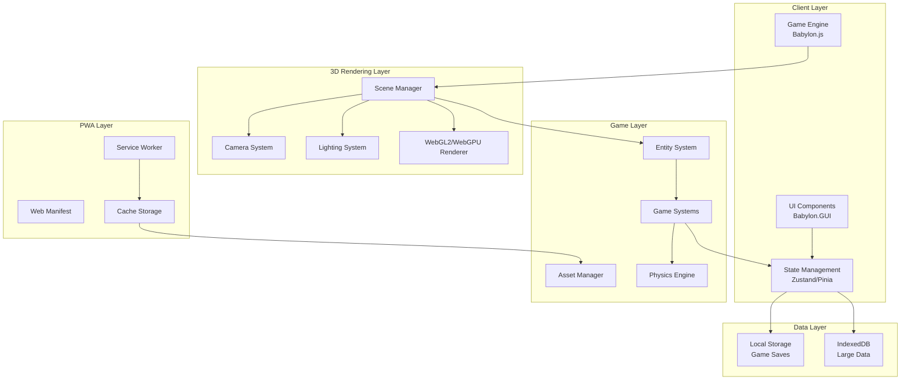
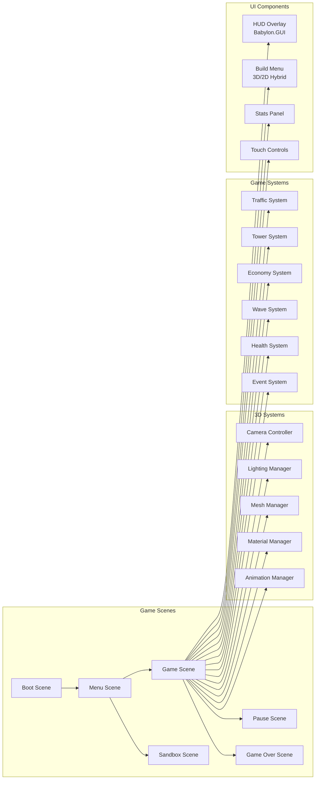

# Server Survival - 3D Tower Defense PWA Architecture Plan

## Executive Summary

This document outlines the comprehensive architectural plan for transforming the 3D "Server Survival" game into a modern, responsive 3D Tower Defense Progressive Web App (PWA). The new implementation will maintain the original game's 3D visual style and core mechanics while optimizing for mobile and desktop browsers with offline capabilities and native-like installation.

## Table of Contents

1. [Project Overview](#project-overview)
2. [Framework Selection](#framework-selection)
3. [System Architecture](#system-architecture)
4. [Responsive Design Strategy](#responsive-design-strategy)
5. [Core Game Mechanics](#core-game-mechanics)
6. [PWA Implementation](#pwa-implementation)
7. [File Structure](#file-structure)
8. [Code Examples](#code-examples)
9. [Performance Optimization](#performance-optimization)
10. [Testing Strategy](#testing-strategy)

---

## Project Overview

### Original Game Analysis

**Server Survival** is a tower defense game that teaches cloud architecture concepts through gameplay:

- **Theme**: Cloud infrastructure management
- **Objective**: Build and scale infrastructure to handle traffic while surviving DDoS attacks
- **Resources**: Budget ($), Reputation (%), Service Health
- **Core Mechanics**:
  - Place defensive services (Firewall, CDN, Load Balancer, etc.)
  - Process different traffic types (Static, Read, Write, Upload, Search)
  - Block malicious attacks
  - Manage service health and repairs
  - Survive escalating traffic waves

### New Implementation Goals

1. **Maintain 3D Graphics**: Keep the immersive 3D visual style while optimizing performance
2. **Responsive Design**: Seamless experience across mobile, tablet, and desktop
3. **Touch-First Controls**: Optimize for mobile touch interactions (pan, zoom, rotate)
4. **PWA Capabilities**: Offline support, installable, push notifications
5. **Modern Tech Stack**: Use contemporary 3D frameworks and best practices

---

## Framework Selection

### Comparison: Babylon.js vs Three.js

| Feature | Babylon.js | Three.js |
|---------|-----------|----------|
| **Engine Type** | ✅ Full 3D game engine | ⚠️ 3D rendering library only |
| **Learning Curve** | 🟢 Moderate | 🟡 Steeper (need to build game systems) |
| **Mobile Performance** | ✅ Optimized for mobile | ✅ Good, but requires optimization |
| **Touch Support** | ✅ Built-in touch handling | ⚠️ Manual implementation |
| **Documentation** | ✅ Extensive tutorials and API docs | ✅ Good, but more technical |
| **Community** | ✅ Large, active community | ✅ Largest 3D web community |
| **Bundle Size** | 🟡 ~800KB (minified) | ✅ ~600KB (minified) |
| **PWA Integration** | ✅ Easy integration | ✅ Easy integration |
| **Asset Management** | ✅ Built-in asset loader | ⚠️ Manual implementation |
| **Scene Management** | ✅ Built-in scene system | ⚠️ Manual implementation |
| **Physics** | ✅ Cannon.js, Havok, Oimo | ⚠️ Need external library |
| **GUI System** | ✅ Babylon GUI | ⚠️ Need external library |
| **Input System** | ✅ Comprehensive input manager | ⚠️ Manual implementation |
| **Camera Controls** | ✅ ArcRotateCamera, UniversalCamera | ⚠️ Need external library (OrbitControls) |
| **Animation** | ✅ Built-in animation system | ✅ Good, but manual setup |
| **TypeScript Support** | ✅ First-class TypeScript | ✅ Good TypeScript support |

### Recommendation: **Babylon.js 7.0+**

**Rationale:**

1. **Complete 3D Game Engine**: Babylon.js provides all systems needed out-of-the-box (scene management, input handling, physics, GUI, camera controls), reducing development time significantly.

2. **Mobile Optimization**: Babylon.js has built-in touch handling, responsive scaling, and mobile-specific optimizations including WebGL2 support and hardware acceleration.

3. **Rich Documentation**: Extensive tutorials, API documentation, playground examples, and community resources accelerate development.

4. **Active Development**: Regular updates with modern features, WebGL2/WebGPU support, and bug fixes.

5. **PWA Ready**: Works seamlessly with service workers and offline caching strategies. Babylon.js has built-in asset management for offline scenarios.

6. **TypeScript Support**: First-class TypeScript support with complete type definitions for better code quality and maintainability.

7. **Built-in GUI System**: Babylon.GUI provides a complete UI system for creating HUDs, menus, and overlays without external dependencies.

8. **Camera Controls**: Built-in camera controllers (ArcRotateCamera for orbit, UniversalCamera for FPS-style) perfect for tower defense games.

9. **Physics Integration**: Easy integration with multiple physics engines (Cannon.js, Havok, Oimo) for collision detection and interactions.

10. **Asset Pipeline**: Built-in support for glTF/GLB models, textures, and audio with automatic loading and caching.

**Version**: Babylon.js 7.0+ (latest stable with WebGPU support and improved mobile performance)

### Alternative: Three.js + Custom Game Loop

Use Three.js if:
- You need maximum flexibility and control
- Building a highly custom 3D engine
- You're already familiar with Three.js ecosystem
- You want to leverage the largest 3D web community

**Note**: The original Server Survival uses Three.js, so migrating to Babylon.js would require rewriting the rendering code, but would provide a more complete game engine out-of-the-box.

---

## System Architecture

### High-Level Architecture Diagram



### Component Architecture



---

## Responsive Design Strategy

### Breakpoint Strategy

| Device | Width | Height | Camera | Controls | UI Layout |
|--------|-------|--------|--------|----------|-----------|
| Mobile Portrait | 320-428px | 100% | Top-down/Isometric | Touch-only (pan, zoom, tap) | Stacked HUD, virtual buttons |
| Mobile Landscape | 480-896px | 100% | Isometric | Touch-only (pan, zoom, rotate) | Compact HUD, swipe gestures |
| Tablet | 768-1024px | 100% | Isometric | Touch + optional keyboard | Split HUD, gesture controls |
| Desktop | 1024px+ | 100% | Isometric/Free | Mouse + keyboard | Full HUD, keyboard shortcuts |

### 3D Camera System

**Camera Configuration:**

```typescript
// Babylon.js camera setup for responsive 3D
class CameraController {
  private camera: BABYLON.ArcRotateCamera;
  private scene: BABYLON.Scene;
  
  constructor(scene: BABYLON.Scene, canvas: HTMLCanvasElement) {
    this.scene = scene;
    this.setupCamera(canvas);
    this.setupCameraControls();
    this.setupResponsiveCamera();
  }
  
  private setupCamera(canvas: HTMLCanvasElement) {
    // Create orbit camera for tower defense gameplay
    this.camera = new BABYLON.ArcRotateCamera(
      'camera',
      -Math.PI / 4,  // Alpha (horizontal rotation)
      Math.PI / 3,   // Beta (vertical rotation)
      30,            // Radius (distance from target)
      new BABYLON.Vector3(0, 0, 0),
      scene
    );
    
    this.camera.attachControl(canvas, true);
    this.camera.wheelPrecision = 50;  // Mouse wheel zoom speed
    this.camera.lowerRadiusLimit = 10; // Minimum zoom
    this.camera.upperRadiusLimit = 80;  // Maximum zoom
    this.camera.lowerBetaLimit = 0.1;   // Minimum vertical angle
    this.camera.upperBetaLimit = Math.PI / 2 - 0.1; // Maximum vertical angle
    this.camera.panningSensibility = 50; // Pan sensitivity
    
    // Disable camera rotation on mobile (use touch gestures instead)
    if (this.isMobile()) {
      this.camera.useAutoRotationBehavior = false;
    }
  }
  
  private setupCameraControls() {
    // Keyboard shortcuts
    this.scene.onKeyboardObservable.add((kbInfo) => {
      switch (kbInfo.type) {
        case BABYLON.KeyboardEventTypes.KEYDOWN:
          this.handleKeyDown(kbInfo.event);
          break;
      }
    });
  }
  
  private handleKeyDown(event: KeyboardEvent) {
    const panSpeed = 0.5;
    switch (event.key) {
      case 'w':
      case 'ArrowUp':
        this.camera.cameraDirection.addInPlace(new BABYLON.Vector3(0, 0, panSpeed));
        break;
      case 's':
      case 'ArrowDown':
        this.camera.cameraDirection.addInPlace(new BABYLON.Vector3(0, 0, -panSpeed));
        break;
      case 'a':
      case 'ArrowLeft':
        this.camera.cameraDirection.addInPlace(new BABYLON.Vector3(panSpeed, 0, 0));
        break;
      case 'd':
      case 'ArrowRight':
        this.camera.cameraDirection.addInPlace(new BABYLON.Vector3(-panSpeed, 0, 0));
        break;
      case 'r':
        this.resetCamera();
        break;
      case 't':
        this.toggleCameraView();
        break;
    }
  }
  
  private setupResponsiveCamera() {
    // Adjust camera based on screen size
    window.addEventListener('resize', () => {
      this.adjustCameraForScreen();
    });
    
    this.adjustCameraForScreen();
  }
  
  private adjustCameraForScreen() {
    const isMobile = this.isMobile();
    const isPortrait = window.innerHeight > window.innerWidth;
    
    if (isMobile && isPortrait) {
      // Portrait mobile: more top-down view
      this.camera.beta = Math.PI / 4;
      this.camera.radius = 40;
    } else if (isMobile) {
      // Landscape mobile: isometric view
      this.camera.beta = Math.PI / 3;
      this.camera.radius = 35;
    } else {
      // Desktop/tablet: standard isometric view
      this.camera.beta = Math.PI / 3;
      this.camera.radius = 30;
    }
  }
  
  private resetCamera() {
    this.camera.alpha = -Math.PI / 4;
    this.camera.beta = Math.PI / 3;
    this.camera.radius = 30;
    this.camera.target = BABYLON.Vector3.Zero();
  }
  
  private toggleCameraView() {
    // Toggle between isometric and top-down
    if (this.camera.beta > Math.PI / 4) {
      this.camera.beta = Math.PI / 8; // Top-down
    } else {
      this.camera.beta = Math.PI / 3; // Isometric
    }
  }
  
  private isMobile(): boolean {
    return /Android|webOS|iPhone|iPad|iPod|BlackBerry|IEMobile|Opera Mini/i.test(navigator.userAgent);
  }
}
```

### Touch Control System

**Multi-Touch Support for 3D:**

```typescript
// 3D touch input configuration
class InputManager {
  private scene: BABYLON.Scene;
  private camera: BABYLON.ArcRotateCamera;
  private touchManager: BABYLON.TouchManager;
  private lastTapTime: number = 0;
  private lastTapPosition: BABYLON.Vector2 = new BABYLON.Vector2(0, 0);
  
  constructor(scene: BABYLON.Scene, camera: BABYLON.ArcRotateCamera) {
    this.scene = scene;
    this.camera = camera;
    this.setupTouchControls();
  }
  
  private setupTouchControls() {
    // Single tap for selection
    this.scene.onPointerObservable.add((pointerInfo) => {
      switch (pointerInfo.type) {
        case BABYLON.PointerEventTypes.POINTERDOWN:
          this.handlePointerDown(pointerInfo);
          break;
        case BABYLON.PointerEventTypes.POINTERUP:
          this.handlePointerUp(pointerInfo);
          break;
        case BABYLON.PointerEventTypes.POINTERMOVE:
          this.handlePointerMove(pointerInfo);
          break;
      }
    });
    
    // Pinch to zoom
    this.setupPinchZoom();
    
    // Two-finger pan
    this.setupTwoFingerPan();
  }
  
  private handlePointerDown(pointerInfo: BABYLON.PointerInfo) {
    const now = Date.now();
    const position = new BABYLON.Vector2(
      pointerInfo.event.clientX,
      pointerInfo.event.clientY
    );
    
    // Detect double tap
    if (now - this.lastTapTime < 300 &&
        BABYLON.Vector2.Distance(position, this.lastTapPosition) < 20) {
      this.handleDoubleTap(pointerInfo.pickInfo);
    } else {
      this.handleSingleTap(pointerInfo.pickInfo);
    }
    
    this.lastTapTime = now;
    this.lastTapPosition = position;
  }
  
  private handleSingleTap(pickInfo: BABYLON.PickingInfo) {
    if (pickInfo.hit && pickInfo.pickedMesh) {
      const mesh = pickInfo.pickedMesh;
      
      // Check if mesh is a service/tower
      if (mesh.metadata && mesh.metadata.type === 'service') {
        this.scene.events.emit('service-selected', mesh.metadata.id);
      }
      
      // Check if mesh is traffic/enemy
      if (mesh.metadata && mesh.metadata.type === 'traffic') {
        this.scene.events.emit('traffic-selected', mesh.metadata.id);
      }
      
      // Check if it's a valid placement location
      if (pickInfo.pickedPoint && this.isPlacementMode) {
        this.handlePlacement(pickInfo.pickedPoint);
      }
    }
  }
  
  private handleDoubleTap(pickInfo: BABYLON.PickingInfo) {
    // Double tap for quick actions
    if (pickInfo.hit && pickInfo.pickedMesh) {
      if (pickInfo.pickedMesh.metadata && pickInfo.pickedMesh.metadata.type === 'service') {
        this.scene.events.emit('service-upgrade', pickInfo.pickedMesh.metadata.id);
      }
    }
  }
  
  private setupPinchZoom() {
    let initialDistance: number = 0;
    let initialRadius: number = 0;
    
    this.scene.onPointerObservable.add((pointerInfo) => {
      if (pointerInfo.type === BABYLON.PointerEventTypes.POINTERDOWN &&
          this.scene.input.pointers.length === 2) {
        // Two fingers down - start pinch
        const p1 = this.scene.input.pointers[0];
        const p2 = this.scene.input.pointers[1];
        initialDistance = BABYLON.Vector2.Distance(
          new BABYLON.Vector2(p1.x, p1.y),
          new BABYLON.Vector2(p2.x, p2.y)
        );
        initialRadius = this.camera.radius;
      }
      
      if (pointerInfo.type === BABYLON.PointerEventTypes.POINTERMOVE &&
          this.scene.input.pointers.length === 2) {
        // Two fingers moving - handle pinch zoom
        const p1 = this.scene.input.pointers[0];
        const p2 = this.scene.input.pointers[1];
        const currentDistance = BABYLON.Vector2.Distance(
          new BABYLON.Vector2(p1.x, p1.y),
          new BABYLON.Vector2(p2.x, p2.y)
        );
        
        const scale = currentDistance / initialDistance;
        this.camera.radius = initialRadius / scale;
      }
    });
  }
  
  private setupTwoFingerPan() {
    let initialPanPosition: BABYLON.Vector2 = new BABYLON.Vector2(0, 0);
    let initialTarget: BABYLON.Vector3 = new BABYLON.Vector3(0, 0, 0);
    
    this.scene.onPointerObservable.add((pointerInfo) => {
      if (pointerInfo.type === BABYLON.PointerEventTypes.POINTERDOWN &&
          this.scene.input.pointers.length === 2) {
        const p1 = this.scene.input.pointers[0];
        const p2 = this.scene.input.pointers[1];
        initialPanPosition = new BABYLON.Vector2(
          (p1.x + p2.x) / 2,
          (p1.y + p2.y) / 2
        );
        initialTarget = this.camera.target.clone();
      }
      
      if (pointerInfo.type === BABYLON.PointerEventTypes.POINTERMOVE &&
          this.scene.input.pointers.length === 2) {
        const p1 = this.scene.input.pointers[0];
        const p2 = this.scene.input.pointers[1];
        const currentPanPosition = new BABYLON.Vector2(
          (p1.x + p2.x) / 2,
          (p1.y + p2.y) / 2
        );
        
        const delta = currentPanPosition.subtract(initialPanPosition);
        const panSpeed = 0.02;
        
        this.camera.target.x = initialTarget.x + delta.x * panSpeed;
        this.camera.target.z = initialTarget.z + delta.y * panSpeed;
      }
    });
  }
}
```

**Virtual Controls for Mobile:**

```typescript
// 3D virtual controls using Babylon.GUI
class VirtualControls {
  private advancedTexture: BABYLON.GUI.AdvancedDynamicTexture;
  private isMobile: boolean;
  
  constructor(scene: BABYLON.Scene) {
    this.isMobile = this.detectMobile();
    
    if (this.isMobile) {
      this.setupVirtualControls(scene);
    }
  }
  
  private detectMobile(): boolean {
    return /Android|webOS|iPhone|iPad|iPod|BlackBerry|IEMobile|Opera Mini/i.test(navigator.userAgent);
  }
  
  private setupVirtualControls(scene: BABYLON.Scene) {
    this.advancedTexture = BABYLON.GUI.AdvancedDynamicTexture.CreateFullscreenUI('UI');
    
    // Create action buttons panel
    this.createActionButtons(scene);
    
    // Create camera controls
    this.createCameraControls(scene);
    
    // Create build menu toggle
    this.createBuildMenuToggle(scene);
  }
  
  private createActionButtons(scene: BABYLON.Scene) {
    const panel = new BABYLON.GUI.StackPanel();
    panel.width = '200px';
    panel.height = '300px';
    panel.horizontalAlignment = BABYLON.GUI.Control.HORIZONTAL_ALIGNMENT_RIGHT;
    panel.verticalAlignment = BABYLON.GUI.Control.VERTICAL_ALIGNMENT_BOTTOM;
    panel.paddingRight = '20px';
    panel.paddingBottom = '20px';
    
    // Build button
    const buildBtn = this.createButton('Build', '#4CAF50', () => {
      scene.events.emit('toggle-build-menu');
    });
    
    // Upgrade button
    const upgradeBtn = this.createButton('Upgrade', '#2196F3', () => {
      scene.events.emit('upgrade-selected');
    });
    
    // Sell button
    const sellBtn = this.createButton('Sell', '#F44336', () => {
      scene.events.emit('sell-selected');
    });
    
    // Pause button
    const pauseBtn = this.createButton('⏸', '#FF9800', () => {
      scene.events.emit('toggle-pause');
    });
    
    panel.addControl(buildBtn);
    panel.addControl(upgradeBtn);
    panel.addControl(sellBtn);
    panel.addControl(pauseBtn);
    
    this.advancedTexture.addControl(panel);
  }
  
  private createButton(text: string, color: string, callback: () => void): BABYLON.GUI.Button {
    const button = BABYLON.GUI.Button.CreateSimpleButton('btn', text);
    button.width = '180px';
    button.height = '60px';
    button.color = 'white';
    button.cornerRadius = 10;
    button.background = color;
    button.onPointerUpObservable.add(callback);
    return button;
  }
  
  private createCameraControls(scene: BABYLON.Scene) {
    // Camera zoom buttons
    const zoomInBtn = this.createCircularButton('+', () => {
      scene.activeCamera!.radius = Math.max(10, scene.activeCamera!.radius - 5);
    });
    
    const zoomOutBtn = this.createCircularButton('-', () => {
      scene.activeCamera!.radius = Math.min(80, scene.activeCamera!.radius + 5);
    });
    
    // Position zoom controls
    zoomInBtn.horizontalAlignment = BABYLON.GUI.Control.HORIZONTAL_ALIGNMENT_RIGHT;
    zoomInBtn.verticalAlignment = BABYLON.GUI.Control.VERTICAL_ALIGNMENT_CENTER;
    zoomInBtn.paddingRight = '20px';
    
    zoomOutBtn.horizontalAlignment = BABYLON.GUI.Control.HORIZONTAL_ALIGNMENT_RIGHT;
    zoomOutBtn.verticalAlignment = BABYLON.GUI.Control.VERTICAL_ALIGNMENT_CENTER;
    zoomOutBtn.paddingRight = '20px';
    zoomOutBtn.top = '80px';
    
    this.advancedTexture.addControl(zoomInBtn);
    this.advancedTexture.addControl(zoomOutBtn);
  }
  
  private createCircularButton(text: string, callback: () => void): BABYLON.GUI.Button {
    const button = BABYLON.GUI.Button.CreateCircleButton('btn', {
      text: text,
      color: 'white',
      background: '#333333'
    });
    button.width = '60px';
    button.height = '60px';
    button.thickness = 3;
    button.onPointerUpObservable.add(callback);
    return button;
  }
  
  private createBuildMenuToggle(scene: BABYLON.Scene) {
    const button = BABYLON.GUI.Button.CreateSimpleButton('build-toggle', '🏗️ Build');
    button.width = '150px';
    button.height = '50px';
    button.color = 'white';
    button.cornerRadius = 10;
    button.background = '#4CAF50';
    button.horizontalAlignment = BABYLON.GUI.Control.HORIZONTAL_ALIGNMENT_LEFT;
    button.verticalAlignment = BABYLON.GUI.Control.VERTICAL_ALIGNMENT_BOTTOM;
    button.paddingLeft = '20px';
    button.paddingBottom = '20px';
    button.onPointerUpObservable.add(() => {
      scene.events.emit('toggle-build-menu');
    });
    
    this.advancedTexture.addControl(button);
  }
}
```

---

## Core Game Mechanics

### 1. Traffic System (Enemies)

**Traffic Types:**

```typescript
enum TrafficType {
  STATIC = 'static',      // Green - CDN/Storage
  READ = 'read',          // Blue - SQL DB
  WRITE = 'write',        // Purple - SQL DB
  UPLOAD = 'upload',      // Orange - Storage
  SEARCH = 'search',      // Cyan - SQL DB
  MALICIOUS = 'malicious' // Red - DDoS attack
}

interface TrafficConfig {
  type: TrafficType;
  color: number;
  speed: number;
  health: number;
  reward: number;
  damage: number;
  path: Phaser.Math.Vector2[];
}
```

**Traffic Spawning System:**

```typescript
class TrafficManager {
  private scene: Phaser.Scene;
  private trafficGroup: Phaser.GameObjects.Group;
  private spawnTimer: Phaser.Time.TimerEvent;
  private currentRPS: number = 10; // Requests per second
  
  constructor(scene: Phaser.Scene) {
    this.scene = scene;
    this.trafficGroup = scene.add.group();
  }
  
  spawnTraffic(type: TrafficType, path: Phaser.Math.Vector2[]) {
    const config = this.getTrafficConfig(type);
    const traffic = new TrafficEntity(this.scene, path[0].x, path[0].y, config);
    this.trafficGroup.add(traffic);
    traffic.followPath(path);
  }
  
  updateRPS(rps: number) {
    this.currentRPS = rps;
    this.spawnTimer.reset({
      delay: 1000 / rps,
      callback: this.spawnRandomTraffic,
      callbackScope: this,
      loop: true
    });
  }
  
  private spawnRandomTraffic() {
    const types = this.getAvailableTrafficTypes();
    const randomType = Phaser.Math.RND.pick(types);
    const path = this.getRandomPath();
    this.spawnTraffic(randomType, path);
  }
}
```

### 2. Tower System (Services)

**Service Types:**

```typescript
enum ServiceType {
  FIREWALL = 'firewall',
  QUEUE = 'queue',
  LOAD_BALANCER = 'load_balancer',
  COMPUTE = 'compute',
  CDN = 'cdn',
  CACHE = 'cache',
  SQL_DB = 'sql_db',
  STORAGE = 'storage'
}

interface ServiceConfig {
  type: ServiceType;
  name: string;
  cost: number;
  capacity: number;
  upkeep: number;
  range: number;
  damage: number;
  attackSpeed: number;
  color: number;
  icon: string;
  upgradeLevels: number;
}

const SERVICE_CONFIGS: Record<ServiceType, ServiceConfig> = {
  [ServiceType.FIREWALL]: {
    type: ServiceType.FIREWALL,
    name: 'Firewall',
    cost: 40,
    capacity: 30,
    upkeep: 5,
    range: 150,
    damage: 100,
    attackSpeed: 1000,
    color: 0xFF5722,
    icon: '🛡️',
    upgradeLevels: 3
  },
  [ServiceType.QUEUE]: {
    type: ServiceType.QUEUE,
    name: 'Queue',
    cost: 40,
    capacity: 200,
    upkeep: 3,
    range: 100,
    damage: 0,
    attackSpeed: 500,
    color: 0x9E9E9E,
    icon: '📦',
    upgradeLevels: 2
  },
  // ... other services
};
```

**Service Placement System:**

```typescript
class ServiceManager {
  private scene: Phaser.Scene;
  private services: Map<string, ServiceEntity> = new Map();
  private grid: GridSystem;
  private placementPreview: Phaser.GameObjects.Graphics;
  
  constructor(scene: Phaser.Scene) {
    this.scene = scene;
    this.grid = new GridSystem(scene, 64); // 64px grid cells
    this.setupPlacementPreview();
  }
  
  startPlacement(serviceType: ServiceType) {
    this.scene.input.on('pointermove', (pointer: Phaser.Input.Pointer) => {
      const gridPos = this.grid.worldToGrid(pointer.x, pointer.y);
      this.updatePreview(gridPos, serviceType);
    });
    
    this.scene.input.on('pointerdown', (pointer: Phaser.Input.Pointer) => {
      const gridPos = this.grid.worldToGrid(pointer.x, pointer.y);
      this.placeService(gridPos, serviceType);
    });
  }
  
  private placeService(gridPos: Phaser.Math.Vector2, type: ServiceType) {
    if (!this.grid.isValidPlacement(gridPos)) {
      this.showInvalidPlacementFeedback(gridPos);
      return;
    }
    
    const config = SERVICE_CONFIGS[type];
    if (!this.canAfford(config.cost)) {
      this.showInsufficientFundsFeedback();
      return;
    }
    
    const worldPos = this.grid.gridToWorld(gridPos.x, gridPos.y);
    const service = new ServiceEntity(this.scene, worldPos.x, worldPos.y, config);
    const id = `${gridPos.x},${gridPos.y}`;
    
    this.services.set(id, service);
    this.grid.setOccupied(gridPos);
    this.deductFunds(config.cost);
    this.showPlacementSuccess(service);
  }
  
  upgradeService(id: string) {
    const service = this.services.get(id);
    if (service && service.canUpgrade()) {
      const cost = service.getUpgradeCost();
      if (this.canAfford(cost)) {
        service.upgrade();
        this.deductFunds(cost);
      }
    }
  }
  
  sellService(id: string) {
    const service = this.services.get(id);
    if (service) {
      const refund = service.config.cost * 0.5;
      this.addFunds(refund);
      service.destroy();
      this.services.delete(id);
      const gridPos = this.grid.worldToGrid(service.x, service.y);
      this.grid.setFree(gridPos);
    }
  }
}
```

### 3. Economy System

```typescript
class EconomyManager {
  private budget: number = 1000;
  private reputation: number = 100;
  private income: number = 0;
  private expenses: number = 0;
  
  // Scoring
  private score: number = 0;
  private requestsProcessed: number = 0;
  private attacksBlocked: number = 0;
  
  constructor() {
    this.startUpkeepTimer();
  }
  
  processRequest(type: TrafficType, success: boolean) {
    if (success) {
      const reward = this.getRequestReward(type);
      this.addFunds(reward);
      this.addScore(this.getRequestScore(type));
      this.addReputation(0.1);
      this.requestsProcessed++;
    } else {
      this.loseReputation(1);
    }
  }
  
  blockAttack() {
    this.addFunds(0.5);
    this.addScore(10);
    this.attacksBlocked++;
  }
  
  attackLeaked() {
    this.loseReputation(5);
  }
  
  private startUpkeepTimer() {
    // Upkeep costs every minute
    this.scene.time.addEvent({
      delay: 60000,
      callback: this.processUpkeep,
      callbackScope: this,
      loop: true
    });
  }
  
  private processUpkeep() {
    const totalUpkeep = this.calculateTotalUpkeep();
    this.deductFunds(totalUpkeep);
    this.expenses = totalUpkeep;
  }
  
  private calculateTotalUpkeep(): number {
    let total = 0;
    this.serviceManager.getServices().forEach(service => {
      total += service.config.upkeep;
      
      // Auto-repair adds 10% overhead
      if (service.isAutoRepairEnabled()) {
        total *= 1.1;
      }
    });
    
    // Upkeep scales 1x to 2x over 10 minutes
    const gameTime = this.getGameTime();
    const scaling = 1 + (gameTime / 600000); // 10 minutes in ms
    total *= Math.min(scaling, 2);
    
    return total;
  }
  
  checkGameOver(): { gameOver: boolean; reason?: string } {
    if (this.reputation <= 0) {
      return { gameOver: true, reason: 'Reputation destroyed!' };
    }
    if (this.budget < -1000) {
      return { gameOver: true, reason: 'Bankrupt!' };
    }
    return { gameOver: false };
  }
}
```

### 4. Wave System

```typescript
class WaveManager {
  private scene: Phaser.Scene;
  private currentWave: number = 0;
  private waveTimer: Phaser.Time.TimerEvent;
  private waveConfig: WaveConfig[] = [];
  
  constructor(scene: Phaser.Scene) {
    this.scene = scene;
    this.loadWaveConfigs();
  }
  
  startWave(waveNumber: number) {
    this.currentWave = waveNumber;
    const config = this.waveConfig[waveNumber - 1];
    
    this.showWaveAnnouncement(waveNumber);
    
    // Spawn traffic based on wave config
    config.traffic.forEach((traffic, index) => {
      this.scene.time.delayedCall(
        index * config.interval,
        () => this.trafficManager.spawnTraffic(traffic.type, traffic.path)
      );
    });
    
    // Schedule next wave
    this.scheduleNextWave();
  }
  
  private loadWaveConfigs() {
    // Dynamic wave generation based on game time
    for (let i = 1; i <= 50; i++) {
      this.waveConfig.push(this.generateWaveConfig(i));
    }
  }
  
  private generateWaveConfig(waveNumber: number): WaveConfig {
    const gameTime = waveNumber * 60000; // 1 minute per wave
    
    // RPS acceleration: ×1.3 at 1min → ×4.0 at 10min
    const rpsMultiplier = Math.min(1.3 + (gameTime / 600000) * 2.7, 4.0);
    
    // Traffic mix shifts every 40 seconds
    const trafficMix = this.getTrafficMix(waveNumber);
    
    // DDoS spikes every 45 seconds
    const hasDDoS = waveNumber % 3 === 0;
    
    return {
      waveNumber,
      duration: 60000,
      rps: Math.floor(10 * rpsMultiplier),
      traffic: this.generateTraffic(trafficMix, hasDDoS),
      interval: 1000 / (10 * rpsMultiplier),
      events: this.generateRandomEvents(waveNumber)
    };
  }
  
  private getTrafficMix(waveNumber: number): TrafficMix {
    // Traffic patterns change over time
    const phase = Math.floor(waveNumber / 5) % 4;
    
    switch (phase) {
      case 0: // Early game - mostly static
        return {
          static: 60,
          read: 20,
          write: 10,
          upload: 5,
          search: 5,
          malicious: 0
        };
      case 1: // Mid game - more database
        return {
          static: 30,
          read: 35,
          write: 20,
          upload: 5,
          search: 5,
          malicious: 5
        };
      case 2: // Late game - mixed with attacks
        return {
          static: 20,
          read: 25,
          write: 25,
          upload: 10,
          search: 10,
          malicious: 10
        };
      case 3: // End game - heavy attacks
        return {
          static: 15,
          read: 20,
          write: 20,
          upload: 10,
          search: 10,
          malicious: 25
        };
    }
  }
}
```

### 5. Health System

```typescript
class HealthSystem {
  private services: Map<string, ServiceHealth> = new Map();
  
  constructor(private scene: Phaser.Scene) {
    this.startHealthDegradation();
  }
  
  registerService(service: ServiceEntity) {
    this.services.set(service.id, {
      currentHealth: 100,
      maxHealth: 100,
      degradationRate: this.calculateDegradationRate(service)
    });
  }
  
  private calculateDegradationRate(service: ServiceEntity): number {
    // Services degrade faster under load
    const load = service.getCurrentLoad();
    const baseRate = 0.1; // 0.1% per second base
    return baseRate * (1 + load / service.config.capacity);
  }
  
  private startHealthDegradation() {
    this.scene.time.addEvent({
      delay: 1000,
      callback: this.updateHealth,
      callbackScope: this,
      loop: true
    });
  }
  
  private updateHealth() {
    this.services.forEach((health, id) => {
      const service = this.serviceManager.getService(id);
      if (service) {
        health.currentHealth -= health.degradationRate;
        
        // Update health bar
        service.updateHealthBar(health.currentHealth / health.maxHealth);
        
        // Reduce capacity when damaged
        if (health.currentHealth < 100) {
          service.setCapacityMultiplier(health.currentHealth / 100);
        }
        
        // Service fails at 0 health
        if (health.currentHealth <= 0) {
          service.setFailed(true);
        }
      }
    });
  }
  
  repairService(id: string) {
    const health = this.services.get(id);
    const service = this.serviceManager.getService(id);
    
    if (health && service) {
      const repairCost = service.config.cost * 0.15;
      
      if (this.economy.canAfford(repairCost)) {
        this.economy.deductFunds(repairCost);
        health.currentHealth = health.maxHealth;
        service.setFailed(false);
        service.setCapacityMultiplier(1);
        service.updateHealthBar(1);
      }
    }
  }
}
```

### 6. Event System

```typescript
class EventManager {
  private activeEvent: GameEvent | null = null;
  private eventTimer: Phaser.Time.TimerEvent;
  
  constructor(private scene: Phaser.Scene) {
    this.startEventScheduler();
  }
  
  private startEventScheduler() {
    // Random events every 15-45 seconds
    this.scene.time.addEvent({
      delay: Phaser.Math.Between(15000, 45000),
      callback: this.triggerRandomEvent,
      callbackScope: this,
      loop: true
    });
  }
  
  private triggerRandomEvent() {
    const events = this.getAvailableEvents();
    const event = Phaser.Math.RND.pick(events);
    
    this.activeEvent = {
      ...event,
      startTime: this.scene.time.now,
      duration: event.duration
    };
    
    this.applyEventEffects(this.activeEvent);
    this.showEventNotification(this.activeEvent);
    
    // Schedule event end
    this.scene.time.delayedCall(
      this.activeEvent.duration,
      () => this.endEvent()
    );
  }
  
  private getAvailableEvents(): GameEventTemplate[] {
    return [
      {
        id: 'cost_spike',
        name: 'Market Volatility',
        description: 'Service costs increased by 50%',
        duration: 30000,
        effect: () => this.economy.multiplyCosts(1.5),
        cleanup: () => this.economy.multiplyCosts(1/1.5)
      },
      {
        id: 'capacity_drop',
        name: 'Server Overload',
        description: 'All services at 50% capacity',
        duration: 20000,
        effect: () => this.serviceManager.setAllCapacityMultiplier(0.5),
        cleanup: () => this.serviceManager.setAllCapacityMultiplier(1)
      },
      {
        id: 'traffic_burst',
        name: 'Flash Sale',
        description: 'Traffic increased by 200%',
        duration: 15000,
        effect: () => this.trafficManager.multiplyRPS(3),
        cleanup: () => this.trafficManager.multiplyRPS(1/3)
      },
      {
        id: 'ddos_attack',
        name: 'DDoS Attack',
        description: '50% malicious traffic',
        duration: 20000,
        effect: () => this.trafficManager.setMaliciousRatio(0.5),
        cleanup: () => this.trafficManager.setMaliciousRatio(0)
      }
    ];
  }
}
```

---

## PWA Implementation

### Service Worker Architecture

```typescript
// public/sw.js
const CACHE_NAME = 'server-survival-v1';
const STATIC_CACHE = 'static-v1';
const DYNAMIC_CACHE = 'dynamic-v1';

const STATIC_ASSETS = [
  '/',
  '/index.html',
  '/manifest.json',
  '/assets/spritesheets/',
  '/assets/audio/',
  '/assets/fonts/',
  '/bundle.js',
  '/bundle.css'
];

self.addEventListener('install', (event) => {
  event.waitUntil(
    caches.open(STATIC_CACHE).then((cache) => {
      return cache.addAll(STATIC_ASSETS);
    })
  );
  self.skipWaiting();
});

self.addEventListener('activate', (event) => {
  event.waitUntil(
    caches.keys().then((cacheNames) => {
      return Promise.all(
        cacheNames
          .filter((name) => name !== STATIC_CACHE && name !== DYNAMIC_CACHE)
          .map((name) => caches.delete(name))
      );
    })
  );
  self.clients.claim();
});

self.addEventListener('fetch', (event) => {
  event.respondWith(
    caches.match(event.request).then((cachedResponse) => {
      if (cachedResponse) {
        // Return cached version for static assets
        return cachedResponse;
      }

      return fetch(event.request).then((response) => {
        // Cache successful responses
        if (response.ok) {
          const responseClone = response.clone();
          caches.open(DYNAMIC_CACHE).then((cache) => {
            cache.put(event.request, responseClone);
          });
        }
        return response;
      }).catch(() => {
        // Offline fallback
        if (event.request.destination === 'image') {
          return caches.match('/assets/fallback.png');
        }
        return new Response('Offline', { status: 503 });
      });
    })
  );
});

// Background sync for game saves
self.addEventListener('sync', (event) => {
  if (event.tag === 'sync-game-save') {
    event.waitUntil(syncGameSave());
  }
});

async function syncGameSave() {
  // Sync local saves to server when back online
  const saves = await getLocalSaves();
  for (const save of saves) {
    await uploadSave(save);
  }
}
```

### Web App Manifest

```json
{
  "name": "Server Survival - Tower Defense",
  "short_name": "Server Survival",
  "description": "Build cloud infrastructure, survive traffic, learn scaling in this tower defense game",
  "start_url": "/",
  "display": "standalone",
  "background_color": "#1a1a2e",
  "theme_color": "#16213e",
  "orientation": "any",
  "scope": "/",
  "icons": [
    {
      "src": "/assets/icons/icon-72x72.png",
      "sizes": "72x72",
      "type": "image/png",
      "purpose": "any maskable"
    },
    {
      "src": "/assets/icons/icon-96x96.png",
      "sizes": "96x96",
      "type": "image/png",
      "purpose": "any maskable"
    },
    {
      "src": "/assets/icons/icon-128x128.png",
      "sizes": "128x128",
      "type": "image/png",
      "purpose": "any maskable"
    },
    {
      "src": "/assets/icons/icon-144x144.png",
      "sizes": "144x144",
      "type": "image/png",
      "purpose": "any maskable"
    },
    {
      "src": "/assets/icons/icon-152x152.png",
      "sizes": "152x152",
      "type": "image/png",
      "purpose": "any maskable"
    },
    {
      "src": "/assets/icons/icon-192x192.png",
      "sizes": "192x192",
      "type": "image/png",
      "purpose": "any maskable"
    },
    {
      "src": "/assets/icons/icon-384x384.png",
      "sizes": "384x384",
      "type": "image/png",
      "purpose": "any maskable"
    },
    {
      "src": "/assets/icons/icon-512x512.png",
      "sizes": "512x512",
      "type": "image/png",
      "purpose": "any maskable"
    }
  ],
  "screenshots": [
    {
      "src": "/assets/screenshots/gameplay-1.png",
      "sizes": "1280x720",
      "type": "image/png",
      "form_factor": "wide"
    },
    {
      "src": "/assets/screenshots/gameplay-mobile.png",
      "sizes": "540x960",
      "type": "image/png",
      "form_factor": "narrow"
    }
  ],
  "categories": ["games", "entertainment"],
  "shortcuts": [
    {
      "name": "Quick Play",
      "short_name": "Play",
      "description": "Start a new survival game",
      "url": "/?mode=survival",
      "icons": [{ "src": "/assets/icons/play-96x96.png", "sizes": "96x96" }]
    },
    {
      "name": "Sandbox",
      "short_name": "Sandbox",
      "description": "Open sandbox mode",
      "url": "/?mode=sandbox",
      "icons": [{ "src": "/assets/icons/sandbox-96x96.png", "sizes": "96x96" }]
    }
  ]
}
```

### PWA Installation Prompt

```typescript
class PWAInstaller {
  private deferredPrompt: any;
  
  constructor() {
    this.setupInstallPrompt();
  }
  
  private setupInstallPrompt() {
    window.addEventListener('beforeinstallprompt', (e) => {
      e.preventDefault();
      this.deferredPrompt = e;
      this.showInstallButton();
    });
    
    window.addEventListener('appinstalled', () => {
      this.deferredPrompt = null;
      this.hideInstallButton();
      this.showInstalledMessage();
    });
  }
  
  async install() {
    if (!this.deferredPrompt) {
      return;
    }
    
    this.deferredPrompt.prompt();
    const { outcome } = await this.deferredPrompt.userChoice;
    
    if (outcome === 'accepted') {
      console.log('User accepted the install prompt');
    } else {
      console.log('User dismissed the install prompt');
    }
    
    this.deferredPrompt = null;
  }
}
```

### Offline Game Save System

```typescript
class SaveManager {
  private static readonly SAVE_KEY = 'server-survival-save';
  private static readonly AUTOSAVE_INTERVAL = 30000; // 30 seconds
  
  constructor(private scene: Phaser.Scene) {
    this.startAutosave();
    this.setupOnlineListener();
  }
  
  saveGame(): GameSave {
    const save: GameSave = {
      version: '1.0',
      timestamp: Date.now(),
      economy: this.economy.getState(),
      services: this.serviceManager.getState(),
      waves: this.waveManager.getState(),
      settings: this.settings.getState()
    };
    
    // Save to localStorage
    localStorage.setItem(SaveManager.SAVE_KEY, JSON.stringify(save));
    
    // Register for background sync
    if ('serviceWorker' in navigator && 'sync' in ServiceWorkerRegistration.prototype) {
      navigator.serviceWorker.ready.then((registration) => {
        registration.sync.register('sync-game-save');
      });
    }
    
    return save;
  }
  
  loadGame(): GameSave | null {
    const saved = localStorage.getItem(SaveManager.SAVE_KEY);
    if (saved) {
      return JSON.parse(saved);
    }
    return null;
  }
  
  private startAutosave() {
    this.scene.time.addEvent({
      delay: SaveManager.AUTOSAVE_INTERVAL,
      callback: this.saveGame,
      callbackScope: this,
      loop: true
    });
  }
  
  private setupOnlineListener() {
    window.addEventListener('online', () => {
      this.showOnlineMessage();
      this.syncToCloud();
    });
    
    window.addEventListener('offline', () => {
      this.showOfflineMessage();
    });
  }
}
```

---

## File Structure

```
sz_server_survival/
├── public/
│   ├── index.html
│   ├── manifest.json
│   ├── sw.js
│   └── assets/
│       ├── spritesheets/
│       │   ├── services.json
│       │   ├── traffic.json
│       │   └── ui.json
│       ├── audio/
│       │   ├── music/
│       │   ├── sfx/
│       │   └── voice/
│       ├── fonts/
│       │   ├── main-font.woff2
│       │   └── ui-font.woff2
│       ├── icons/
│       │   ├── icon-72x72.png
│       │   ├── icon-96x96.png
│       │   ├── ...
│       │   └── icon-512x512.png
│       └── screenshots/
│           ├── gameplay-1.png
│           └── gameplay-mobile.png
├── src/
│   ├── main.ts
│   ├── config/
│   │   ├── game.config.ts
│   │   ├── services.config.ts
│   │   └── traffic.config.ts
│   ├── scenes/
│   │   ├── BootScene.ts
│   │   ├── MenuScene.ts
│   │   ├── GameScene.ts
│   │   ├── PauseScene.ts
│   │   ├── GameOverScene.ts
│   │   └── SandboxScene.ts
│   ├── systems/
│   │   ├── TrafficSystem.ts
│   │   ├── ServiceSystem.ts
│   │   ├── EconomySystem.ts
│   │   ├── WaveSystem.ts
│   │   ├── HealthSystem.ts
│   │   └── EventSystem.ts
│   ├── entities/
│   │   ├── TrafficEntity.ts
│   │   ├── ServiceEntity.ts
│   │   └── ParticleEntity.ts
│   ├── ui/
│   │   ├── HUD.ts
│   │   ├── BuildMenu.ts
│   │   ├── StatsPanel.ts
│   │   ├── Controls.ts
│   │   └── VirtualControls.ts
│   ├── managers/
│   │   ├── InputManager.ts
│   │   ├── SaveManager.ts
│   │   ├── AudioManager.ts
│   │   └── PWAInstaller.ts
│   ├── utils/
│   │   ├── GridSystem.ts
│   │   ├── Pathfinding.ts
│   │   └── Helpers.ts
│   └── types/
│       ├── game.types.ts
│       ├── traffic.types.ts
│       └── service.types.ts
├── tests/
│   ├── unit/
│   │   ├── TrafficSystem.test.ts
│   │   ├── EconomySystem.test.ts
│   │   └── WaveSystem.test.ts
│   └── integration/
│       └── GameFlow.test.ts
├── plans/
│   └── architecture-plan.md
├── package.json
├── tsconfig.json
├── vite.config.ts
├── .eslintrc.json
└── README.md
```

---

## Code Examples

### 1. Main Game Entry Point

```typescript
// src/main.ts
import Phaser from 'phaser';
import BootScene from './scenes/BootScene';
import MenuScene from './scenes/MenuScene';
import GameScene from './scenes/GameScene';
import PauseScene from './scenes/PauseScene';
import GameOverScene from './scenes/GameOverScene';
import SandboxScene from './scenes/SandboxScene';
import { GAME_CONFIG } from './config/game.config';

const config: Phaser.Types.Core.GameConfig = {
  type: Phaser.AUTO,
  parent: 'game-container',
  width: 1920,
  height: 1080,
  backgroundColor: '#1a1a2e',
  scale: {
    mode: Phaser.Scale.FIT,
    autoCenter: Phaser.Scale.CENTER_BOTH,
    min: {
      width: 320,
      height: 480
    },
    max: {
      width: 2560,
      height: 1440
    }
  },
  physics: {
    default: 'arcade',
    arcade: {
      gravity: { x: 0, y: 0 },
      debug: false
    }
  },
  scene: [
    BootScene,
    MenuScene,
    GameScene,
    PauseScene,
    GameOverScene,
    SandboxScene
  ],
  pixelArt: false,
  roundPixels: false,
  audio: {
    disableWebAudio: false
  }
};

new Phaser.Game(config);
```

### 2. Boot Scene - Asset Loading

```typescript
// src/scenes/BootScene.ts
import Phaser from 'phaser';

export default class BootScene extends Phaser.Scene {
  constructor() {
    super({ key: 'BootScene' });
  }

  preload() {
    // Loading bar
    const progressBar = this.add.graphics();
    const width = this.cameras.main.width;
    const height = this.cameras.main.height;

    this.load.on('progress', (value: number) => {
      progressBar.clear();
      progressBar.fillStyle(0x4CAF50, 1);
      progressBar.fillRect(width / 4, height / 2 - 30, (width / 2) * value, 50);
    });

    this.load.on('complete', () => {
      progressBar.destroy();
    });

    // Load service sprites
    this.load.atlas(
      'services',
      'assets/spritesheets/services.png',
      'assets/spritesheets/services.json'
    );

    // Load traffic sprites
    this.load.atlas(
      'traffic',
      'assets/spritesheets/traffic.png',
      'assets/spritesheets/traffic.json'
    );

    // Load UI sprites
    this.load.atlas(
      'ui',
      'assets/spritesheets/ui.png',
      'assets/spritesheets/ui.json'
    );

    // Load audio
    this.load.audio('bgm-menu', 'assets/audio/music/menu.mp3');
    this.load.audio('bgm-game', 'assets/audio/music/game.mp3');
    this.load.audio('sfx-place', 'assets/audio/sfx/place.mp3');
    this.load.audio('sfx-attack', 'assets/audio/sfx/attack.mp3');
    this.load.audio('sfx-block', 'assets/audio/sfx/block.mp3');

    // Load fonts
    this.load.json('font-data', 'assets/fonts/font-data.json');

    // Register PWA service worker
    if ('serviceWorker' in navigator) {
      navigator.serviceWorker.register('/sw.js')
        .then((registration) => {
          console.log('SW registered:', registration);
        })
        .catch((error) => {
          console.log('SW registration failed:', error);
        });
    }
  }

  create() {
    // Initialize audio
    this.sound.play('bgm-menu', { loop: true, volume: 0.3 });

    // Transition to menu
    this.scene.start('MenuScene');
  }
}
```

### 3. Game Scene - Core Gameplay

```typescript
// src/scenes/GameScene.ts
import Phaser from 'phaser';
import TrafficSystem from '../systems/TrafficSystem';
import ServiceSystem from '../systems/ServiceSystem';
import EconomySystem from '../systems/EconomySystem';
import WaveSystem from '../systems/WaveSystem';
import HealthSystem from '../systems/HealthSystem';
import EventSystem from '../systems/EventSystem';
import HUD from '../ui/HUD';
import BuildMenu from '../ui/BuildMenu';
import VirtualControls from '../ui/VirtualControls';
import { GAME_CONFIG } from '../config/game.config';

export default class GameScene extends Phaser.Scene {
  private trafficSystem!: TrafficSystem;
  private serviceSystem!: ServiceSystem;
  private economySystem!: EconomySystem;
  private waveSystem!: WaveSystem;
  private healthSystem!: HealthSystem;
  private eventSystem!: EventSystem;
  private hud!: HUD;
  private buildMenu!: BuildMenu;
  private virtualControls!: VirtualControls;
  private isPaused: boolean = false;

  constructor() {
    super({ key: 'GameScene' });
  }

  create() {
    // Create game map
    this.createMap();

    // Initialize systems
    this.trafficSystem = new TrafficSystem(this);
    this.serviceSystem = new ServiceSystem(this);
    this.economySystem = new EconomySystem(this);
    this.waveSystem = new WaveSystem(this);
    this.healthSystem = new HealthSystem(this);
    this.eventSystem = new EventSystem(this);

    // Create UI
    this.hud = new HUD(this);
    this.buildMenu = new BuildMenu(this);
    this.virtualControls = new VirtualControls(this);

    // Setup input
    this.setupInput();

    // Start first wave
    this.waveSystem.startWave(1);

    // Start background music
    this.sound.play('bgm-game', { loop: true, volume: 0.3 });
  }

  update(time: number, delta: number) {
    if (this.isPaused) return;

    // Update all systems
    this.trafficSystem.update(time, delta);
    this.serviceSystem.update(time, delta);
    this.economySystem.update(time, delta);
    this.waveSystem.update(time, delta);
    this.healthSystem.update(time, delta);
    this.eventSystem.update(time, delta);

    // Update UI
    this.hud.update();
    this.buildMenu.update();

    // Check game over
    const gameOver = this.economySystem.checkGameOver();
    if (gameOver.gameOver) {
      this.scene.pause();
      this.scene.start('GameOverScene', {
        reason: gameOver.reason,
        score: this.economySystem.getScore(),
        time: this.waveSystem.getGameTime()
      });
    }
  }

  private createMap() {
    // Create game background
    this.add.image(0, 0, 'map-background')
      .setOrigin(0, 0)
      .setDisplaySize(this.scale.width, this.scale.height);

    // Create grid for placement
    const gridGraphics = this.add.graphics();
    gridGraphics.lineStyle(1, 0x333333, 0.3);

    const gridSize = 64;
    for (let x = 0; x < this.scale.width; x += gridSize) {
      gridGraphics.moveTo(x, 0);
      gridGraphics.lineTo(x, this.scale.height);
    }
    for (let y = 0; y < this.scale.height; y += gridSize) {
      gridGraphics.moveTo(0, y);
      gridGraphics.lineTo(this.scale.width, y);
    }
  }

  private setupInput() {
    // Keyboard shortcuts
    this.input.keyboard!.on('keydown-ESC', () => {
      this.togglePause();
    });

    this.input.keyboard!.on('keydown-P', () => {
      this.togglePause();
    });

    // Touch/mouse input handled by individual systems
  }

  private togglePause() {
    this.isPaused = !this.isPaused;
    
    if (this.isPaused) {
      this.scene.pause();
      this.scene.launch('PauseScene');
    } else {
      this.scene.resume();
    }
  }
}
```

### 4. Traffic Entity Implementation

```typescript
// src/entities/TrafficEntity.ts
import Phaser from 'phaser';
import { TrafficType, TrafficConfig } from '../types/traffic.types';

export default class TrafficEntity extends Phaser.GameObjects.Sprite {
  private config: TrafficConfig;
  private path: Phaser.Math.Vector2[];
  private currentPathIndex: number = 0;
  private speed: number;
  private health: number;
  private maxHealth: number;
  private isProcessed: boolean = false;
  private healthBar: Phaser.GameObjects.Graphics;

  constructor(
    scene: Phaser.Scene,
    x: number,
    y: number,
    config: TrafficConfig,
    path: Phaser.Math.Vector2[]
  ) {
    super(scene, x, y, 'traffic', config.type);
    
    this.config = config;
    this.path = path;
    this.speed = config.speed;
    this.health = config.health;
    this.maxHealth = config.health;
    
    this.setOrigin(0.5);
    this.setScale(0.8);
    this.setTint(config.color);
    
    // Create health bar
    this.createHealthBar();
    
    scene.add.existing(this);
  }

  private createHealthBar() {
    this.healthBar = this.scene.add.graphics();
    this.updateHealthBar();
  }

  private updateHealthBar() {
    this.healthBar.clear();
    
    const width = 40;
    const height = 4;
    const x = this.x - width / 2;
    const y = this.y - this.height / 2 - 10;
    
    // Background
    this.healthBar.fillStyle(0x333333, 0.8);
    this.healthBar.fillRect(x, y, width, height);
    
    // Health
    const healthPercent = this.health / this.maxHealth;
    this.healthBar.fillStyle(healthPercent > 0.5 ? 0x4CAF50 : healthPercent > 0.25 ? 0xFFC107 : 0xF44336, 1);
    this.healthBar.fillRect(x, y, width * healthPercent, height);
  }

  followPath(path: Phaser.Math.Vector2[]) {
    this.path = path;
    this.currentPathIndex = 0;
    this.moveToNextPoint();
  }

  private moveToNextPoint() {
    if (this.currentPathIndex >= this.path.length) {
      this.reachDestination();
      return;
    }

    const target = this.path[this.currentPathIndex];
    const angle = Phaser.Math.Angle.Between(
      this.x, this.y,
      target.x, target.y
    );
    
    this.setRotation(angle);
    
    this.scene.tweens.add({
      targets: this,
      x: target.x,
      y: target.y,
      duration: this.getMoveDuration(target),
      onComplete: () => {
        this.currentPathIndex++;
        this.moveToNextPoint();
      },
      onUpdate: () => {
        this.updateHealthBar();
      }
    });
  }

  private getMoveDuration(target: Phaser.Math.Vector2): number {
    const distance = Phaser.Math.Distance.Between(
      this.x, this.y,
      target.x, target.y
    );
    return (distance / this.speed) * 1000;
  }

  private reachDestination() {
    if (!this.isProcessed) {
      // Traffic reached destination without being processed
      this.scene.events.emit('traffic-leaked', this.config.type);
    }
    this.destroy();
  }

  takeDamage(damage: number) {
    this.health -= damage;
    this.updateHealthBar();
    
    // Flash effect
    this.setTint(0xFFFFFF);
    this.scene.time.delayedCall(100, () => {
      this.setTint(this.config.color);
    });
    
    if (this.health <= 0) {
      this.destroy();
      return true; // Destroyed
    }
    
    return false; // Survived
  }

  process() {
    this.isProcessed = true;
    this.scene.events.emit('traffic-processed', this.config.type);
    this.destroy();
  }

  destroy() {
    if (this.healthBar) {
      this.healthBar.destroy();
    }
    super.destroy();
  }
}
```

### 5. Service Entity Implementation

```typescript
// src/entities/ServiceEntity.ts
import Phaser from 'phaser';
import { ServiceType, ServiceConfig } from '../types/service.types';

export default class ServiceEntity extends Phaser.GameObjects.Container {
  public readonly id: string;
  public config: ServiceConfig;
  private level: number = 1;
  private health: number = 100;
  private maxHealth: number = 100;
  private isAutoRepairEnabled: boolean = false;
  private isFailed: boolean = false;
  private capacityMultiplier: number = 1;
  private currentLoad: number = 0;
  
  private sprite: Phaser.GameObjects.Sprite;
  private rangeIndicator: Phaser.GameObjects.Graphics;
  private healthBar: Phaser.GameObjects.Graphics;
  private levelText: Phaser.GameObjects.Text;
  private loadText: Phaser.GameObjects.Text;

  constructor(
    scene: Phaser.Scene,
    x: number,
    y: number,
    config: ServiceConfig,
    id: string
  ) {
    super(scene, x, y);
    
    this.id = id;
    this.config = config;
    
    this.createSprite();
    this.createRangeIndicator();
    this.createHealthBar();
    this.createLevelText();
    this.createLoadText();
    
    scene.add.existing(this);
    
    // Setup interaction
    this.setSize(64, 64);
    this.setInteractive({ useHandCursor: true });
    this.on('pointerdown', this.handleClick);
    this.on('pointerover', this.handleHover);
    this.on('pointerout', this.handleHoverOut);
  }

  private createSprite() {
    this.sprite = this.scene.add.sprite(0, 0, 'services', this.config.type);
    this.sprite.setTint(this.config.color);
    this.add(this.sprite);
  }

  private createRangeIndicator() {
    this.rangeIndicator = this.scene.add.graphics();
    this.rangeIndicator.lineStyle(2, this.config.color, 0.3);
    this.rangeIndicator.strokeCircle(0, 0, this.config.range);
    this.rangeIndicator.setVisible(false);
    this.add(this.rangeIndicator);
  }

  private createHealthBar() {
    this.healthBar = this.scene.add.graphics();
    this.updateHealthBar(1);
    this.add(this.healthBar);
  }

  private updateHealthBar(healthPercent: number) {
    this.healthBar.clear();
    
    const width = 50;
    const height = 4;
    const x = -width / 2;
    const y = -35;
    
    // Background
    this.healthBar.fillStyle(0x333333, 0.8);
    this.healthBar.fillRect(x, y, width, height);
    
    // Health
    this.healthBar.fillStyle(healthPercent > 0.5 ? 0x4CAF50 : healthPercent > 0.25 ? 0xFFC107 : 0xF44336, 1);
    this.healthBar.fillRect(x, y, width * healthPercent, height);
  }

  private createLevelText() {
    this.levelText = this.scene.add.text(0, 0, `L${this.level}`, {
      fontSize: '12px',
      color: '#FFFFFF',
      fontStyle: 'bold'
    });
    this.levelText.setOrigin(0.5);
    this.levelText.setPosition(20, -20);
    this.add(this.levelText);
  }

  private createLoadText() {
    this.loadText = this.scene.add.text(0, 25, '0/0', {
      fontSize: '10px',
      color: '#FFFFFF'
    });
    this.loadText.setOrigin(0.5);
    this.add(this.loadText);
  }

  private handleClick() {
    this.scene.events.emit('service-selected', this);
    this.showRange();
  }

  private handleHover() {
    this.sprite.setScale(1.1);
    this.showRange();
  }

  private handleHoverOut() {
    this.sprite.setScale(1);
    this.hideRange();
  }

  private showRange() {
    this.rangeIndicator.setVisible(true);
  }

  private hideRange() {
    this.rangeIndicator.setVisible(false);
  }

  upgrade() {
    if (this.level >= this.config.upgradeLevels) return;
    
    this.level++;
    this.levelText.setText(`L${this.level}`);
    
    // Improve stats
    this.config.damage *= 1.2;
    this.config.range *= 1.1;
    this.config.capacity *= 1.3;
    this.config.attackSpeed *= 0.9;
    
    // Visual feedback
    this.scene.tweens.add({
      targets: this.sprite,
      scaleX: 1.3,
      scaleY: 1.3,
      duration: 200,
      yoyo: true
    });
  }

  canUpgrade(): boolean {
    return this.level < this.config.upgradeLevels;
  }

  getUpgradeCost(): number {
    return Math.floor(this.config.cost * 0.75 * this.level);
  }

  getCurrentLoad(): number {
    return this.currentLoad;
  }

  setLoad(load: number) {
    this.currentLoad = load;
    const maxLoad = this.config.capacity * this.capacityMultiplier;
    this.loadText.setText(`${Math.floor(load)}/${Math.floor(maxLoad)}`);
  }

  setCapacityMultiplier(multiplier: number) {
    this.capacityMultiplier = multiplier;
  }

  setAutoRepair(enabled: boolean) {
    this.isAutoRepairEnabled = enabled;
  }

  isAutoRepairEnabled(): boolean {
    return this.isAutoRepairEnabled;
  }

  setFailed(failed: boolean) {
    this.isFailed = failed;
    if (failed) {
      this.sprite.setTint(0x666666);
      this.sprite.setAlpha(0.5);
    } else {
      this.sprite.setTint(this.config.color);
      this.sprite.setAlpha(1);
    }
  }

  updateHealthBar(healthPercent: number) {
    this.health = healthPercent * this.maxHealth;
    super.updateHealthBar(healthPercent);
  }
}
```

---

## Performance Optimization

### 1. Asset Optimization

```typescript
// Asset loading optimization
class AssetOptimizer {
  static preloadOptimized(scene: Phaser.Scene) {
    // Use compressed textures
    scene.load.image('compressed-texture', 'assets/textures/compressed.pvr');
    
    // Load spritesheets with texture packing
    scene.load.atlas('packed-atlas', 'assets/packed.png', 'assets/packed.json');
    
    // Use audio compression
    scene.load.audio('bgm', 'assets/audio/bgm.mp3');
    
    // Lazy load non-critical assets
    scene.load.on('complete', () => {
      this.lazyLoadSecondaryAssets(scene);
    });
  }
  
  private static lazyLoadSecondaryAssets(scene: Phaser.Scene) {
    // Load particles and effects after game starts
    setTimeout(() => {
      scene.load.atlas('particles', 'assets/particles.png', 'assets/particles.json');
      scene.load.start();
    }, 5000);
  }
}
```

### 2. Object Pooling

```typescript
// Object pooling for traffic entities
class TrafficPool {
  private pool: TrafficEntity[] = [];
  private maxSize: number = 100;
  
  get(scene: Phaser.Scene, x: number, y: number, config: TrafficConfig): TrafficEntity {
    if (this.pool.length > 0) {
      const entity = this.pool.pop()!;
      entity.setPosition(x, y);
      entity.setVisible(true);
      entity.setActive(true);
      return entity;
    }
    return new TrafficEntity(scene, x, y, config);
  }
  
  release(entity: TrafficEntity) {
    if (this.pool.length < this.maxSize) {
      entity.setVisible(false);
      entity.setActive(false);
      this.pool.push(entity);
    } else {
      entity.destroy();
    }
  }
}
```

### 3. Render Optimization

```typescript
// Render optimization settings
const renderConfig = {
  // Use WebGL renderer
  type: Phaser.WEBGL,
  
  // Disable pixel art for better scaling
  pixelArt: false,
  
  // Enable round pixels for crisp rendering
  roundPixels: true,
  
  // Disable physics debug in production
  physics: {
    arcade: {
      debug: false
    }
  },
  
  // Optimize for mobile
  fps: {
    target: 60,
    forceSetTimeOut: false,
    smoothStep: true
  },
  
  // Batch rendering
  batchSize: 2000
};
```

---

## Testing Strategy

### 1. Unit Testing

```typescript
// tests/unit/EconomySystem.test.ts
import { describe, it, expect, beforeEach } from 'vitest';
import EconomySystem from '../../src/systems/EconomySystem';

describe('EconomySystem', () => {
  let economy: EconomySystem;
  
  beforeEach(() => {
    economy = new EconomySystem();
  });
  
  it('should start with initial budget', () => {
    expect(economy.getBudget()).toBe(1000);
  });
  
  it('should deduct funds correctly', () => {
    economy.deductFunds(100);
    expect(economy.getBudget()).toBe(900);
  });
  
  it('should not allow negative budget below -1000', () => {
    economy.deductFunds(2000);
    expect(economy.getBudget()).toBe(-1000);
  });
  
  it('should detect game over on bankruptcy', () => {
    economy.deductFunds(2000);
    const result = economy.checkGameOver();
    expect(result.gameOver).toBe(true);
    expect(result.reason).toBe('Bankrupt!');
  });
});
```

### 2. Integration Testing

```typescript
// tests/integration/GameFlow.test.ts
import { describe, it, expect } from 'vitest';
import { createGameScene } from '../helpers/test-helpers';

describe('Game Flow Integration', () => {
  it('should complete a full game cycle', async () => {
    const scene = await createGameScene();
    
    // Place a firewall
    scene.serviceSystem.placeService({ x: 100, y: 100 }, 'firewall');
    
    // Start wave
    scene.waveSystem.startWave(1);
    
    // Wait for wave to complete
    await scene.time.delayedCall(60000);
    
    // Check game state
    expect(scene.economySystem.getScore()).toBeGreaterThan(0);
    expect(scene.trafficSystem.getTrafficCount()).toBe(0);
  });
});
```

### 3. Performance Testing

```typescript
// Performance benchmarks
describe('Performance Benchmarks', () => {
  it('should maintain 60 FPS with 100 traffic entities', () => {
    const scene = createGameScene();
    
    for (let i = 0; i < 100; i++) {
      scene.trafficSystem.spawnTraffic('static', []);
    }
    
    const fps = scene.game.loop.actualFps;
    expect(fps).toBeGreaterThan(55);
  });
});
```

---

## Implementation Roadmap

### Phase 1: Foundation (Week 1-2)
- [ ] Set up project structure with Vite + TypeScript
- [ ] Configure Phaser.js game engine
- [ ] Implement basic scene system
- [ ] Create asset loading system
- [ ] Set up responsive scaling

### Phase 2: Core Mechanics (Week 3-5)
- [ ] Implement traffic system
- [ ] Implement service/tower system
- [ ] Implement economy system
- [ ] Implement wave system
- [ ] Implement health system
- [ ] Implement event system

### Phase 3: UI/UX (Week 6-7)
- [ ] Create HUD overlay
- [ ] Create build menu
- [ ] Create stats panel
- [ ] Implement virtual controls for mobile
- [ ] Add touch gestures

### Phase 4: PWA Features (Week 8)
- [ ] Create service worker
- [ ] Create web manifest
- [ ] Implement offline caching
- [ ] Add install prompt
- [ ] Implement save system

### Phase 5: Polish & Optimization (Week 9-10)
- [ ] Add sound effects and music
- [ ] Implement particle effects
- [ ] Optimize performance
- [ ] Add animations
- [ ] Test on multiple devices

### Phase 6: Testing & Launch (Week 11-12)
- [ ] Write unit tests
- [ ] Write integration tests
- [ ] Performance testing
- [ ] Cross-browser testing
- [ ] Mobile device testing
- [ ] Deploy to production

---

## Conclusion

This architecture plan provides a comprehensive foundation for building a modern, responsive Tower Defense PWA based on the Server Survival game. The use of Phaser.js 3.80+ ensures robust game functionality with excellent mobile support, while the PWA implementation provides offline capabilities and native-like installation.

The modular architecture allows for easy maintenance and future enhancements, while the responsive design ensures a great experience across all devices. The code examples demonstrate the implementation of key systems and provide a starting point for development.

Next steps would involve:
1. Reviewing and approving this architecture plan
2. Setting up the development environment
3. Beginning implementation with Phase 1
4. Iterating through each phase with regular testing and feedback
